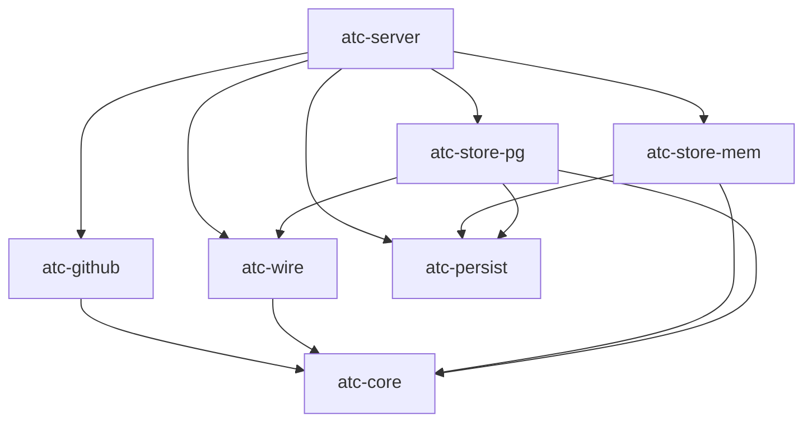
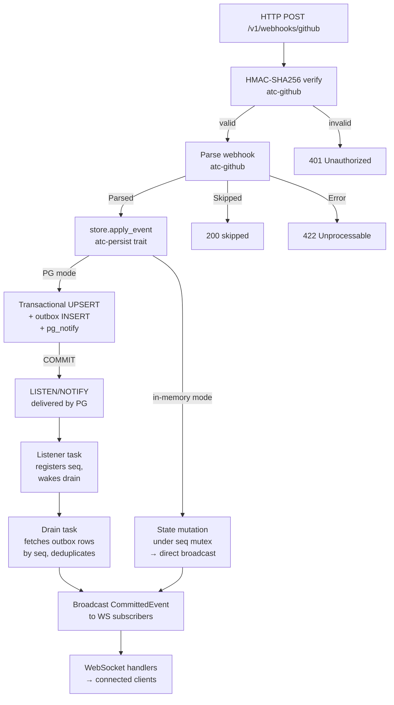
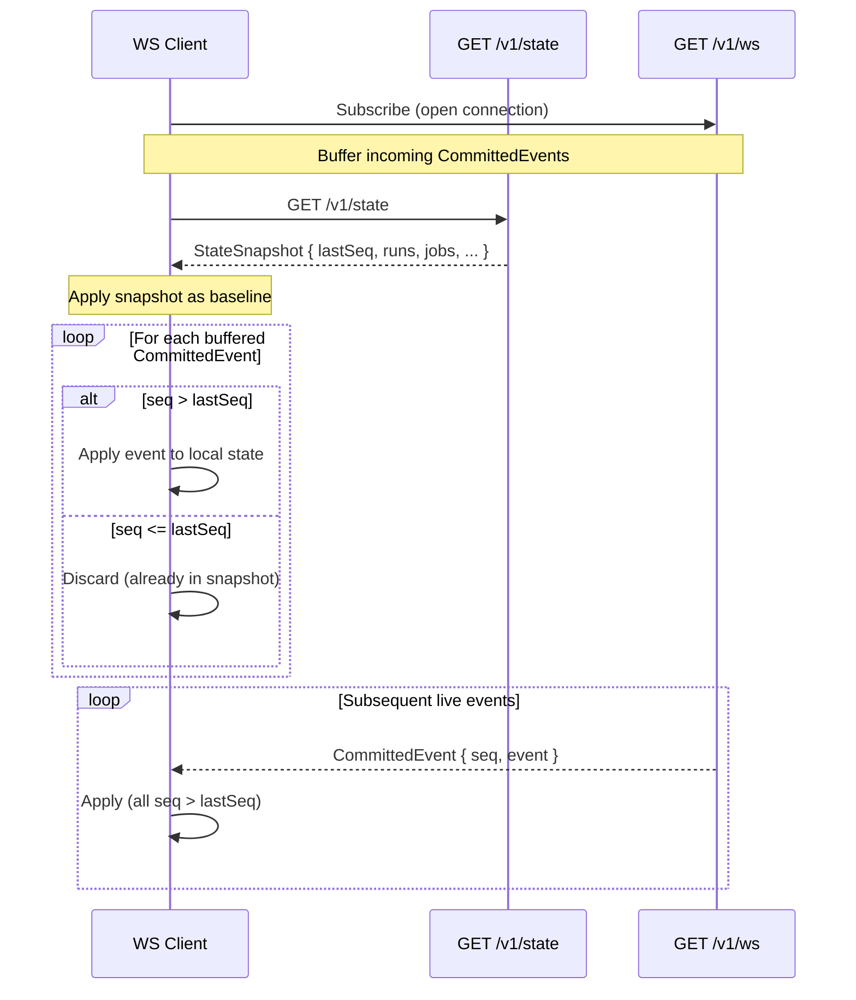
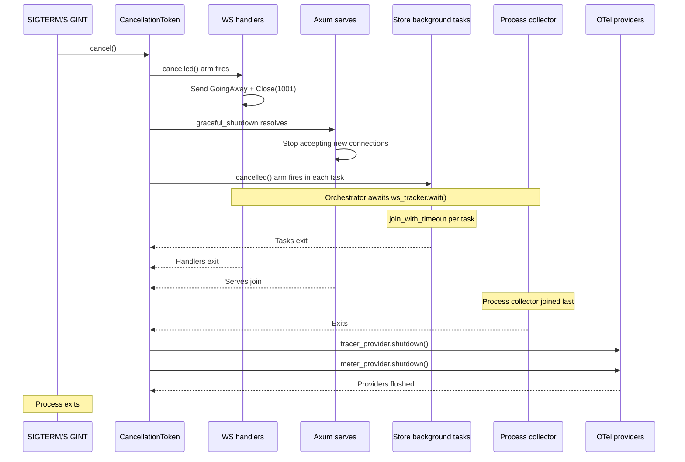

# Backend Server — Architecture

Last verified: 2026-05-23

Living document. Updated whenever the backend wiring or crate topology evolves.

## Purpose

`atc-server` is the single executable crate in the workspace. It wires the six library crates into a running Axum HTTP server: accepting GitHub webhook POST requests, verifying HMAC signatures, applying domain events to the active store, and delivering a real-time WebSocket stream plus a REST snapshot to the frontend.

Six library crates sit beneath `atc-server`:

- **`atc-core`** — Pure domain model: `WorkflowRun`, `Job`, `Step` types; forward-only state-machine transition functions; the `Clock` trait. No async, no locks, no I/O.
- **`atc-github`** — Webhook payload parsing, HMAC-SHA256 signature verification, translation into `atc-core` domain events.
- **`atc-wire`** — Serializable wire types (`CommittedEvent`, `StateSnapshot`) that cross the WebSocket and REST boundary to the frontend. ts-rs–exported.
- **`atc-persist`** — The `PersistentStore` trait, `LivenessError`, and `join_with_timeout`. No storage-library dependencies — the interface waist between the server and the concrete store implementations.
- **`atc-store-mem`** — In-memory `PersistentStore` implementation. Dev-only; single-replica; state lost on process exit.
- **`atc-store-pg`** — Postgres `PersistentStore` implementation: transactional writes, outbox, LISTEN/NOTIFY drain, retention sweep, snapshot reads. The production path.

The persistence crate split is recorded in [ADR-0008](../architecture-decisions/0008-persistence-crate-split.md).



## Key Decisions

**Decision:** Compile-time asset/proxy switching via `cfg!(debug_assertions)` rather than a runtime flag.
**Alternatives considered:** Environment variable, feature flag, runtime configuration.
**Rationale:** Debug builds always proxy to the Vite dev server (HMR expected). Release builds always embed `frontend/dist/` via rust-embed (single-binary deployment goal). No operator misconfiguration is possible.

**Decision:** Single `PersistentStore` trait as the mode-selection seam (ADR-0005, ADR-0006).
**Alternatives considered:** Mode enum threaded through handlers, per-mode router compositions.
**Rationale:** Route handlers call `persist.apply_*_event()` and `persist.read_snapshot()` without branching on storage mode. The active store — `PgStore` or `InMemoryStore` — is wired once at startup as an `Arc<dyn PersistentStore>`. Each store owns its background-task lifecycle (see [ADR-0006](../architecture-decisions/0006-stores-own-background-task-lifecycle.md)).

**Decision:** figment with `ATC_*` env var prefix for all scalar configuration; structured config (runner pools) is file-only.
**Alternatives considered:** CLI flags, hand-rolled `std::env::var` reads, config file only.
**Rationale:** figment's layered model (struct defaults → YAML file → env vars) needs zero boilerplate. The `__`-split convention maps nested env vars onto the config struct without custom parsing. Env-var-only scalars fit the container deployment model; file-only structure for `runner_pools` prevents ambiguous override semantics.

**Decision:** `/healthz` (liveness) and `/readyz` (readiness) as separate root-level probes; no backward-compat `/health` alias.
**Alternatives considered:** Deprecation shim, versioned probes under `/v1/`.
**Rationale:** No prior consumers of `/health` existed. Separate probes let liveness and readiness signal independently — readiness can degrade (DB unavailable, drain stale) while the process is still alive.

**Decision:** Log format branched on build profile: pretty in debug, JSON in release.
**Alternatives considered:** Always JSON, always pretty, runtime-only env var.
**Rationale:** Developer builds get ANSI-colored output without any configuration. Production/container builds default to structured JSON for log aggregators. Both can be overridden via `ATC_LOG_FORMAT`.

**Decision:** Snapshot cursor is the drain's `broadcast_watermark`, not `MAX(outbox.seq)`.
**Alternatives considered:** MAX seq from outbox table.
**Rationale:** `BIGSERIAL` allocates pre-commit; a transaction holding `seq=10` can still be in-flight while `seq=11` commits. `MAX(seq)` would then report 11 as seen even though 10's mutation isn't yet visible. The drain's watermark advances only after a successful pass over committed rows, so the cursor is strictly monotonic in commit order.

**Decision:** Cross-trace causal links via `traceparent` column on outbox rows, not span nesting (ADR-0003).
**Alternatives considered:** Full span parent/child linking from HTTP request through drain pass.
**Rationale:** The drain is a per-tick root by design — a task-lifetime parent would never export. The `traceparent` column captures the webhook span's W3C context at INSERT; the drain attaches it as a span LINK on `drain.broadcast`, letting operators follow the end-to-end pipeline across the async-tx boundary without breaking the per-tick root invariant.

**Decision:** Display TTL filtering at the snapshot layer, not the data-retention layer (ADR-0009).
**Alternatives considered:** Evict completed rows from storage when the display window closes; compute age-out on the frontend only.
**Rationale:** Separates operator-visible display filtering from irreversible storage eviction. The store's `read_snapshot` accepts an optional cutoff; the route layer computes the cutoff from the configured display TTL. The frontend mirrors the predicate reactively. See [ADR-0009](../architecture-decisions/0009-display-vs-data-retention.md).

## Boundaries

**Owns:** HTTP routing, request handling, frontend asset serving, dev proxy, server lifecycle (bind, serve, graceful shutdown), OTel SDK initialization, config hot-reload watcher, WS framing envelope.
**Does not own:** Domain logic (`atc-core`), GitHub API integration (`atc-github`), wire type definitions (`atc-wire`), storage implementation (`atc-store-mem`, `atc-store-pg`), frontend build process, authentication.
**Prohibitions:** Do not put domain logic in route handlers — extract to `atc-core`. Do not call into `atc-github` outside the webhook handler. Do not serve assets from the filesystem in release builds — always use the rust-embed path.

## Files

- `backend/crates/atc-server/src/main.rs` — Entry point: config loading, OTel init, store construction, router composition, shutdown orchestration.
- `backend/crates/atc-server/src/routes.rs` — Route handlers for `/v1/webhooks/github`, `/v1/ws`, `/v1/state`, `/healthz`, `/readyz`.
- `backend/crates/atc-server/src/shutdown.rs` — `run_shutdown_orchestration`: cooperative shutdown sequencing, per-task timeout budgets.
- `backend/crates/atc-server/src/ws.rs` — WebSocket connection handling; `WireFrame` discriminator enum; biased select loop.
- `backend/crates/atc-server/src/otel.rs` — OTel SDK init (`init_otel`) and provider flush (`shutdown`); sampler parsing.

## Architecture

### Webhook → Outbox → Drain → Broadcast pipeline

A single GitHub webhook traverses this path end to end:



### Config hot-reload

The `config_watcher` task watches the parent directory of `$ATC_CONFIG_FILE` using `notify-debouncer-full` (500 ms debounce). Each debounced event triggers a narrow reload of the `runner_pools` block only — scalar fields are deliberately ignored. Outcomes:

- **Applied** — new capacities differ from the current `AppState` value. The watcher atomically replaces the `runner_pool_capacities` RwLock contents and broadcasts `ConfigEvent::Update` on the config channel. WS handlers receive it as `WireFrame::ConfigUpdate`.
- **No-op** — content unchanged. Counter increments; no broadcast.
- **Failure** — read/parse/validate error. Existing capacities stay in place; a `ConfigEvent::ReloadError` is broadcast so WS handlers can surface a banner.

A diagnostic scalar-drift check also runs on each reload: the watcher parses the full config and warns on any scalar field that changed but cannot be hot-reloaded (e.g., `http_addr`). This catches the "I edited it in YAML — why didn't it take effect" foot-gun without adding full hot-reload for scalars.

**Kubernetes ConfigMap atomic-swap:** kubelet projects the ConfigMap via a `..data` symlink that is atomically renamed on update. The watcher's parent-dir watch sees the rename. The Helm chart must mount the ConfigMap as a directory (no `subPath`) — `subPath` mounts block kubelet propagation and break hot-reload. See `docs/architecture/deployment.md` § "File-based configuration".

## Data Model

### Domain entity hierarchy

Three levels: `WorkflowRun` → `Job` → `Step`. Each entity is identified by a numeric ID, carries a status, and is immutable after completion.

```mermaid
stateDiagram-v2
    direction LR
    state "WorkflowRun" {
        [*] --> Queued
        Queued --> InProgress : in-progress event
        Queued --> Completed : completed event
        InProgress --> Completed : completed event
        Completed --> [*]
    }

    state "Job" {
        [*] --> QueuedJ
        QueuedJ: Queued
        QueuedJ --> Waiting : waiting event
        QueuedJ --> InProgressJ : in-progress event
        QueuedJ --> CompletedJ : completed event
        Waiting --> InProgressJ : in-progress event
        Waiting --> CompletedJ : completed event
        InProgressJ: InProgress
        InProgressJ --> CompletedJ : completed event
        CompletedJ: Completed
        CompletedJ --> [*]
    }
```

State transitions are forward-only. Applying the same event twice is a safe no-op (idempotent). `Queued → Completed` is valid for both runs and jobs — GitHub emits this for workflows or jobs cancelled before they start.

The pure transition functions (`apply_run_event`, `apply_job_event`) live in `atc-core` with no locks, no async, and no side effects. The stores delegate all entity mutation to these functions and handle locking, indexing, seq accounting, and broadcasting themselves.

### Runner pool capacity model

Runner pool statistics are a frontend-derived view over the current job state (`computePoolStats` in the frontend). The backend does not compute or ship pool stats on the wire — it ships only the operator-declared `RunnerPoolCapacity` entries (label set + optional ceiling) on every `/v1/state` snapshot. The three-way `RunnerPoolTotal` variant (Bounded / Unbounded / Undeclared) is composed frontend-side by merging webhook-observed pools against the operator's declared list. See [ADR-0004](../architecture-decisions/0004-runner-pool-stats-frontend-derived.md).

### Postgres schema

Migrations live in `backend/crates/atc-store-pg/migrations/`, embedded in the binary at compile time via `sqlx::migrate!`. They run automatically on startup. The schema currently has:

- `runs` and `jobs` tables: columns, FK, CHECK constraints, composite indexes for snapshot reads and TTL eviction.
- `outbox` table: `BIGSERIAL seq` primary key (durable monotonic cursor), `kind`, run/job IDs, `payload JSONB` (domain event envelope — not the wire type), `inserted_at`, and a nullable `traceparent` column for cross-trace causal links.
- `outbox_watermarks` table: per-replica heartbeat tracking for multi-replica outbox retention. Every write of `updated_at` uses a `Clock`-sourced timestamp (not `DEFAULT now()`) so `TestClock`-driven tests can advance time deterministically. See [ADR-0007](../architecture-decisions/0007-outbox-retention-policy.md).
- `runs.placeholder` column: FK-only stub rows created when a job event arrives before its parent run event. `/v1/state` reads `WHERE placeholder = false`. Stubs are promoted to real rows when the matching `workflow_run` webhook arrives.
- `runs.completed_at` column (added in a later migration): used by the composite index for display-TTL snapshot filtering.

**Placeholder note:** The `placeholder` mechanism provides out-of-order event tolerance at the storage layer. A job event always has a parent run to satisfy the FK constraint, even if the run event arrives later.

## Contracts

### AppState

`AppState` is passed to all handlers via Axum's `State` extractor. It carries:

- **`persist`** — The active store as `Arc<dyn PersistentStore>`. `PgStore` when `ATC_DATABASE_URL` is set; `InMemoryStore` otherwise. Route handlers call through this trait uniformly; no mode branching in handlers.
- **`webhook_secret`** — Optional HMAC key. When `None`, signature verification is skipped. When `Some`, all webhook requests must carry a valid `X-Hub-Signature-256`.
- **`runner_pool_capacities`** — Operator-declared pool ceiling list, wrapped in a Tokio `RwLock`. Built once at startup; atomically replaced by the `config_watcher` on filesystem change. Write-preferring, so a sustained read load from `/v1/state` cannot starve the watcher.
- **`config_events_tx`** — Bounded broadcast sender for `ConfigEvent` variants (`Update`, `ReloadError`). The `config_watcher` is the sole writer; WS handlers subscribe alongside the committed-event channel.
- **`shutdown`** — Shared `CancellationToken` for cooperative shutdown signalling to background tasks and WS handlers.
- **`ws_tracker`** — `TaskTracker` counting live WS handlers. Awaited during shutdown to ensure every connected client receives a `Close(1001)` frame before the process exits.

PG-mode operational state (the pool, seq watermark, drain heartbeat timestamp) is owned by `PgStore` internally. Task handles live in `main.rs` scope; `AppState` does not own them.

### WireFrame envelope

Every outbound WS message is wrapped in a `WireFrame` discriminator, which lets the frontend pattern-match on `kind` without inspecting payload structure:

- **`Committed`** — wraps a `CommittedEvent { seq, event }`. `seq` is the monotonic commit cursor. Internally tagged on `kind`.
- **`ConfigUpdate`** — carries the full replacement `runner_pool_capacities` list after a successful hot-reload.
- **`ConfigReloadError`** — carries a structured reason string after a failed reload.
- **`ServerHello`** — sent as the first text frame on every new WS connection, carrying the build's `VERGEN_GIT_DESCRIBE` version. The frontend detects backend redeploys across reconnects by comparing the session's first `ServerHello` to later ones; a mismatch arms a refresh banner.
- **`GoingAway`** — sent immediately before `Close(1001)` on graceful shutdown. Informational; the close frame remains the authoritative signal.

Broadcast receivers subscribe before the WS upgrade completes, so events that fire in the gap between subscription and `ServerHello` delivery accumulate in the bounded channel and drain through the select loop after `ServerHello` — `ServerHello` is always the first text frame without additional synchronization.

Lagging on either the committed channel or the config channel closes the socket. The client reconnects and fetches `/v1/state` to re-establish both the seq cursor and the current capacity list.

`WireFrame` is local to the `ws.rs` boundary. `CommittedEvent` and `WebhookEvent` are not modified; stores remain pure event sources.

### Snapshot/stream reconciliation

A fresh WS client that joins mid-stream uses this protocol to guarantee no gaps and no duplicates:



`lastSeq = 0` is the cold-start sentinel (no events yet committed). The protocol ensures the client holds a consistent view at all times. In PG mode the snapshot may additionally include rows the drain has not yet broadcast — those accumulate in the WS buffer and are applied idempotently when their `CommittedEvent`s arrive.

### Storage mode invariants

ATC runs in one of two storage modes, selected at startup from environment:

- **External Postgres** (`ATC_DATABASE_URL` set) — production path. The webhook handler writes transactionally (UPSERT + outbox INSERT + `pg_notify`) and returns immediately. The drain task is the sole broadcaster; the WS stream is decoupled from the write path. Required for any deployment with more than one replica — the Helm chart's template-render guard refuses multi-replica without a Postgres URL. See `docs/architecture/deployment.md` § "Multi-replica constraints".
- **In-memory** (`ATC_DATABASE_URL` unset) — dev-only. Single-replica. Events broadcast directly from the webhook handler under the seq mutex. State is lost on process exit. Multi-replica deployments in this mode would silently fork state per replica with no convergence mechanism.

An invalid URL scheme (`ATC_DATABASE_URL` set to a non-`postgres://` / `postgresql://` value) causes the process to log and exit before making any sqlx calls. This mirrors the Helm chart's template-render-time guard.

**Startup behavior summary:**

| Scenario | Behavior |
|---|---|
| `ATC_DATABASE_URL` unset | In-memory mode; no migration step |
| Invalid URL scheme | Log + `process::exit(1)` before any DB call |
| Connect fails | `tracing::error!` + `process::exit(1)` |
| Connect succeeds, migrations fail | `tracing::error!` + `process::exit(1)` |
| DB lost at runtime | Process stays up; `/readyz` returns 503 |

### Health probes

- **`/healthz`** — Liveness. Returns 200 unconditionally. Process up = alive regardless of DB state.
- **`/readyz`** — Readiness. Short-circuits to 503 `{"status":"shutting_down"}` once the shutdown token is cancelled (checked first, preventing DB work during drain). In PG mode: checks `SELECT 1` against the pool, then checks drain heartbeat age against a 30 s staleness threshold. A healthy drain updates its heartbeat every 5 s; any value older than 30 s indicates a stalled drain task. Returns 200 when all checks pass.

## Observability

ATC emits metrics and spans through a single OpenTelemetry pipeline initialized by `otel::init_otel`. When `OTEL_EXPORTER_OTLP_ENDPOINT` is set, the function builds an OTLP/HTTP tracer provider and a meter provider, sets both as the OTel globals, registers `TraceContextPropagator` globally, and layers per-request HTTP duration tracking onto the API router. With the env var unset, the SDK is never initialized — no background tasks, no exporter overhead — and every metric emit through the global meter becomes a cheap no-op.

An invalid endpoint value (typo, missing scheme) is treated as unset, disabling OTel with a warning to stderr rather than silently falling back to `http://localhost:4318`.

The metric and span authoring contract — naming, attributes, the `tokio::spawn` Instrument-trait gotcha, histogram aggregation choice, and the full per-metric and per-span inventory — lives in [`metrics.md`](metrics.md). This section describes the wiring; the contract lives there.

### OTel wiring highlights

- **Sampler:** Default `ParentBased(root=AlwaysOn)`. `init_otel` reads `OTEL_TRACES_SAMPLER` and `OTEL_TRACES_SAMPLER_ARG` directly (the SDK's autoload is not yet fully reliable for these). Invalid or out-of-range sampler args fall back to the default sampler with a stderr warning.
- **Per-query spans (PG mode):** The PG pool is wrapped in an `sqlx-tracing` adapter that emits a child span for every query (`db.system.name`, `db.query.text`, `net.peer.*`). Bind values are inaccessible through sqlx's `Execute` trait surface and cannot leak.
- **Cross-trace causal link:** The outbox row carries a nullable `traceparent` column. The write path captures the current span's W3C traceparent at INSERT; the drain parses it on the way out and attaches it as an OTel span LINK on `drain.broadcast`. Under no-op OTel the column is NULL and the link is a no-op.
- **Per-tick roots:** Long-lived spawned tasks (`listener task`, `drain task`, `eviction task`, `process metrics collector`) do NOT take a task-lifetime root span. Each tick handler is annotated with `#[tracing::instrument]` so each invocation emits its own root that exports on return. See [`metrics.md`](metrics.md) § "Task-lifetime root spans are an anti-pattern".
- **Shutdown ordering invariant:** OTel provider flush runs after every emitter has joined. `run_shutdown_orchestration` joins all store-owned background tasks (listener, drain, outbox retention, eviction), the process collector, and the Axum graceful-drain BEFORE calling the tracer and meter provider shutdown. No live emitter is active when the providers flush. Any new emitter category added to the server MUST extend the join sequence before the OTel shutdown step.

## Supervision and Shutdown

ATC uses a single `CancellationToken` shared across all supervised surfaces. The orchestration function in `shutdown.rs` awaits the full sequence before the process exits.

### Shutdown sequence



### Per-task timeout budgets

| Task | Budget | Notes |
|---|---|---|
| Drain task | 5 s | Worst case: one in-flight 500-row pass with PG round-trips |
| WS tracker (`ws_tracker.wait()`) | 2 s | Time for connected clients to receive Close frames |
| Axum serves | 3 s | |
| Listener task | 1 s | |
| Eviction task (in-memory mode) | 1 s | |
| Process metrics collector | 1 s | |

Aggregate worst-case: ~13 seconds. The Helm chart sets `terminationGracePeriodSeconds: 30`, leaving ~17 seconds of headroom. On per-task timeout, `AbortHandle::abort()` is called (best-effort) and orchestration continues.

### Drain task shutdown observability

Before the drain task exits, it runs one bounded count query against the outbox (`seq > watermark`, 1 s timeout) and records the result as a metric. This lets operators verify that the cooperative-shutdown assumption holds — the unscanned tail should rarely exceed one drain pass. On query failure or timeout the observation is skipped rather than recorded as zero.

### Cancellation-token rationale

A previous design used two tokens plus a keepalive clone to ensure the drain's final pass broadcast before WS Close frames. That ordering is not load-bearing: clients reconnect to a healthy replica and fetch `/v1/state`, whose REPEATABLE READ snapshot reflects every committed row. The frontend uses `snapshot.lastSeq` as its cursor; the new replica's drain seeds its watermark from `MAX(seq)` at startup and only broadcasts seqs strictly above that. Catch-up is the snapshot endpoint's job, not the dying replica's.

### WS handler biased select

The WS handler loop uses a biased `select!` with arms ordered: (1) shutdown cancelled → send Close(1001) and exit, (2) broadcast recv → forward as JSON text frame, (3) client socket recv → detect client-initiated close or read error. Cancel is first so the shutdown signal is preferred over any concurrently-ready arm, keeping shutdown behavior predictable.

### Webhook durability during shutdown

Webhooks committed to the outbox before or during the shutdown window are durable in PG. The dying replica's drain may exit before broadcasting all committed-but-undrained rows. Clients that reconnect to a healthy replica fetch `/v1/state` and the REPEATABLE READ snapshot reflects every committed row including ones the dying replica didn't broadcast. No committed webhook is lost.

## Operator Surface

Server configuration uses `ATC_*`-prefixed environment variables for scalars and an optional YAML config file for structured config. The canonical operator-facing list of env vars, Helm values, and deployment constraints lives in `docs/architecture/deployment.md` § "Environment Variables" and § "File-based configuration".

OTel configuration uses spec-standard `OTEL_*` env vars read by the SDK directly. Metrics — per-metric metadata, attributes, and interpretation guidance — live in `docs/architecture/metrics.md`.

Test infrastructure for the PG store path uses testcontainers (ephemeral Docker containers per test run). CI configuration and test-execution requirements are described in `docs/architecture/ci-pipeline.md`.
