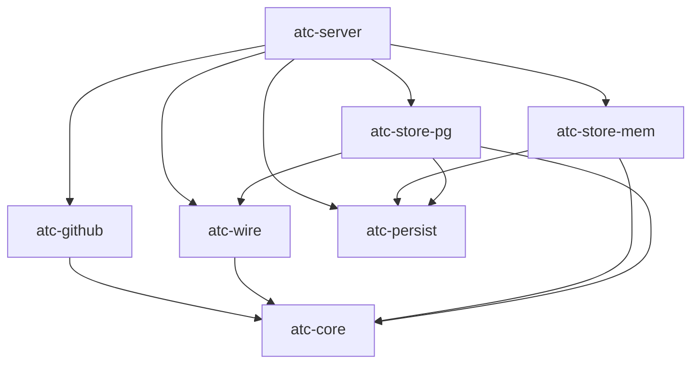
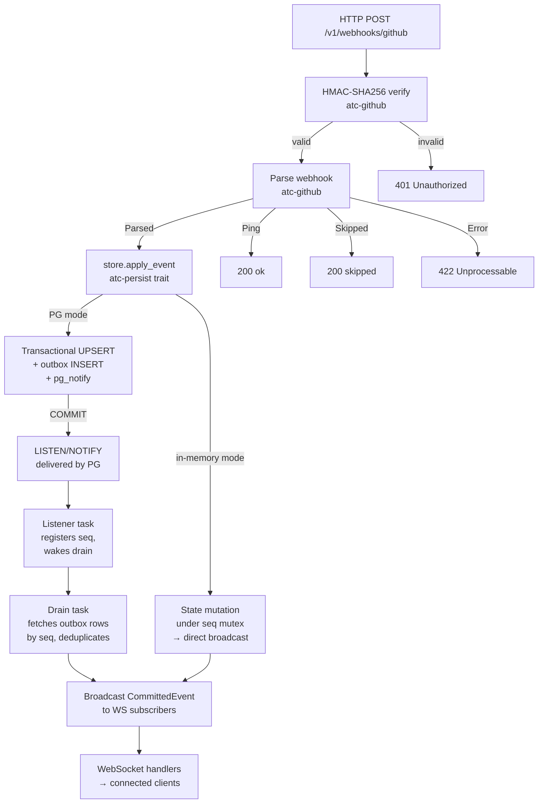
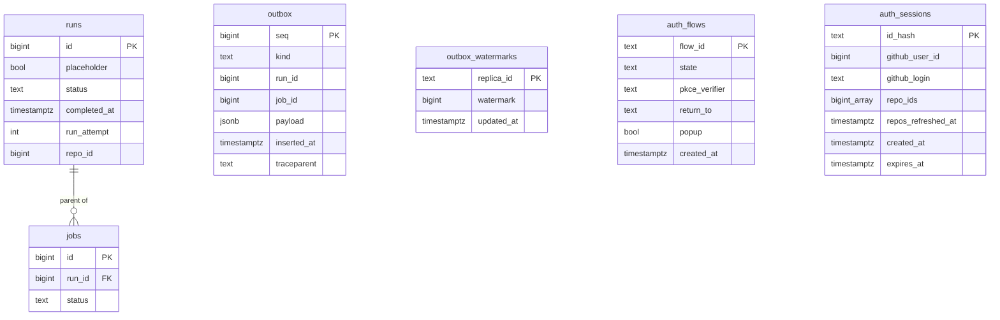
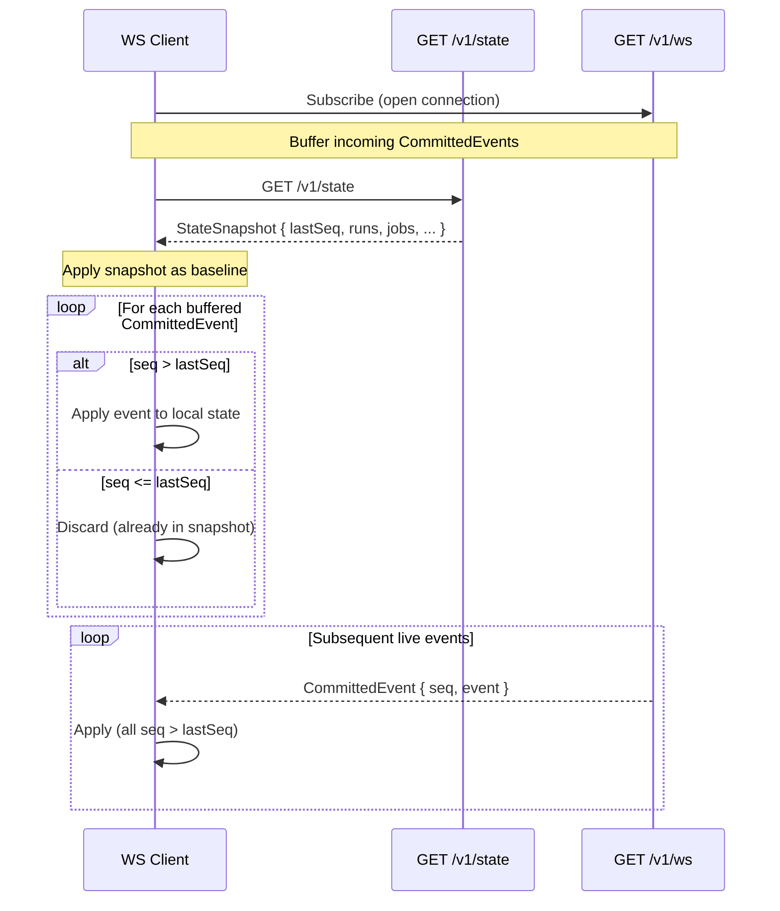
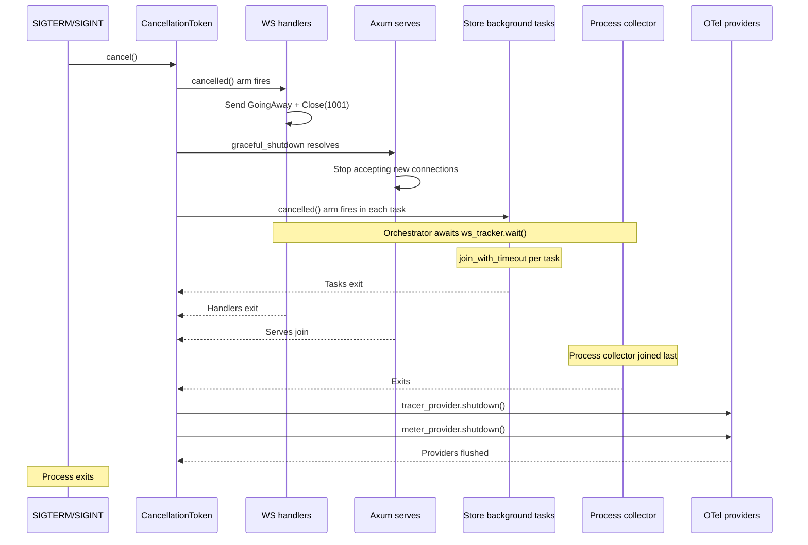

# Backend Server — Architecture

Last verified: 2026-07-04

`atc-server` is the single executable crate in the workspace. It wires the six library crates into a running Axum HTTP server: accepting GitHub webhook POST requests, verifying HMAC signatures, applying domain events to the active store, and delivering a real-time WebSocket stream plus a REST snapshot to the frontend. The persistence crate split is recorded in [ADR-0008](../architecture-decisions/0008-persistence-crate-split.md).



## Domain model and state-machine invariants

The domain types and their transition rules live in `atc-core` as pure, side-effect-free functions (`apply_run_event` / `apply_job_event`). Three invariants hold across both storage backends:

- **Forward-only.** Run and job status only advances (`Queued → InProgress → Completed`); a terminal `Completed` never reverts. The sole documented exception is a GitHub re-run, which arrives with a higher `run_attempt` and is handled at the persistence layer — see § "GitHub re-runs and `run_attempt`".
- **Idempotent reapplication.** Replaying the same event (same status target) is a no-op rather than an error. In PG mode this is enforced by the predicated UPSERT's predecessor set including the target status itself; in memory by the same-status short-circuit.
- **Conclusion implies completion.** A `conclusion` is only populated on the `Completed` transition and, once recorded, is preserved across idempotent replay (`completed_at` follows the same preserve-first rule).

These are verified by unit + proptest suites in `atc-core`. Crate-specific implementation notes (the predecessor-includes-self predicate, `completed_at` preserve-first) live in `backend/crates/atc-core/CLAUDE.md`.

Deterministic test fixtures for these types live in `atc-core`'s `test_support` module, gated on the `test-support` feature alongside `TestClock` / `fixed_test_timestamp`. It exposes event-envelope builders (`make_run_event`, `make_job_event`) and zero-arg domain-struct factories (`make_workflow_run`, `make_job`, `make_step`, `make_runner_info`) that callers specialize with struct-update syntax. Because the feature is opt-in via dev-dependency, cross-crate test code (e.g. `atc-server`'s in-memory store tests) builds domain values from this one canonical source rather than re-declaring the field lists.

Both event envelopes carry `repo_id`, GitHub's immutable numeric repository identifier — the authorization key the native-auth initiative filters on (see [ADR-0014](../architecture-decisions/0014-native-github-auth-mode.md)). `atc-github` parses it from every webhook's `repository.id` and populates it unconditionally, but the envelope field itself is `Option`, not required: these envelopes are also the payload persisted to the Postgres outbox and replayed by the cross-replica drain, so a required field would fail to decode outbox rows written before this field existed. `None` on decode is the tolerated legacy shape, mirroring `run_attempt`'s and `completed_at`'s existing rolling-deploy defaults. The staleness sweep's synthesized completion events carry the swept row's real `repo_id` (read off the parent run in both stores — jobs have none of their own), not a hardcoded `None`: `WebhookEvent::repo_id()` reads straight off these envelopes, and the WS per-connection filter checks it directly, so a synthetic completion with no `repo_id` would otherwise never reach an authenticated session even though the row's repo is known.

`WorkflowRun.repo_id` carries the same identifier into domain state, populated on first-sight from the envelope and self-healed from `None` to `Some` on the next event that carries one — `apply_run_event` never regresses an already-known `Some` back to `None`, a safety net for a legacy pre-migration row or a decoded pre-#449 outbox entry. The Postgres write path mirrors the same self-heal via `COALESCE(EXCLUDED.repo_id, runs.repo_id)` in the run UPSERT (and the job-before-run FK-stub insert), and the read path constructs `Some(repo_id)` for rows that have one, `None` for legacy rows predating the column. `Job` stays repo-less by design and joins through its parent run.

## Webhook → Outbox → Drain → Broadcast pipeline

A single GitHub webhook traverses this path end to end:



`parse_webhook` (`atc-github`) returns one of three outcomes: `Parsed` (a
`workflow_run` / `workflow_job` translated to a domain event), `Ping` (a GitHub
connectivity check, no payload), or `Skipped` (a recognized-but-unhandled event
type — `push`, `pull_request`, …). Ping is a first-class variant rather than a
server-side string check, so the handler's match stays exhaustive.

### Webhook boundary logging

Every webhook outcome emits exactly one boundary log line so an operator can tell
"webhook never arrived" from "arrived but unhandled" from "handled but rejected"
at the default `info` filter. The level policy and the rationale for emitting
skipped/ping at INFO live in [metrics.md](metrics.md) § "Webhook boundary logs";
the lines are:

| Outcome | Level | Message | Fields |
|---------|-------|---------|--------|
| Ping | INFO | `ping received` | `event_type`, `delivery_id` |
| Skipped (unhandled type) | INFO | `event skipped` | `event_type`, `delivery_id` |
| State transition committed | INFO | `event accepted` | `event_type`, `seq`, `run_id`, `job_id` (jobs), `delivery_id` |
| Invalid transition (rejected) | WARN | `transition invalid; rejecting` | `event_type`, `run_id`, `job_id` (jobs), `delivery_id` |
| Missing signature header | WARN | `missing X-Hub-Signature-256 header` | `delivery_id` |
| Signature verification failed | WARN | `HMAC verification failed` | `delivery_id` |
| Parse failure | ERROR | `webhook parse error` | `error.message`, `event_type`, `delivery_id` |
| Persistence write failed | ERROR | `persistence write failed` | `error.message`, `event_type`, `delivery_id` |

`delivery_id` is the `X-GitHub-Delivery` header — GitHub's per-delivery
correlation id, recorded on the `webhook.handler` span and carried on **every**
emitted line (logged as the bare string value, empty when the header is absent) so
a line correlates to a specific GitHub delivery even in pretty (non-span-list) log
output. A request missing the `X-GitHub-Event` header is rejected `400` without a
log line — it never reaches a boundary outcome.

## Config hot-reload

The `config_watcher` task watches the parent directory of `$ATC_CONFIG_FILE` using `notify-debouncer-full` (500 ms debounce). Each debounced event triggers a narrow reload of the `runner_pools` block only — scalar fields are deliberately ignored. Outcomes:

- **Applied** — new capacities differ from the current `AppState` value. The watcher atomically replaces the `runner_pool_capacities` RwLock contents and broadcasts `ConfigEvent::Update` on the config channel. WS handlers receive it as `WireFrame::ConfigUpdate`.
- **No-op** — content unchanged. Counter increments; no broadcast.
- **Failure** — read/parse/validate error. Existing capacities stay in place; a `ConfigEvent::ReloadError` is broadcast so WS handlers can surface a banner.

A diagnostic scalar-drift check also runs on each reload: the watcher parses the full config and warns on any scalar field that changed but cannot be hot-reloaded (e.g., `http_addr`). This catches the "I edited it in YAML — why didn't it take effect" foot-gun without adding full hot-reload for scalars.

**Kubernetes ConfigMap atomic-swap:** kubelet projects the ConfigMap via a `..data` symlink that is atomically renamed on update. The watcher's parent-dir watch sees the rename. The Helm chart must mount the ConfigMap as a directory (no `subPath`) — `subPath` mounts block kubelet propagation and break hot-reload. See `docs/architecture/deployment.md` § "File-based configuration".

## Auth configuration (`auth.github`)

`[auth]` is an opt-in section: `mode = "none"` (default) is byte-for-byte identical to today's behavior. `mode = "github"` enables the native GitHub OAuth web flow (see [ADR-0014](../architecture-decisions/0014-native-github-auth-mode.md)) and requires a fully populated `[auth.github]`: `client_id`, `client_secret` (env `ATC_AUTH__GITHUB__CLIENT_SECRET`), `public_origin`, plus `repo_auth_ttl` (default `1h`) and `max_session_ttl` (default `30d`).

Boot validation for `mode = "github"` runs alongside the existing `display_ttl`/`staleness_threshold` checks in `Config::load`: it requires `database_url` (the in-memory store has no session storage) and each `[auth.github]` key, naming the exact missing key in the error rather than surfacing figment's generic deserialize failure. `public_origin` must parse as an absolute `http`/`https` URL with no path, query, or fragment — it doubles as the WS `Origin` allowlist and the OAuth redirect_uri base.

Like every other scalar field, `[auth]` is restart-only: an operator edit to a live config file is reported by the scalar-drift warn-log (`ScalarSnapshot` treats the whole section as one unit) but does not take effect until the next pod roll. `client_secret` (and the existing `github.webhook_secret`) never appear in `Debug` output — both config types have a manual `Debug` impl that redacts the secret field.

Config parsing and boot validation are covered here; session storage is § "Session storage (`auth.github`)" and the OAuth endpoints are § "OAuth login and callback (`auth.github`)", both below. Request-time enforcement on `/v1/state` and `/v1/ws` is a separate, later piece of the `auth.github` substrate (ADR-0014).

## Session storage (`auth.github`)

`SessionStore` (in `atc-store-pg`) is a concrete struct over `auth_flows` and `auth_sessions` — deliberately not a `PersistentStore` implementation (ADR-0008): sessions are not run-state, and `auth.github` requires Postgres by locked decision, so exactly one implementation exists. It shares the same `TracedPool` as `PgStore` but owns its own background sweep task lifecycle (ADR-0006), independent of `PgStore`'s outbox retention tasks.

No token columns exist anywhere in either table (ADR-0014): ATC derives the repo-authorization set at the OAuth callback and discards both the GitHub access and refresh token immediately.

- **`auth_flows`** — a pre-auth OAuth round-trip bound to the browser that started it via the `flow_id` in a short-lived `__Host-atc_flow` cookie. Single-use: `consume_flow` deletes the row on read (`DELETE ... RETURNING`). Rows older than 10 minutes read as absent regardless of whether the sweep has reaped them yet.
- **`auth_sessions`** — the post-login session. `id_hash` (the primary key) is the SHA-256 hex digest of the opaque session id carried in the `__Host-atc_session` cookie; the raw value is never persisted, so a database dump alone cannot forge a session cookie. `repos_refreshed_at` is the clock `repo_auth_ttl` staleness measures against; `expires_at` is the absolute `max_session_ttl` cutoff, independent of that staleness. A session is deleted on read once `expires_at` has passed (best-effort — a racing sweep tick may already have removed it).

Every timestamp column (`created_at`, `expires_at`, `repos_refreshed_at`) is bound Rust-side from `Clock::now()`, never SQL `now()` — the same discipline `outbox_watermarks.updated_at` established, so `TestClock`-driven tests can advance time deterministically. `sweep_expired` deletes both expired flows and expired sessions in one call and reports counts; the task spawned by `SessionStore::start` calls it every 5 minutes (no cross-replica coordination needed, unlike the outbox sweep's `SKIP LOCKED` candidate selection — deleting an already-deleted row is simply a no-op). Each tick is a per-tick root span (`auth.session_sweep.tick`, no task-lifetime wrapper at the spawn site — the same pattern as `outbox.sweep.tick`) and increments `atc_auth_swept_total{kind=flow|session}`; see [`metrics.md`](metrics.md) for the full metric/span contract.

## OAuth login and callback (`auth.github`)

`GET /v1/auth/github/login`, `GET /v1/auth/github/callback`, `POST /v1/auth/github/logout`, and `GET /v1/auth/me` (all `auth.rs`) are merged into the router only when `auth.mode = "github"` — `routes::api_routes` takes an `auth_enabled` flag and conditionally `.merge()`s them, so a disabled mode 404s the same way any unmounted path does rather than via a runtime check inside the handlers.

```mermaid
sequenceDiagram
    participant B as Browser
    participant A as ATC
    participant G as GitHub
    B->>A: GET /v1/auth/github/login?return_to=...&popup=...
    A->>A: generate state + PKCE verifier (32B random each)
    A->>A: SessionStore::create_flow
    A-->>B: 302 + __Host-atc_flow cookie (flow_id)
    B->>G: authorize?client_id&state&code_challenge&code_challenge_method=S256
    G-->>B: 302 callback?code&state
    B->>A: GET /v1/auth/github/callback?code&state (flow cookie)
    A->>A: consume_flow (single-use); verify state matches
    A->>G: POST /login/oauth/access_token (code + verifier + secret)
    G-->>A: access_token (200 OK even on failure — check body for `error`)
    A->>G: GET /user, GET /user/installations (+ per-installation repositories, paginated)
    A->>A: PublicRepoCache.get() — refresh if stale (see below)
    A->>A: discard token; union public repo_ids; create_session or refresh_session_repos
    A-->>B: 302 return_to (or, popup mode: 200 + BroadcastChannel HTML)
```

`GitHubClient` (`github_client.rs`) owns the GitHub-facing side: token exchange, `/user`, and the installations/repositories pagination (`Link: rel="next"`, `per_page=100`, capped at `MAX_PAGES` = 500 — a malformed or cycling `Link` header fails closed with `GitHubClientError::TooManyPages` instead of looping forever inside a request handler). Base URLs are constructor parameters so tests point it at a local mock instead of `github.com`/`api.github.com` — there's no `wiremock` (or equivalent) dependency in this workspace, so the test suite hand-rolls a small axum router for the mock rather than adding one. The shared `reqwest::Client` is built with an explicit `User-Agent` (`atc-server/<version>`) set once at construction — GitHub's REST API rejects any request with none (403 Forbidden), unlike the OAuth token-exchange endpoint, which doesn't require one. GitHub returns `200 OK` even for a rejected token exchange (the failure is an `error` field in the body, not an HTTP status) — `exchange_code` checks for that field regardless of status. The access token is used only within the callback handler's own scope to make the identity/repo-set calls that follow, then dropped; it is never returned to a caller beyond `github_client`, stored, or logged (ADR-0014). `TokenExchangeResponse`'s `Debug` impl redacts both token fields as defense in depth. The identity (`get_user`) and repo-authorization-set (`get_authorized_repo_ids`) calls are independent of each other, so the callback handler runs them concurrently via `tokio::try_join!` rather than as two sequential round trips.

**Public-repo visibility widening** (ADR-0014, amended decision 2, further amended 2026-07-05): `PublicRepoCache` (`public_repo_cache.rs`) caches the set of repo IDs GitHub reports as publicly visible, unioned into every session's `repo_ids` at callback. Refresh is lazy — whichever caller first observes the cache stale (past `repo_auth_ttl`, reused rather than a second TTL knob) triggers it, holding an `async Mutex` across the refresh so concurrent callers converge on one in-flight computation. A refresh reads the known-repo universe off `PersistentStore::read_snapshot`'s `runs` (distinct `repo_id`s — already bounded to repos that send webhooks, condition (a)) and checks each directly via `GitHubClient::fetch_public_repo_ids`, which issues fully concurrent, **unauthenticated** `GET /repositories/{id}` calls (unbounded — the known-repo universe is realistically dozens, not the scale where the 60/hr-per-source-IP unauthenticated ceiling or GitHub's abuse-detection would bind). Basic auth with the login app's `client_id`/`client_secret` was tried first for the higher 5,000/hr OAuth-app rate ceiling, but that mechanism is OAuth-App-only — the login app is a GitHub App, which has no equivalent, so it 401'd on every repo; a per-installation JWT/access-token path was rejected too, since it only authenticates for repos the app is installed on, defeating the point of this check (see the ADR amendment). A 404 means "not public" (private or gone — GitHub doesn't distinguish); a per-repo failure is logged and excluded from that cycle rather than failing the whole refresh. The union happens in `callback_handler` **outside** the `try_join!` above — a `PublicRepoCache` failure (which never surfaces as an `Err`; see its doc comment) must not block login the way a real GitHub-side failure does. The cache is in-process and per-replica, not shared via Postgres: replicas can disagree on the public set for up to one `repo_auth_ttl` window after a repo flips public/private, the same accepted-staleness posture already covering per-user authorization.

Cookies are hand-rolled `Set-Cookie` strings (`auth.rs`'s `set_cookie_header`), not a `cookie`/`axum-extra` dependency — the values are always ATC's own generated tokens (no user-controlled characters needing RFC 6265 escaping), so a ~10-line builder covers it. `cookie_names` switches between `__Host-atc_flow`/`__Host-atc_session` (https `public_origin`, `Secure` set) and plain `atc_flow`/`atc_session` (http, dev) — a `__Host-` cookie is browser-rejected without `Secure`. Every redirect in this flow is an explicit 302 (`redirect_302`, not `axum::response::Redirect::to`, which sends 303).

`return_to` is validated as same-origin (`starts_with('/')`, not `starts_with("//")` — the scheme-relative open-redirect shape) before being bound into the flow row; anything else falls back to `/`. A GitHub `error` query param (user denied authorization) redirects to `/?auth_error=denied` regardless of `return_to` — there's nothing to resume. Structured logging: a successful callback emits one `info` event (`user`, `user_id`, `repo_count`); the full `repo_ids` list is `debug`-only (can be hundreds of entries); each failure is `warn` with a `reason` field — `missing_flow`, `state_mismatch`, `denied`, and `exchange_failed` (GitHub-side calls) are distinct from `session_error` (local `SessionStore` failures), so an operator filtering logs can tell a GitHub outage apart from a Postgres one. Token material never appears at any level.

The whole handler runs inside an `auth.callback` root span recording `outcome` (the same value as the `reason` log field, plus `"success"`) and `repo_count`; `exchange_code` and `get_authorized_repo_ids` are `auth.callback.exchange` / `auth.callback.repos` child spans (the latter recording total pages fetched across installations + per-installation repositories). `atc_auth_logins_total{outcome}` increments once per exit from this handler, and `atc_auth_callback_duration_seconds{phase=exchange|repos}` records the wall time of each GitHub round trip. See [`metrics.md`](metrics.md) for the full contract.

A session cookie present on the callback request is only ever refreshed (via `refresh_session_repos`) when it belongs to the SAME GitHub user who just completed this login (`existing.github_user_id == user.id`); a mismatch — a shared browser, or a stale cookie left over from a previous account — is treated the same as no existing session, and `create_session` mints a fresh one instead. `refresh_session_repos` only ever updates `repo_ids`/`repos_refreshed_at`, never `github_user_id`, so skipping this check would let a second user's login silently attribute their repo access to the first user's still-live session identity. Because `refresh_session_repos` also never extends `expires_at` (§ "Session storage" above — that clock is independent of repo staleness by design), the refreshed session's cookie `Max-Age` is set to the time remaining until the DB row's actual `expires_at`, not a fresh `max_session_ttl` — otherwise the browser would hold a cookie advertised as good for a full term the server will reject well before it's up.

`POST /v1/auth/github/logout` deletes the session row (`SessionStore::delete_session`) and clears the cookie (`Max-Age=0`, same name/attributes as the original). It is idempotent by design: no session cookie, or a cookie for a session that's already gone, both still return `204` — only a genuine `SessionStore` failure surfaces as `500`. There is no CSRF token in v1: a forged cross-site logout can only force a re-login, not escalate privilege or leak anything, so the gap is accepted rather than closed (see the design doc's "Locked decisions").

`GET /v1/auth/me` takes `AuthContext` (see below) as an extractor argument, so its `401` on a missing/unknown/expired session shares the same `{"reason": "auth_required"}` body every other auth-gated handler produces — no duplicated JSON literal. On a valid session it returns `200` with `{"login", "repoCount", "reposRefreshedAt", "stale"}` — the response struct (`WhoamiResponse`, in `auth.rs`) derives `ts_rs::TS` and is exported to `frontend/src/lib/types/generated/WhoamiResponse.ts`, the same pattern `ws.rs`'s `WireFrame` uses, so the frontend's `Identity` type can never drift from this shape. `stale` is computed by `SessionIdentity::is_stale` (`elapsed >= repo_auth_ttl` where `elapsed = now - repos_refreshed_at`, a `DateTime - DateTime` subtraction compared against a `Duration`, not `repos_refreshed_at + repo_auth_ttl >= now`) but — unlike the read rails below — is reported as a body field rather than rejected: the identity-chrome bootstrap depends on this `200`-with-`stale` shape, and only `/v1/state`/`/v1/ws` fail closed on staleness. An unrepresentably large configured `repo_auth_ttl` falls back to `chrono::Duration::MAX` for "never stale"; adding that fallback to a `DateTime` would overflow-panic (`chrono`'s `Add` impl panics rather than saturates), which the elapsed-vs-ttl shape avoids entirely since it never adds a `Duration` to a `DateTime`.

## Request-time enforcement (`AuthContext`)

`AuthContext` (`auth.rs`) is the `FromRequestParts` extractor every auth-gated handler takes as an argument — `/v1/auth/me`, `/v1/state`, and `/v1/ws`. It resolves to one of two variants:

- **`Disabled`** — `auth.mode = "none"`. Produced without touching `SessionStore` at all, so a no-auth deployment pays zero extra cost per request.
- **`Session(SessionIdentity)`** — a valid session, carrying `github_login`, the authorized `repo_ids` (`HashSet<RepoId>`, the `atc-core` newtype, since callers compare it directly against `WorkflowRun::repo_id`), and `repos_refreshed_at` + `repo_auth_ttl` (so `SessionIdentity::is_stale` needs no extra lookup from its callers).

Extraction itself only ever produces `auth_required` — missing cookie, unknown cookie, or an expired session row all collapse to the same `{"reason": "auth_required"}` `401` via `AuthRejection::Required`, reusing the existing `session_from_cookie` helper (`get_cookie` + `SessionStore::load_session`, resolved once and shared with the `had_cookie` trace field). **Staleness is deliberately not checked during extraction** — `AuthContext::Session` is produced regardless of how old `repos_refreshed_at` is. `/v1/auth/me` needs to see a stale session to report it in its body (above); the read rails instead call `AuthContext::require_fresh(now, surface)`, which rejects with `AuthRejection::Stale` (`{"reason": "stale_authorization"}`) when `SessionIdentity::is_stale` is `true` (and passes `Disabled` through unchanged). Both rejection variants — and their tracing (`reason`, `had_cookie`, `surface`, never the cookie value) — live in one `IntoResponse` impl on `AuthRejection`, so the two reason strings (the wire contract `/v1/state`'s 401-aware connection handling keys off) are defined exactly once regardless of which handler triggers them. `surface` (`"state"` / `"ws"` / `"me"`) is derived from the request path inside the extractor for `Required`, and passed explicitly by each caller of `require_fresh`; it labels `atc_auth_rejections_total{surface, reason}`, recorded at each of the three call sites (the extractor, `state_handler`, `ws_handler`) rather than inside `IntoResponse` itself, since that impl has no `AppState` to record a metric against. See [`metrics.md`](metrics.md).

`AuthContext::can_see(repo_id: Option<RepoId>)` is the filter predicate the read rails apply per-row: `Disabled` sees everything; a `Session` sees a repo only if it's in `repo_ids` — `None` (a pre-migration row with no `repo_id`) is never visible to an authenticated session, only to `Disabled`.

`GET /v1/state` (`routes.rs::state_handler`) calls `AuthContext::require_fresh(now, "state")` before touching the store — a stale session 401s (`stale_authorization`, incrementing `atc_auth_rejections_total{surface="state"}`) without ever reading a snapshot. Filtering happens in-memory, post-read, in the handler — never in SQL (locked; keeps the read path and store trait untouched): `snap.runs.retain(|r| ctx.can_see(r.repo_id))`, then jobs filter through their parent run (`Job` carries no repo identity of its own) via the kept run-id set. `lastSeq`, `runnerPoolCapacities`, and `displayTtlSeconds` are left untouched regardless of filtering — global operator data, and the accepted global-`seq` inference side channel (ADR-0003 places seq contiguity out of contract). `Disabled` (`mode = "none"`) makes `can_see` always `true`, so the retain is a byte-for-byte no-op — response shape is unaffected by this change for no-auth deployments.

Two edge cases leave a job legitimately visible under `mode = "none"` with no matching entry in `snap.runs`, both rooted in the same cause: (1) a job-before-run race (a `workflow_job` webhook arriving before its `workflow_run`) — both stores hide the FK-stub/placeholder run row but still surface the job; (2) a re-run's job at a higher `run_attempt` than its parent row, whose prior attempt already aged past `display_ttl` and was cut off (see `atc-store-pg::reads::read_all_jobs`'s doc comment for both). Since the job's `repo_id` is only ever knowable through a run the auth-filtered path can't see in either case, it fails closed on both rather than leaking the job to an unverifiable session — consistent with the NULL-`repo_id`-invisible-in-auth-mode rule above — and self-heals the moment the run event lands and promotes/advances the row. A session-filtered response also carries `Cache-Control: private, no-store`, since its body now varies per session; `mode = "none"` gets no such header (response shape stays untouched).

`GET /v1/ws` (`ws.rs::ws_handler`) rejects pre-upgrade, before ever calling `WebSocketUpgrade::on_upgrade` — cookies are ambient credentials the browser attaches to any upgrade request, so validation happens before the handshake completes rather than after. For a `Session`: the request's `Origin` header must match `auth.github.public_origin` (`origin_matches` parses both as URLs and compares scheme + host + `port_or_known_default`, rather than a raw string compare, so an operator writing an explicit default port in config still matches a browser's Origin header, which omits it) — a missing or mismatched Origin 403s (`origin_mismatch`, logged with `cause` — the pre-upgrade check bypasses `AuthRejection` entirely, so its field name differs from the `reason` the extractor/`require_fresh` use) before any session check runs. Then `AuthContext::require_fresh(now, "ws")` 401s a stale session (`stale_authorization`); a missing/expired session already 401s (`auth_required`) via `AuthContext`'s own extraction, before the handler body executes at all. Each of the three rejects (`origin_mismatch`, `stale_authorization`, `auth_required`) increments `atc_auth_rejections_total{surface="ws", reason}`. `Disabled` (`mode = "none"`) skips both checks — bit-for-bit today's path.

The resolved `AuthContext` is captured once, at upgrade time, and threaded into `handle_socket`/`handle_socket_inner` for the connection's lifetime — frozen per connection and never re-checked; mid-stream revocation or staleness is explicitly out of scope (locked decision), so a revoked or newly-stale session keeps streaming until the connection ends for an unrelated reason (lag eviction, config reload, shutdown, client-initiated reconnect), not on any bounded cadence. In the forwarding loop, only the `committed_rx` branch filters: `ctx.can_see(committed_event.event.repo_id())` (`WebhookEvent::repo_id`, in `atc-github`, reads through whichever envelope variant — `Run` or `Job` — the event wraps) gates whether a `CommittedEvent` forwards; a filtered-out event is silently dropped (`continue`, not a disconnect) — safe because ADR-0003 already places seq contiguity out of contract, and `connection.ts` does no gap detection. `ConfigEvent`s and `ServerHello` always forward regardless of `ctx` — global operator data, visible to any authenticated user.

## Postgres schema

Migrations live in `backend/crates/atc-store-pg/migrations/`, embedded in the binary at compile time via `sqlx::migrate!`. They run automatically on startup. The pool is built with a 5-second `acquire_timeout` (sqlx default: 30 s) so that during a database outage handlers fail fast into the transient-failure 503 path instead of stalling for the full default timeout. The schema currently has:

- `runs` and `jobs` tables: columns, FK, CHECK constraints, composite indexes for snapshot reads and TTL eviction.
- `outbox` table: `BIGSERIAL seq` primary key (durable monotonic cursor), `kind`, run/job IDs, `payload JSONB` (domain event envelope — not the wire type), `inserted_at`, and a nullable `traceparent` column for cross-trace causal links.
- `outbox_watermarks` table: per-replica heartbeat tracking for multi-replica outbox retention. Every write of `updated_at` uses a `Clock`-sourced timestamp (not `DEFAULT now()`) so `TestClock`-driven tests can advance time deterministically. See [ADR-0007](../architecture-decisions/0007-outbox-retention-policy.md).
- `runs.placeholder` column: FK-only stub rows created when a job event arrives before its parent run event. `/v1/state` reads `WHERE placeholder = false`. Stubs are promoted to real rows when the matching `workflow_run` webhook arrives.
- `runs.completed_at` column (added in a later migration): used by the composite index for display-TTL snapshot filtering.
- `runs.run_attempt` column (added in migration `0008`): GitHub's 1-based attempt counter, reused across re-runs. Drives the re-run reset path in the run UPSERT predicate — see § "GitHub re-runs and `run_attempt`".
- `auth_flows` + `auth_sessions` tables (migration `0010`): `auth.github` session and pre-auth OAuth flow storage, owned by `SessionStore` rather than `PgStore` — see § "Session storage (`auth.github`)" above.
- `runs.repo_id` column (added in migration `0011`): nullable, no backfill, no index — per-repo filtering happens in-memory in the request handler, never in a SQL `WHERE` clause. Self-heals a legacy `NULL` the same way `workflow_name`/`workflow_path` do: `COALESCE(EXCLUDED.repo_id, runs.repo_id)`.

**Placeholder note:** The `placeholder` mechanism provides out-of-order event tolerance at the storage layer. A job event always has a parent run to satisfy the FK constraint, even if the run event arrives later.



`auth_flows` and `auth_sessions` have no FK relationship to `runs`/`jobs` — `SessionStore` is a separate concern from the run/job domain, sharing only the connection pool.

## GitHub re-runs and `run_attempt`

GitHub's "Re-run jobs" / "Re-run all jobs" feature reuses the **same `run_id`** and increments a `run_attempt` counter (1 for the initial run, 2+ for re-runs). Without special handling this collides with ATC's forward-only run state machine: a completed/cancelled run is already in a terminal `Completed` status, so the re-run's `workflow_run` `requested`/`in_progress` event would be rejected — the predicated UPSERT's `WHERE runs.status = ANY(predecessors)` guard matches no rows, the event is dropped, and the re-run never surfaces on the dashboard.

The fix threads `run_attempt` (parsed from the webhook in `atc-github`) through `RunEventEnvelope` and onto `WorkflowRun`. The detection that "a higher attempt means start fresh" is deliberately a **persistence-layer concern**, not a domain rule:

- **`atc-core`** stays forward-only. `apply_run_event` copies `run_attempt` onto the resulting run but never compares attempts or resets state. The pure transition functions remain side-effect-free and attempt-agnostic.
- **`atc-store-pg`** extends the run UPSERT predicate to `WHERE (runs.status = ANY(predecessors) AND EXCLUDED.run_attempt = runs.run_attempt) OR EXCLUDED.run_attempt > runs.run_attempt`. The same-attempt clause on the status branch rejects a *delayed lower-attempt* event (an attempt-1 `completed` arriving after attempt 2 is live would otherwise match, since `InProgress` is a valid predecessor of `Completed`, and regress the run). When a higher attempt arrives, the row updates even from a terminal status, and `conclusion` / `completed_at` / `run_started_at` use `CASE` expressions that take the incoming value (rather than `COALESCE`-preserving the prior one) so the terminal state is cleared for the new attempt. `run_attempt` is always written from `EXCLUDED`.
- **`atc-store-mem`** achieves the same semantics by passing `None` (not the existing run) to `apply_run_event` when `env.run_attempt > existing.run_attempt`, and rejecting a lower attempt outright.

The two stores must stay behaviorally aligned on this path.

**Jobs are attempt-scoped too.** A re-run's jobs arrive under the same `run_id` with fresh job IDs, so prior-attempt job rows accumulate. `jobs.run_attempt` (migration `0009`, parsed from the `workflow_job` payload) records each job's attempt; the snapshot read filters jobs to `j.run_attempt >= r.run_attempt` (and the in-memory store applies the same parent-attempt filter), so a reopened run's card drops the prior attempt's stale jobs. The comparison is `>=`, not `=`: GitHub emits no `workflow_run.requested` for a queued re-run, so the first signal can be a `workflow_job.queued` at attempt 2 while the run row is still attempt 1 — those queued jobs must stay visible, so only strictly-lower (stale) attempts are dropped. In steady state no job outlives its run's attempt, so nothing mixes. Filtering on read — rather than deleting prior-attempt rows on re-run — is also safe under webhook reordering. A higher-attempt job additionally bypasses the parent-run display-TTL cutoff: if a long-completed run is re-run and the queued job arrives before the run event, the parent row is still the aged-out prior attempt, and gating the fresh job on it would hide queued demand. The frontend run store mirrors the attempt filter in its `jobStatsByRun` / `jobsByRunId` / `jobs` derivations.

## Snapshot/stream reconciliation

A fresh WS client that joins mid-stream uses this protocol to guarantee no gaps and no duplicates:



`lastSeq = 0` is the cold-start sentinel (no events yet committed). The protocol ensures the client holds a consistent view at all times. In PG mode the snapshot may additionally include rows the drain has not yet broadcast — those accumulate in the WS buffer and are applied idempotently when their `CommittedEvent`s arrive.

## Storage mode invariants

ATC runs in one of two storage modes, selected at startup from environment:

- **External Postgres** (`ATC_DATABASE_URL` set) — production path. The webhook handler writes transactionally (UPSERT + outbox INSERT + `pg_notify`) and returns immediately. The drain task is the sole broadcaster; the WS stream is decoupled from the write path. Required for any deployment with more than one replica — the Helm chart's template-render guard refuses multi-replica without a Postgres URL. See `docs/architecture/deployment.md` § "Multi-replica constraints".
- **In-memory** (`ATC_DATABASE_URL` unset) — dev-only. Single-replica. Events broadcast directly from the webhook handler under the seq mutex. State is lost on process exit. Multi-replica deployments in this mode would silently fork state per replica with no convergence mechanism.

An invalid URL scheme (`ATC_DATABASE_URL` set to a non-`postgres://` / `postgresql://` value) causes the process to log and exit before making any sqlx calls. This mirrors the Helm chart's template-render-time guard.

**Startup behavior summary:**

| Scenario | Behavior |
|---|---|
| `ATC_DATABASE_URL` unset | In-memory mode; no migration step |
| Invalid URL scheme | Log + `process::exit(1)` before any DB call |
| Connect fails | `tracing::error!` + `process::exit(1)` |
| Connect succeeds, migrations fail | `tracing::error!` + `process::exit(1)` |
| DB lost at runtime | Process stays up; `/readyz` returns 503 |

Every `tracing::error!`/`warn!` call site across the workspace (including the ones above) follows the `error.message = %e` field-naming convention in [`metrics.md` § Span attribute conventions](metrics.md#span-attribute-conventions) — a literal `error` field collides with Honeycomb's derived boolean `error` column and silently drops the message.

## Staleness sweep

Both storage modes run a periodic sweep that force-completes non-terminal runs/jobs GitHub never sent a terminal webhook for, with conclusion `Stale`. See [ADR-0013](../architecture-decisions/0013-staleness-sweep-synthetic-completion.md) for the full design rationale — this section covers only the current shape.

**Shared predicate.** `atc_core::state_machine::is_stale_job` / `is_stale_run` are pure predicates beside `is_evictable`. A job is stale when it's `Queued` or `InProgress` (never `Waiting` — the FSM has no `Waiting -> Completed` transition, so a `Waiting` job can never be force-completed and is excluded from candidacy entirely) and `now - GREATEST(created_at, started_at) > staleness_threshold`; a run is stale when non-terminal, `now - updated_at > staleness_threshold`, *and* it has zero non-terminal jobs — the non-terminal-jobs guard prevents a long-running self-hosted job from getting its parent run falsely swept, since `runs.updated_at` only bumps on run-level webhooks.

**PG mode** (`atc-store-pg/src/store/staleness.rs`): rides the existing outbox sweep task (`retention::spawn_outbox_sweep`) rather than a separate task — both run on the identical 300s quiet-first-tick cadence, so the staleness pass is piggybacked onto the outbox sweep's tick the same way that task already piggybacks its watermark cleanup. Each tick sweeps jobs first, then runs, so a run's non-terminal-jobs guard reflects jobs already force-completed earlier in the same tick. Per candidate row: `SELECT ... FOR UPDATE SKIP LOCKED`, re-check the row is still non-terminal, build a synthetic `Completed { conclusion: Stale }` envelope from the locked row, and write it through the same `upsert_*_in_txn` + `insert_outbox_*_in_txn` + `notify_outbox_seq_in_txn` helpers the webhook handler uses. `SKIP LOCKED` means a second replica racing the same row gets `None` back immediately rather than blocking — no double-write is possible. `staleness_threshold: None` skips just the staleness pass each tick; the outbox sweep itself always runs.

**In-memory mode** (`atc-store-mem/src/lib.rs`): wired into the existing eviction-tick task rather than a separate task — no row locks exist in this store, so the race against a real webhook is resolved by `apply_*_event`'s own forward-only transition check instead: whichever call lands first wins, and the loser gets `Err(InvalidTransition)`, logged at debug and ignored.

**Config:** `staleness_threshold: Option<Duration>` (`ATC_STALENESS_THRESHOLD`), default 48h, floor 24h (GitHub's hosted queued-job wait ceiling — the longer of GitHub's two relevant hosted ceilings, since the sweep applies one threshold to both queued and running jobs), restart-only. See `docs/architecture/deployment.md` § "Staleness sweep" for the operator-facing knob.

## Supervision and shutdown

ATC uses a single `CancellationToken` shared across all supervised surfaces. Each store owns its background-task lifecycle (see [ADR-0006](../architecture-decisions/0006-stores-own-background-task-lifecycle.md)); the orchestration function in `shutdown.rs` joins them in sequence before the process exits.



OTel provider flush runs after every emitter has joined, so no live emitter is active when the providers flush.
