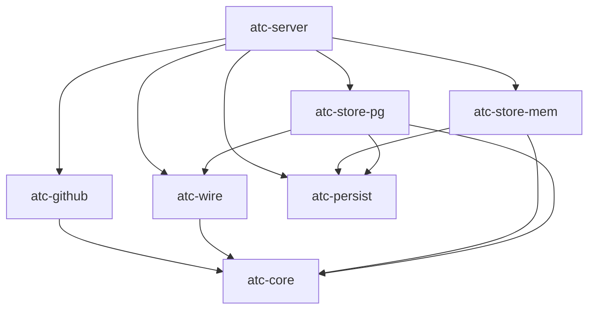
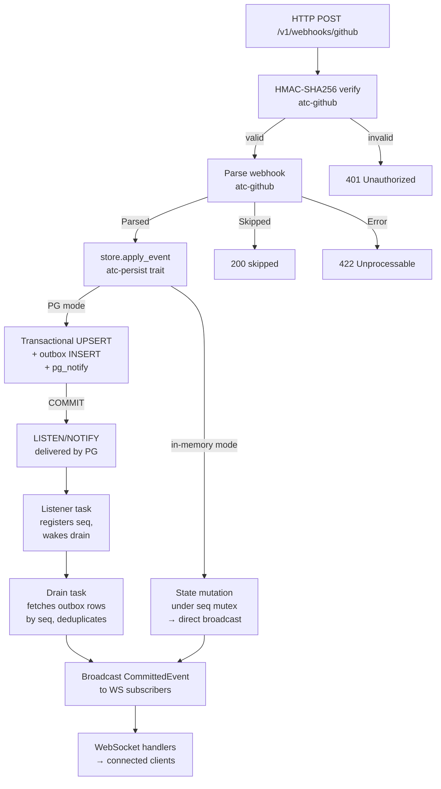
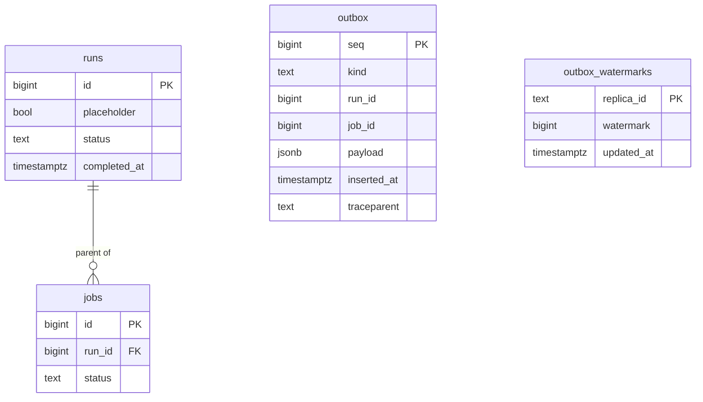
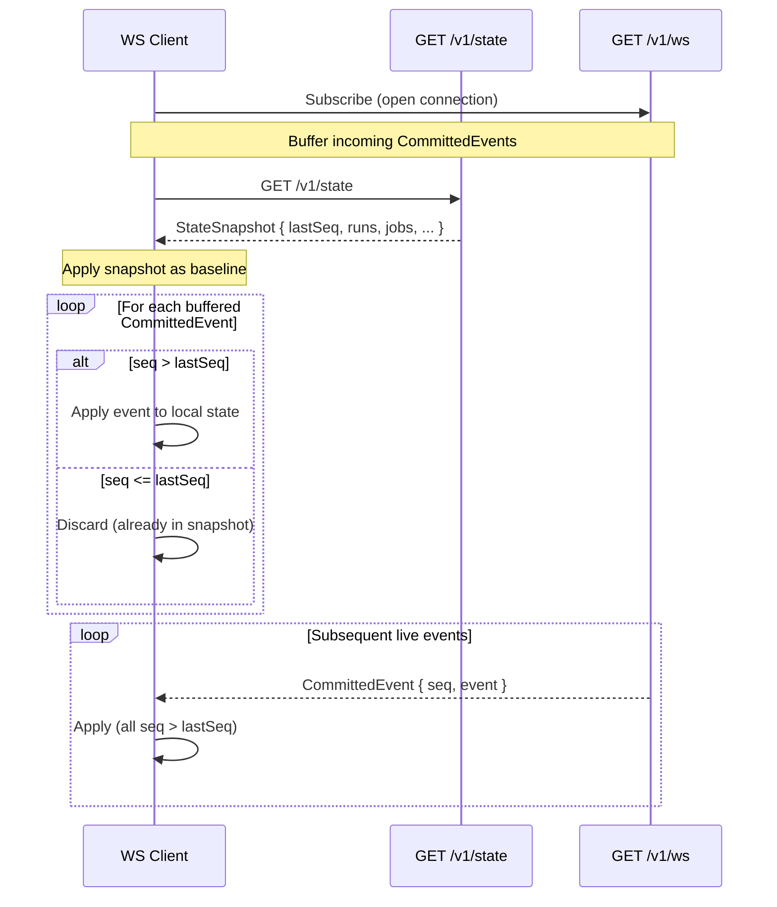
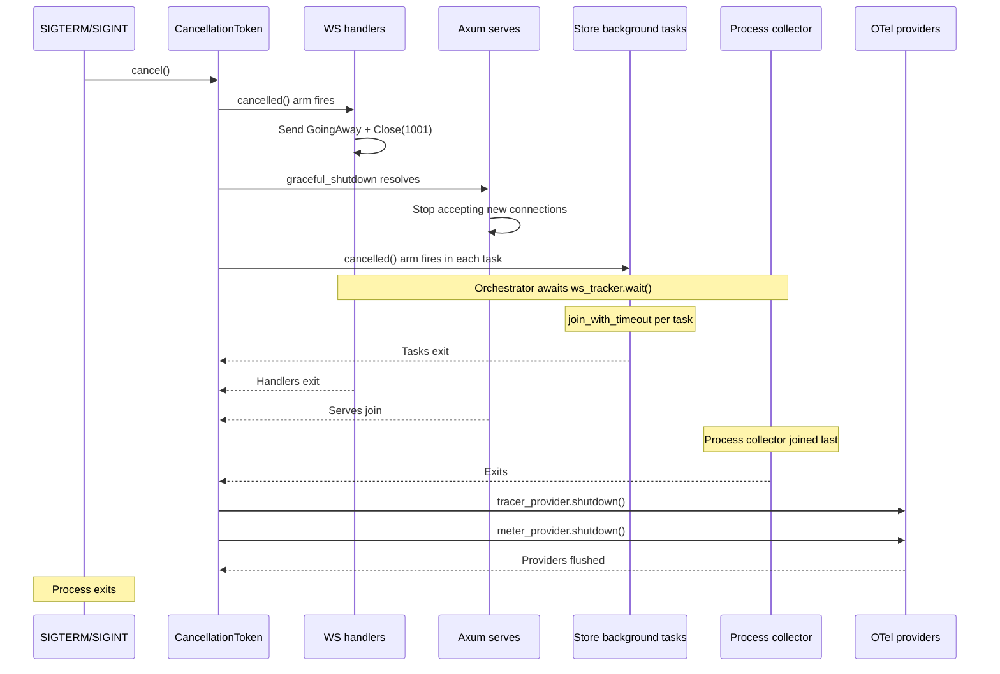

# Backend Server — Architecture

Last verified: 2026-05-23

`atc-server` is the single executable crate in the workspace. It wires the six library crates into a running Axum HTTP server: accepting GitHub webhook POST requests, verifying HMAC signatures, applying domain events to the active store, and delivering a real-time WebSocket stream plus a REST snapshot to the frontend. The persistence crate split is recorded in [ADR-0008](../architecture-decisions/0008-persistence-crate-split.md).

## Webhook → Outbox → Drain → Broadcast pipeline

A single GitHub webhook traverses this path end to end:

## Config hot-reload

The `config_watcher` task watches the parent directory of `$ATC_CONFIG_FILE` using `notify-debouncer-full` (500 ms debounce). Each debounced event triggers a narrow reload of the `runner_pools` block only — scalar fields are deliberately ignored. Outcomes:

- **Applied** — new capacities differ from the current `AppState` value. The watcher atomically replaces the `runner_pool_capacities` RwLock contents and broadcasts `ConfigEvent::Update` on the config channel. WS handlers receive it as `WireFrame::ConfigUpdate`.
- **No-op** — content unchanged. Counter increments; no broadcast.
- **Failure** — read/parse/validate error. Existing capacities stay in place; a `ConfigEvent::ReloadError` is broadcast so WS handlers can surface a banner.

A diagnostic scalar-drift check also runs on each reload: the watcher parses the full config and warns on any scalar field that changed but cannot be hot-reloaded (e.g., `http_addr`). This catches the "I edited it in YAML — why didn't it take effect" foot-gun without adding full hot-reload for scalars.

**Kubernetes ConfigMap atomic-swap:** kubelet projects the ConfigMap via a `..data` symlink that is atomically renamed on update. The watcher's parent-dir watch sees the rename. The Helm chart must mount the ConfigMap as a directory (no `subPath`) — `subPath` mounts block kubelet propagation and break hot-reload. See `docs/architecture/deployment.md` § "File-based configuration".

## Postgres schema

Migrations live in `backend/crates/atc-store-pg/migrations/`, embedded in the binary at compile time via `sqlx::migrate!`. They run automatically on startup. The schema currently has:

- `runs` and `jobs` tables: columns, FK, CHECK constraints, composite indexes for snapshot reads and TTL eviction.
- `outbox` table: `BIGSERIAL seq` primary key (durable monotonic cursor), `kind`, run/job IDs, `payload JSONB` (domain event envelope — not the wire type), `inserted_at`, and a nullable `traceparent` column for cross-trace causal links.
- `outbox_watermarks` table: per-replica heartbeat tracking for multi-replica outbox retention. Every write of `updated_at` uses a `Clock`-sourced timestamp (not `DEFAULT now()`) so `TestClock`-driven tests can advance time deterministically. See [ADR-0007](../architecture-decisions/0007-outbox-retention-policy.md).
- `runs.placeholder` column: FK-only stub rows created when a job event arrives before its parent run event. `/v1/state` reads `WHERE placeholder = false`. Stubs are promoted to real rows when the matching `workflow_run` webhook arrives.
- `runs.completed_at` column (added in a later migration): used by the composite index for display-TTL snapshot filtering.

**Placeholder note:** The `placeholder` mechanism provides out-of-order event tolerance at the storage layer. A job event always has a parent run to satisfy the FK constraint, even if the run event arrives later.

## Snapshot/stream reconciliation

A fresh WS client that joins mid-stream uses this protocol to guarantee no gaps and no duplicates:

`lastSeq = 0` is the cold-start sentinel (no events yet committed). The protocol ensures the client holds a consistent view at all times. In PG mode the snapshot may additionally include rows the drain has not yet broadcast — those accumulate in the WS buffer and are applied idempotently when their `CommittedEvent`s arrive.

## Storage mode invariants

ATC runs in one of two storage modes, selected at startup from environment:

- **External Postgres** (`ATC_DATABASE_URL` set) — production path. The webhook handler writes transactionally (UPSERT + outbox INSERT + `pg_notify`) and returns immediately. The drain task is the sole broadcaster; the WS stream is decoupled from the write path. Required for any deployment with more than one replica — the Helm chart's template-render guard refuses multi-replica without a Postgres URL. See `docs/architecture/deployment.md` § "Multi-replica constraints".
- **In-memory** (`ATC_DATABASE_URL` unset) — dev-only. Single-replica. Events broadcast directly from the webhook handler under the seq mutex. State is lost on process exit. Multi-replica deployments in this mode would silently fork state per replica with no convergence mechanism.

An invalid URL scheme (`ATC_DATABASE_URL` set to a non-`postgres://` / `postgresql://` value) causes the process to log and exit before making any sqlx calls. This mirrors the Helm chart's template-render-time guard.

**Startup behavior summary:**

| Scenario | Behavior |
|---|---|
| `ATC_DATABASE_URL` unset | In-memory mode; no migration step |
| Invalid URL scheme | Log + `process::exit(1)` before any DB call |
| Connect fails | `tracing::error!` + `process::exit(1)` |
| Connect succeeds, migrations fail | `tracing::error!` + `process::exit(1)` |
| DB lost at runtime | Process stays up; `/readyz` returns 503 |

## Supervision and shutdown

ATC uses a single `CancellationToken` shared across all supervised surfaces. Each store owns its background-task lifecycle (see [ADR-0006](../architecture-decisions/0006-stores-own-background-task-lifecycle.md)); the orchestration function in `shutdown.rs` joins them in sequence before the process exits.

OTel provider flush runs after every emitter has joined, so no live emitter is active when the providers flush.
