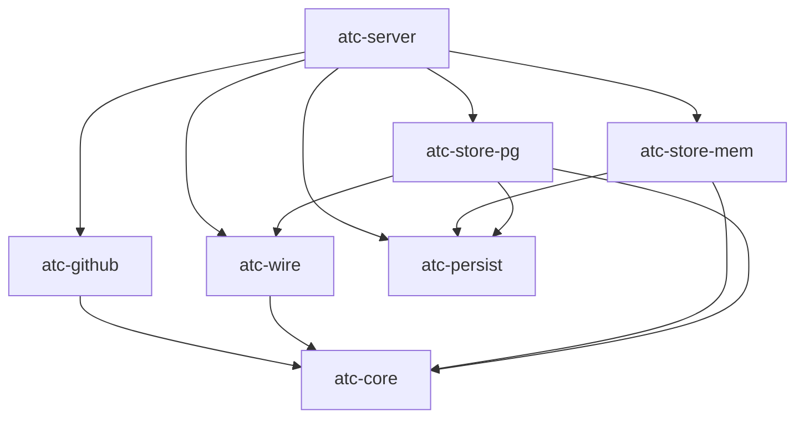
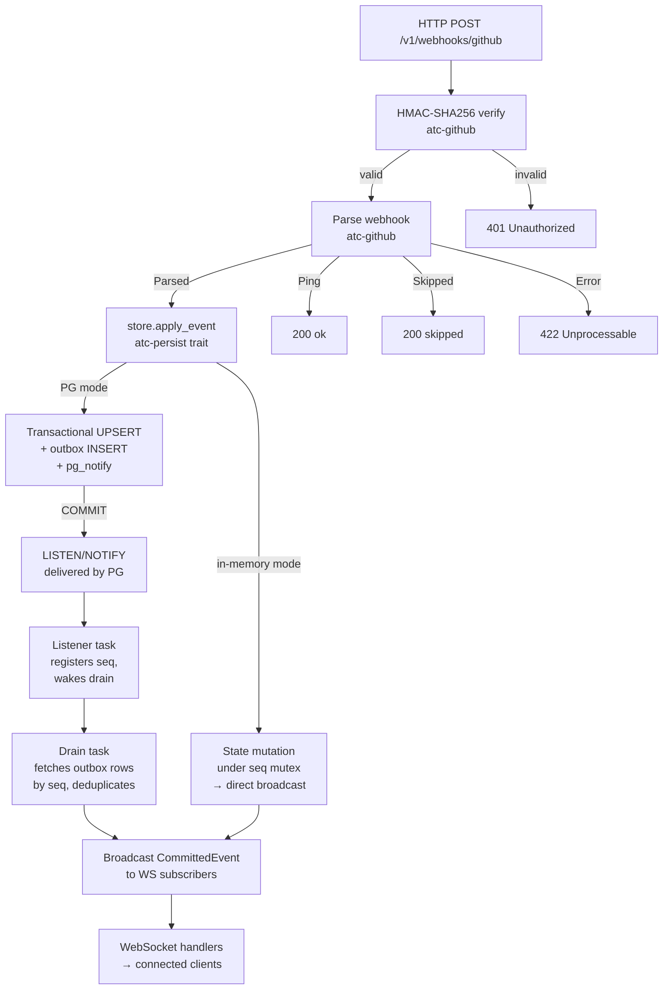
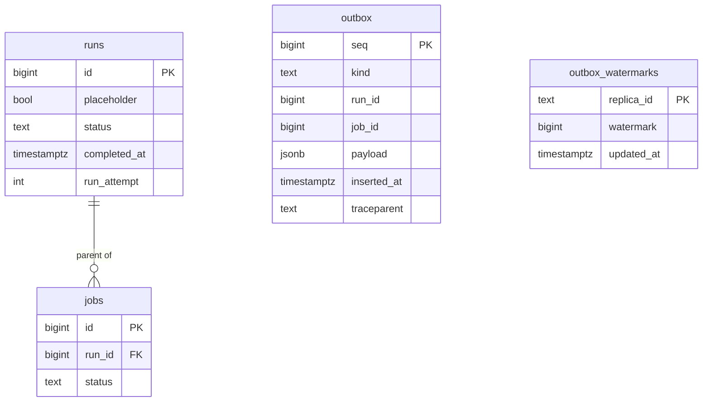
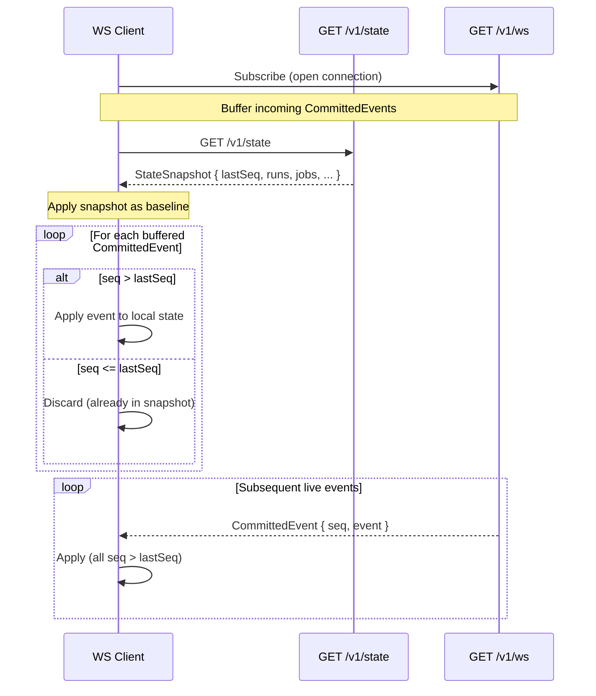
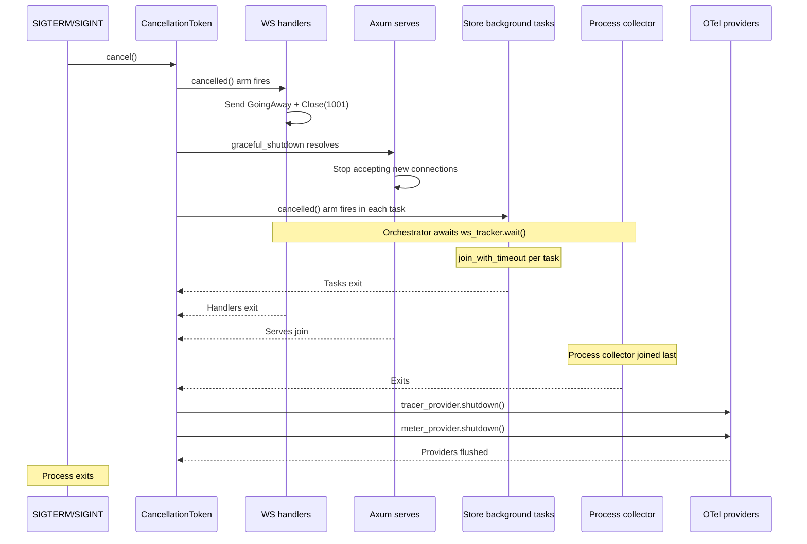

# Backend Server — Architecture

Last verified: 2026-05-30

`atc-server` is the single executable crate in the workspace. It wires the six library crates into a running Axum HTTP server: accepting GitHub webhook POST requests, verifying HMAC signatures, applying domain events to the active store, and delivering a real-time WebSocket stream plus a REST snapshot to the frontend. The persistence crate split is recorded in [ADR-0008](../architecture-decisions/0008-persistence-crate-split.md).

## Domain model and state-machine invariants

The domain types and their transition rules live in `atc-core` as pure, side-effect-free functions (`apply_run_event` / `apply_job_event`). Three invariants hold across both storage backends:

- **Forward-only.** Run and job status only advances (`Queued → InProgress → Completed`); a terminal `Completed` never reverts. The sole documented exception is a GitHub re-run, which arrives with a higher `run_attempt` and is handled at the persistence layer — see § "GitHub re-runs and `run_attempt`".
- **Idempotent reapplication.** Replaying the same event (same status target) is a no-op rather than an error. In PG mode this is enforced by the predicated UPSERT's predecessor set including the target status itself; in memory by the same-status short-circuit.
- **Conclusion implies completion.** A `conclusion` is only populated on the `Completed` transition and, once recorded, is preserved across idempotent replay (`completed_at` follows the same preserve-first rule).

These are verified by unit + proptest suites in `atc-core`. Crate-specific implementation notes (the predecessor-includes-self predicate, `completed_at` preserve-first) live in `backend/crates/atc-core/CLAUDE.md`.

Deterministic test fixtures for these types live in `atc-core`'s `test_support` module, gated on the `test-support` feature alongside `TestClock` / `fixed_test_timestamp`. It exposes event-envelope builders (`make_run_event`, `make_job_event`) and zero-arg domain-struct factories (`make_workflow_run`, `make_job`, `make_step`, `make_runner_info`) that callers specialize with struct-update syntax. Because the feature is opt-in via dev-dependency, cross-crate test code (e.g. `atc-server`'s in-memory store tests) builds domain values from this one canonical source rather than re-declaring the field lists.

## Webhook → Outbox → Drain → Broadcast pipeline

A single GitHub webhook traverses this path end to end:

`parse_webhook` (`atc-github`) returns one of three outcomes: `Parsed` (a
`workflow_run` / `workflow_job` translated to a domain event), `Ping` (a GitHub
connectivity check, no payload), or `Skipped` (a recognized-but-unhandled event
type — `push`, `pull_request`, …). Ping is a first-class variant rather than a
server-side string check, so the handler's match stays exhaustive.

### Webhook boundary logging

Every webhook outcome emits exactly one boundary log line so an operator can tell
"webhook never arrived" from "arrived but unhandled" from "handled but rejected"
at the default `info` filter. The level policy and the rationale for emitting
skipped/ping at INFO live in [metrics.md](metrics.md) § "Webhook boundary logs";
the lines are:

| Outcome | Level | Message | Fields |
|---------|-------|---------|--------|
| Ping | INFO | `ping received` | `event_type`, `delivery_id` |
| Skipped (unhandled type) | INFO | `event skipped` | `event_type`, `delivery_id` |
| State transition committed | INFO | `event accepted` | `event_type`, `seq`, `run_id`, `job_id` (jobs), `delivery_id` |
| Invalid transition (rejected) | WARN | `transition invalid; rejecting` | `event_type`, `run_id`, `job_id` (jobs), `delivery_id` |
| Missing signature header | WARN | `missing X-Hub-Signature-256 header` | `delivery_id` |
| Signature verification failed | WARN | `HMAC verification failed` | `delivery_id` |
| Parse failure | ERROR | `webhook parse error` | `error.message`, `event_type`, `delivery_id` |
| Persistence write failed | ERROR | `persistence write failed` | `error.message`, `event_type`, `delivery_id` |

`delivery_id` is the `X-GitHub-Delivery` header — GitHub's per-delivery
correlation id, recorded on the `webhook.handler` span and carried on **every**
emitted line (logged as the bare string value, empty when the header is absent) so
a line correlates to a specific GitHub delivery even in pretty (non-span-list) log
output. A request missing the `X-GitHub-Event` header is rejected `400` without a
log line — it never reaches a boundary outcome.

## Config hot-reload

The `config_watcher` task watches the parent directory of `$ATC_CONFIG_FILE` using `notify-debouncer-full` (500 ms debounce). Each debounced event triggers a narrow reload of the `runner_pools` block only — scalar fields are deliberately ignored. Outcomes:

- **Applied** — new capacities differ from the current `AppState` value. The watcher atomically replaces the `runner_pool_capacities` RwLock contents and broadcasts `ConfigEvent::Update` on the config channel. WS handlers receive it as `WireFrame::ConfigUpdate`.
- **No-op** — content unchanged. Counter increments; no broadcast.
- **Failure** — read/parse/validate error. Existing capacities stay in place; a `ConfigEvent::ReloadError` is broadcast so WS handlers can surface a banner.

A diagnostic scalar-drift check also runs on each reload: the watcher parses the full config and warns on any scalar field that changed but cannot be hot-reloaded (e.g., `http_addr`). This catches the "I edited it in YAML — why didn't it take effect" foot-gun without adding full hot-reload for scalars.

**Kubernetes ConfigMap atomic-swap:** kubelet projects the ConfigMap via a `..data` symlink that is atomically renamed on update. The watcher's parent-dir watch sees the rename. The Helm chart must mount the ConfigMap as a directory (no `subPath`) — `subPath` mounts block kubelet propagation and break hot-reload. See `docs/architecture/deployment.md` § "File-based configuration".

## Postgres schema

Migrations live in `backend/crates/atc-store-pg/migrations/`, embedded in the binary at compile time via `sqlx::migrate!`. They run automatically on startup. The schema currently has:

- `runs` and `jobs` tables: columns, FK, CHECK constraints, composite indexes for snapshot reads and TTL eviction.
- `outbox` table: `BIGSERIAL seq` primary key (durable monotonic cursor), `kind`, run/job IDs, `payload JSONB` (domain event envelope — not the wire type), `inserted_at`, and a nullable `traceparent` column for cross-trace causal links.
- `outbox_watermarks` table: per-replica heartbeat tracking for multi-replica outbox retention. Every write of `updated_at` uses a `Clock`-sourced timestamp (not `DEFAULT now()`) so `TestClock`-driven tests can advance time deterministically. See [ADR-0007](../architecture-decisions/0007-outbox-retention-policy.md).
- `runs.placeholder` column: FK-only stub rows created when a job event arrives before its parent run event. `/v1/state` reads `WHERE placeholder = false`. Stubs are promoted to real rows when the matching `workflow_run` webhook arrives.
- `runs.completed_at` column (added in a later migration): used by the composite index for display-TTL snapshot filtering.
- `runs.run_attempt` column (added in migration `0008`): GitHub's 1-based attempt counter, reused across re-runs. Drives the re-run reset path in the run UPSERT predicate — see § "GitHub re-runs and `run_attempt`".

**Placeholder note:** The `placeholder` mechanism provides out-of-order event tolerance at the storage layer. A job event always has a parent run to satisfy the FK constraint, even if the run event arrives later.

## GitHub re-runs and `run_attempt`

GitHub's "Re-run jobs" / "Re-run all jobs" feature reuses the **same `run_id`** and increments a `run_attempt` counter (1 for the initial run, 2+ for re-runs). Without special handling this collides with ATC's forward-only run state machine: a completed/cancelled run is already in a terminal `Completed` status, so the re-run's `workflow_run` `requested`/`in_progress` event would be rejected — the predicated UPSERT's `WHERE runs.status = ANY(predecessors)` guard matches no rows, the event is dropped, and the re-run never surfaces on the dashboard.

The fix threads `run_attempt` (parsed from the webhook in `atc-github`) through `RunEventEnvelope` and onto `WorkflowRun`. The detection that "a higher attempt means start fresh" is deliberately a **persistence-layer concern**, not a domain rule:

- **`atc-core`** stays forward-only. `apply_run_event` copies `run_attempt` onto the resulting run but never compares attempts or resets state. The pure transition functions remain side-effect-free and attempt-agnostic.
- **`atc-store-pg`** extends the run UPSERT predicate to `WHERE (runs.status = ANY(predecessors) AND EXCLUDED.run_attempt = runs.run_attempt) OR EXCLUDED.run_attempt > runs.run_attempt`. The same-attempt clause on the status branch rejects a *delayed lower-attempt* event (an attempt-1 `completed` arriving after attempt 2 is live would otherwise match, since `InProgress` is a valid predecessor of `Completed`, and regress the run). When a higher attempt arrives, the row updates even from a terminal status, and `conclusion` / `completed_at` / `run_started_at` use `CASE` expressions that take the incoming value (rather than `COALESCE`-preserving the prior one) so the terminal state is cleared for the new attempt. `run_attempt` is always written from `EXCLUDED`.
- **`atc-store-mem`** achieves the same semantics by passing `None` (not the existing run) to `apply_run_event` when `env.run_attempt > existing.run_attempt`, and rejecting a lower attempt outright.

The two stores must stay behaviorally aligned on this path.

**Jobs are attempt-scoped too.** A re-run's jobs arrive under the same `run_id` with fresh job IDs, so prior-attempt job rows accumulate. `jobs.run_attempt` (migration `0009`, parsed from the `workflow_job` payload) records each job's attempt; the snapshot read filters jobs to `j.run_attempt >= r.run_attempt` (and the in-memory store applies the same parent-attempt filter), so a reopened run's card drops the prior attempt's stale jobs. The comparison is `>=`, not `=`: GitHub emits no `workflow_run.requested` for a queued re-run, so the first signal can be a `workflow_job.queued` at attempt 2 while the run row is still attempt 1 — those queued jobs must stay visible, so only strictly-lower (stale) attempts are dropped. In steady state no job outlives its run's attempt, so nothing mixes. Filtering on read — rather than deleting prior-attempt rows on re-run — is also safe under webhook reordering. A higher-attempt job additionally bypasses the parent-run display-TTL cutoff: if a long-completed run is re-run and the queued job arrives before the run event, the parent row is still the aged-out prior attempt, and gating the fresh job on it would hide queued demand. The frontend run store mirrors the attempt filter in its `jobStatsByRun` / `jobsByRunId` / `jobs` derivations.

## Snapshot/stream reconciliation

A fresh WS client that joins mid-stream uses this protocol to guarantee no gaps and no duplicates:

`lastSeq = 0` is the cold-start sentinel (no events yet committed). The protocol ensures the client holds a consistent view at all times. In PG mode the snapshot may additionally include rows the drain has not yet broadcast — those accumulate in the WS buffer and are applied idempotently when their `CommittedEvent`s arrive.

## Storage mode invariants

ATC runs in one of two storage modes, selected at startup from environment:

- **External Postgres** (`ATC_DATABASE_URL` set) — production path. The webhook handler writes transactionally (UPSERT + outbox INSERT + `pg_notify`) and returns immediately. The drain task is the sole broadcaster; the WS stream is decoupled from the write path. Required for any deployment with more than one replica — the Helm chart's template-render guard refuses multi-replica without a Postgres URL. See `docs/architecture/deployment.md` § "Multi-replica constraints".
- **In-memory** (`ATC_DATABASE_URL` unset) — dev-only. Single-replica. Events broadcast directly from the webhook handler under the seq mutex. State is lost on process exit. Multi-replica deployments in this mode would silently fork state per replica with no convergence mechanism.

An invalid URL scheme (`ATC_DATABASE_URL` set to a non-`postgres://` / `postgresql://` value) causes the process to log and exit before making any sqlx calls. This mirrors the Helm chart's template-render-time guard.

**Startup behavior summary:**

| Scenario | Behavior |
|---|---|
| `ATC_DATABASE_URL` unset | In-memory mode; no migration step |
| Invalid URL scheme | Log + `process::exit(1)` before any DB call |
| Connect fails | `tracing::error!` + `process::exit(1)` |
| Connect succeeds, migrations fail | `tracing::error!` + `process::exit(1)` |
| DB lost at runtime | Process stays up; `/readyz` returns 503 |

Every `tracing::error!`/`warn!` call site across the workspace (including the ones above) follows the `error.message = %e` field-naming convention in [`metrics.md` § Span attribute conventions](metrics.md#span-attribute-conventions) — a literal `error` field collides with Honeycomb's derived boolean `error` column and silently drops the message.

## Staleness sweep

Both storage modes run a periodic sweep that force-completes non-terminal runs/jobs GitHub never sent a terminal webhook for, with conclusion `Stale`. See [ADR-0013](../architecture-decisions/0013-staleness-sweep-synthetic-completion.md) for the full design rationale — this section covers only the current shape.

**Shared predicate.** `atc_core::state_machine::is_stale_job` / `is_stale_run` are pure predicates beside `is_evictable`. A job is stale when it's `Queued` or `InProgress` (never `Waiting` — the FSM has no `Waiting -> Completed` transition, so a `Waiting` job can never be force-completed and is excluded from candidacy entirely) and `now - GREATEST(created_at, started_at) > staleness_threshold`; a run is stale when non-terminal, `now - updated_at > staleness_threshold`, *and* it has zero non-terminal jobs — the non-terminal-jobs guard prevents a long-running self-hosted job from getting its parent run falsely swept, since `runs.updated_at` only bumps on run-level webhooks.

**PG mode** (`atc-store-pg/src/store/staleness.rs`): rides the existing outbox sweep task (`retention::spawn_outbox_sweep`) rather than a separate task — both run on the identical 300s quiet-first-tick cadence, so the staleness pass is piggybacked onto the outbox sweep's tick the same way that task already piggybacks its watermark cleanup. Each tick sweeps jobs first, then runs, so a run's non-terminal-jobs guard reflects jobs already force-completed earlier in the same tick. Per candidate row: `SELECT ... FOR UPDATE SKIP LOCKED`, re-check the row is still non-terminal, build a synthetic `Completed { conclusion: Stale }` envelope from the locked row, and write it through the same `upsert_*_in_txn` + `insert_outbox_*_in_txn` + `notify_outbox_seq_in_txn` helpers the webhook handler uses. `SKIP LOCKED` means a second replica racing the same row gets `None` back immediately rather than blocking — no double-write is possible. `staleness_threshold: None` skips just the staleness pass each tick; the outbox sweep itself always runs.

**In-memory mode** (`atc-store-mem/src/lib.rs`): wired into the existing eviction-tick task rather than a separate task — no row locks exist in this store, so the race against a real webhook is resolved by `apply_*_event`'s own forward-only transition check instead: whichever call lands first wins, and the loser gets `Err(InvalidTransition)`, logged at debug and ignored.

**Config:** `staleness_threshold: Option<Duration>` (`ATC_STALENESS_THRESHOLD`), default 48h, floor 6h, restart-only. See `docs/architecture/deployment.md` § "Staleness sweep" for the operator-facing knob.

## Supervision and shutdown

ATC uses a single `CancellationToken` shared across all supervised surfaces. Each store owns its background-task lifecycle (see [ADR-0006](../architecture-decisions/0006-stores-own-background-task-lifecycle.md)); the orchestration function in `shutdown.rs` joins them in sequence before the process exits.

OTel provider flush runs after every emitter has joined, so no live emitter is active when the providers flush.
