# CI Pipeline — Architecture

Last verified: 2026-05-23

The CI pipeline spans two workflow files. `ci.yml` gates every merge and every push to main: it lints, type-checks, tests, and builds the Rust backend, Svelte frontend, and Helm chart. `zizmor.yml` scans GitHub Actions workflow files for security violations and reports findings to the Security tab. The two are intentionally separate so the security linter runs only when workflow files change rather than on every commit.

All Linux jobs run on pinned GitHub-hosted runners (`ubuntu-24.04` for amd64, `ubuntu-24.04-arm` for arm64). macOS jobs use `macos-26`. All `runs-on` labels are pinned to versioned tags — never `*-latest` — so runner-OS changes appear as reviewable diffs. `ubuntu-24.04-arm` provides native arm64 compilation; no QEMU emulation in either the CI or the release pipeline.

## Job structure and path filtering

On pull requests, `ci.yml` path-filters each stack: backend jobs only trigger when `backend/` changes, frontend jobs when `frontend/` changes, helm jobs when `deploy/helm/` changes. Two jobs always run regardless of which files changed: PR title validation (commitlint against the PR title) and dependency review. On push to main the path filters are dropped and all stacks run unconditionally.

A gate job per stack (`backend-result`, `frontend-result`, `helm-result`) translates "skipped due to path filter" into a passing status check. GitHub branch protection cannot distinguish a skipped job from a failed one; the gate pattern makes a Rust-only PR pass all required checks without triggering helm validation.

```mermaid
flowchart TD
    PR[pull_request event]
    PUSH[push to main]

    PR --> PATHB{backend/ changed?}
    PR --> PATHF{frontend/ changed?}
    PR --> PATHH{deploy/helm/ changed?}
    PR --> ALWAYS[PR title validate\nDependency review]

    PATHB -->|yes| BFMT[cargo fmt]
    PATHB -->|yes| BCLIP[cargo clippy]
    PATHB -->|yes| BCHECK[cargo check --locked]
    PATHB -->|yes| BTEST[cargo llvm-cov --locked]
    PATHB -->|no| BSKIP[skip]

    PATHF -->|yes| FLINT[eslint / svelte-check]
    PATHF -->|yes| FTEST[vitest + playwright]
    PATHF -->|yes| FBLD[vite build]
    PATHF -->|no| FSKIP[skip]

    PATHH -->|yes| HLINT[helm-lint\nhelm unittest]
    PATHH -->|yes| HVAL[helm-validate\n2 k8s × 10 values]
    PATHH -->|yes| HINST[helm-install\nkind + ct install]
    PATHH -->|no| HSKIP[skip]

    BFMT & BCLIP & BCHECK & BTEST & BSKIP --> BGATE[Backend Result]
    FLINT & FTEST & FBLD & FSKIP --> FGATE[Frontend Result]
    HLINT & HVAL & HINST & HSKIP --> HGATE[Helm Result]

    PUSH --> BFMT2[cargo fmt]
    PUSH --> BCLIP2[cargo clippy]
    PUSH --> BCHECK2[cargo check --locked]
    PUSH --> BTEST2[cargo llvm-cov --locked]
    PUSH --> FLINT2[eslint / svelte-check]
    PUSH --> FTEST2[vitest + playwright]
    PUSH --> FBLD2[vite build]
    PUSH --> HLINT2[helm-lint / helm unittest]
    PUSH --> HVAL2[helm-validate]
    PUSH --> HINST2[helm-install]

    BFMT2 & BCLIP2 & BCHECK2 & BTEST2 --> BGATE2[Backend Result]
    FLINT2 & FTEST2 & FBLD2 --> FGATE2[Frontend Result]
    HLINT2 & HVAL2 & HINST2 --> HGATE2[Helm Result]
```

## Backend job

All cargo invocations use `--locked` ([ADR-0008](../architecture-decisions/0008-persistence-crate-split.md) established the four-crate workspace; `--locked` makes CI fail loudly when any `Cargo.toml` edit lands without a committed `Cargo.lock` regeneration, preventing dependency drift across developer machines, CI, and released artifacts).

The backend job runs two cargo build passes: `cargo test --workspace --lib -- export_bindings` first (to verify ts-rs type generation without compiling the full integration binary), then `cargo llvm-cov --workspace` for coverage. Reordering verify-types before coverage ensures deps built without instrumentation are reused by the coverage pass rather than rebuilt in the opposite direction.

`RUSTFLAGS="-C link-arg=-fuse-ld=mold"` is set at the job level. `lld`'s parallel link stage exceeded available memory when linking large test binaries on GitHub-hosted runners, producing reproducible `SIGBUS` linker crashes. `mold` uses a fundamentally different incremental linking approach with much lower peak memory. A leading `jlumbroso/free-disk-space` step reclaims ~10–15 GB of preinstalled software the backend job never uses; without it the coverage build hits "No space left on device" mid-link.

Tests run via `cargo llvm-cov` (built-in `cargo test`) in CI rather than `cargo nextest run`. Local `just test` uses nextest and gets ~9× parallelism on a multi-core machine. On the 4-vCPU GitHub-hosted runner, nextest's per-test-process model multiplies coverage-instrumentation init cost across ~319 processes (vs. ~30 binary processes under `cargo test`), and concurrent testcontainers boots contend on the Docker daemon. The measured CI wall-clock time was longer under nextest. Local tooling keeps using nextest; CI keeps using `cargo llvm-cov`.

### Shared testcontainers `atc-test-pg` container

Backend integration tests share a single Postgres container (`atc-test-pg`) across test processes via the testcontainers `reusable-containers` feature. Each test gets its own freshly-created database inside that container (`CREATE DATABASE test_<pid>_<nanos>_<counter>`). This gives full schema independence (each test runs migrations from zero) without transaction-rollback tricks that break tests asserting on database state visible across connections.

Booting a Postgres container takes ~1.5 s and Docker daemon boot-pressure is the dominant cost in a parallel test run. Sharing one container with `ReuseDirective::Always` means the entire workspace pays that boot cost once; subsequent test processes attach to the already-running container. The `atc-server` architecture doc ([`backend-server.md`](backend-server.md) § Postgres schema) describes the schema under test — the outbox retention policy tested here is defined in [ADR-0007](../architecture-decisions/0007-outbox-retention-policy.md).

Two retry loops protect against races:

1. **Container creation race.** `ReuseDirective::Always` does an `inspect → create` sequence that is not atomic. Concurrent test processes can both pass the `inspect`, then one wins `docker create` while the others get a 409 Conflict. The first loop retries `start()` with exponential backoff (50 ms doubling, capped at ~4 s).

2. **Postgres-readiness race.** Even once the container exists, the Postgres process inside may still be starting. The second loop retries the admin connection with the same exponential backoff. Typical convergence is <1 s.

In CI (single ephemeral runner per job), the container starts on first `start_pg()` and dies with the runner; no cumulative residue. Locally, the container persists between test runs. `just cleanup-test-pg` (`docker rm -f atc-test-pg`) is the cleanup primitive when local storage footprint becomes uncomfortable.

## Helm validation

Helm validation spans three jobs that land under the single `helm-result` gate.

`helm-lint` runs `helm lint` and `helm unittest` — both are k8s-version-independent (no API server needed), so they run once in a single job.

`helm-validate` runs a 2 × 10 sweep: two Kubernetes API versions (the chart's declared `kubeVersion` floor and the current stable) × ten values fixtures representing distinct feature surfaces (defaults, ingress, gateway, multi-replica, otel, existing-secret-listener, pdb, networkpolicy, autoscaling, and a ct-install fixture). The sweep runs sequentially inside a single runner via `scripts/helm-kubeconform.sh`, which loops over both k8s versions × all values files, delegates each pair to `scripts/helm-kubeconform-one.sh`, collects results, and emits a Markdown pass/fail table to `$GITHUB_STEP_SUMMARY`. Running 20 combinations sequentially on one runner consumes one runner slot; kubeconform is fast enough (network-bound on the first CRD schema fetch; subsequent runs hit the OS page cache) that wall-clock time is not a concern.

`scripts/helm-kubeconform-one.sh` passes `--kube-version` to `helm template` so Helm enforces the chart's own `kubeVersion` constraint at render time. Without that flag, kubeconform validates resource schemas but a chart declaring an incompatible `kubeVersion` renders green anyway. The supplemental schema location is `datreeio/CRDs-catalog`, which provides community-maintained schemas for `HTTPRoute` (gateway.networking.k8s.io/v1) and other CRDs absent from the upstream Kubernetes JSON schema repository, enabling `--strict` mode without false negatives.

`helm-install` goes deeper: it spins up a kind cluster, `kind load`s the chart's container image, and runs `ct install` (chart-testing) — which exercises admission, controller acceptance, Pod readiness (`/healthz`, `/readyz`), and the in-cluster `helm test` hook. `ct install` validates against a real API server and catches cluster-side regressions that kubeconform cannot see (admission policies, CRD ordering, probe configuration drift, image references that don't start). It runs against a single k8s version and values fixture because the cluster spinup cost makes a full matrix prohibitive.

## Zizmor security scan

`zizmor.yml` runs when workflow files change. Findings appear in the GitHub Security tab as advisories rather than as required status checks. Zizmor findings are security improvement opportunities, not merge blockers; surfacing them in the Security tab allows triage without blocking PRs on first occurrence.

## Dependency updates

Mend Renovate manages every dependency surface (Cargo, npm/pnpm, Dockerfile, docker-compose, GitHub Actions, mise) under one configuration at `renovate.json`. It extends `config:best-practices`, which bundles digest pinning for Docker FROMs and GitHub Action `uses:` references, dev-dependency pinning, weekly lockfile maintenance, the npm security minimum-release-age, and abandoned-package surfacing.

The auto-merge policy: a 3-day release-age delay gives upstream time to yank or patch before ATC's CI sees the bump; security advisories (via `osvVulnerabilityAlerts: true`) bypass the delay and auto-merge non-major updates; major versions open a PR but require manual review. Several packages carry explicit no-automerge overrides — `ts-rs` and `sqlx` (bumps cross compile-time contracts: regenerated TypeScript types and sqlx macros), and the cross-repo `opentelemetry ecosystem` group (four upstream repos that must coordinate together). Conventional-commit prefix mapping: runtime dependency bumps land as `fix(deps):` (release-please ships a patch release); dev/tooling bumps land as `chore(deps):` (no release). See `renovate.json` for the full configuration.

The release pipeline boundary ([`release-pipeline.md`](release-pipeline.md)) is: `ci.yml` gates merges; `release.yml` runs on tags created by release-please. Release-please's role in the toolchain is recorded in [ADR-0011](../architecture-decisions/0011-release-toolchain.md). The release PR's own CI passes under the same `--locked` rule because release-please includes a bot-driven `Cargo.lock` refresh in the release PR itself.

## mise tool provisioning

`.mise.toml` lists every tool the project needs across all surfaces. Jobs that need only a subset (`helm`, `kubeconform`, `helm + ct`) set `install: false` on `mise-action` and run an explicit `mise install <tools>` to avoid dragging in the full Rust toolchain plus `cargo install` of sqlx-cli and cargo-nextest on every cold runner. The Backend and Frontend jobs provision their primary language runtimes via `dtolnay/rust-toolchain` and `setup-node` respectively; they also set `install: false`.

`cargo:` tools in `.mise.toml` install via `cargo-binstall` (prebuilt binaries) rather than `cargo install` (compile from source). `MISE_CARGO_BINSTALL=1` in the `.mise.toml` `[env]` block tells mise to invoke `cargo-binstall`, downloading prebuilt release binaries in seconds rather than compiling from source (2–4 minutes per tool on a fresh runner). This speedup applies equally to local `mise install` cold-starts.
