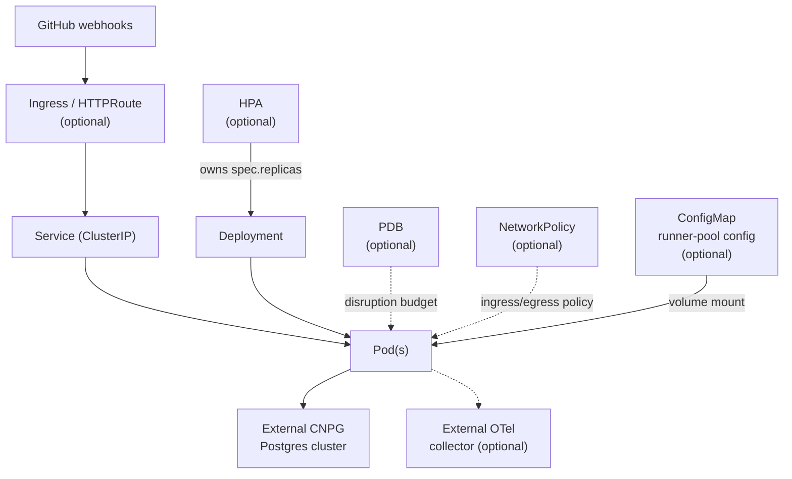
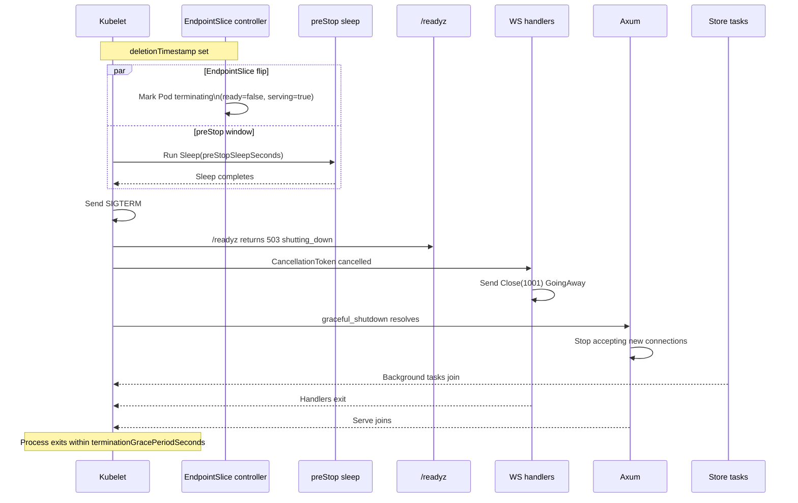

# Deployment — Architecture

Last verified: 2026-05-23

The ATC Helm chart (`deploy/helm/atc/`) packages the ATC server for any conformant Kubernetes cluster. Every install produces a `Deployment`, a `ClusterIP Service`, and a dedicated `ServiceAccount`. Optional resources — `Ingress`, `HTTPRoute`, `HorizontalPodAutoscaler`, `PodDisruptionBudget`, `NetworkPolicy`, a dashboard `ConfigMap`, and a runner-pool `ConfigMap` — are each gated behind independent values flags that default to disabled, so the minimal install is as simple as possible. The chart is published via two parallel channels on the tag-triggered release workflow: an OCI artifact at `oci://ghcr.io/bojanrajkovic/charts/atc` (Sigstore-attested) and a classic HTTP Helm repo on GitHub Pages at `https://bojanrajkovic.github.io/atc/charts` — the Pages channel is recommended for consumers without GHCR authentication. See `docs/architecture/release-pipeline.md` for the release workflow shape. The CI pipeline validates the chart on every PR — see `docs/architecture/ci-pipeline.md` for the helm-validate sweep and the `helm install` kind + chart-testing job.



## Storage modes and multi-replica constraints

The chart supports two storage modes — ephemeral in-memory and external Postgres — per [ADR-0003](../architecture-decisions/0003-state-cursor-contract-and-operator-policy.md). SQLite was considered as a single-replica durable option and rejected: it has no `LISTEN/NOTIFY` equivalent, so supporting it would require dual SQL flavors with different forwarder implementations (Postgres push, SQLite poll). The maintenance and test-matrix cost outweighs the value of a PVC-backed single-replica mode. The chart carries no `persistence.*` values block, no PVC template, and no conditional volume mounts — an operator values file that includes a `persistence:` key will be rejected at install time by the `values.schema.json` `additionalProperties: false` guard.

Deployment strategy is a constant `RollingUpdate` (`maxSurge: 1, maxUnavailable: 0`) regardless of storage mode. Both modes are RWO-volume-free at the application layer, so neither can suffer the `ReadWriteOnce`-volume foot-gun that would drive a conditional `Recreate`. Ephemeral mode tolerates rolling pod handoff because state loss is implicit at restart; Postgres mode tolerates it because replicas are symmetric (per [ADR-0002](../architecture-decisions/0002-state-externalization-postgres-outbox.md) D5). Rolling-update behavior is also what makes the graceful-shutdown contract tractable — see the diagram below. Rolling updates have reconnect-UX implications for connected WebSocket clients — see `docs/architecture/frontend-app.md` for how the client handles gaps during pod restarts.

`replicaCount > 1` requires a PostgreSQL connection string via either `config.databaseUrl` or `existingSecret.database.name` + `existingSecret.database.urlKey`. A `{{ fail }}` guard at the top of `templates/deployment.yaml` rejects the combination at template-render time. The same guard fires when `autoscaling.enabled` is true with `autoscaling.maxReplicas > 1`, because the HPA can scale to that ceiling — any unguarded ceiling above 1 admits divergent in-memory state. The guard also validates that an inline `config.databaseUrl` uses the `postgres://` or `postgresql://` scheme; the `existingSecret.database` path is opaque at render time and falls through to a startup-time scheme check inside the binary that exits with a remediation-naming log line before any sqlx connect call.

**PgBouncer and listener-URL compatibility.** When the main pool (`ATC_DATABASE_URL`) connects through transaction-mode PgBouncer, the underlying connection is reassigned between transactions, silently dropping `LISTEN` registrations. Point `ATC_DATABASE_LISTENER_URL` (or `config.databaseListenerUrl` / `existingSecret.database.listenerUrlKey`) at a direct Postgres DSN or a session-mode PgBouncer endpoint. When neither is set, the listener falls back to `ATC_DATABASE_URL` and no separate env entry is injected.

**Runtime multi-replica invariants** (per-replica `broadcast_watermark`, REPEATABLE READ snapshots, 2048-seq ring-buffer dedup) are described in `docs/architecture/backend-server.md` § Storage mode invariants. Sticky sessions are NOT required and are discouraged — reconnect-then-snapshot via `/v1/state` + `lastSeq` is the design; sticky sessions mask gap-healing regressions. The chart ships `podAntiAffinity: soft` by default, spreading replicas across nodes without refusing to schedule in single-node homelab clusters; set `hard` for strict spread or `off` to omit the block entirely.

## Configuration surface

`atc-server` loads config through the [`figment`](https://docs.rs/figment) crate: struct-field defaults (lowest priority) → YAML file at `$ATC_CONFIG_FILE` (default `/etc/atc/config.yaml`, missing file is benign) → `ATC_`-prefixed environment variables (highest priority). Env carries scalar overrides only; structured config (`runner_pools`) is file-only because figment's env provider does not natively decode arrays of objects.

The operator-facing `ATC_*` variables wired by the chart:

- **`ATC_GITHUB__WEBHOOK_SECRET`** — enables HMAC-SHA256 validation of `X-Hub-Signature-256` on incoming webhook payloads; unset means unsigned payloads are accepted (safe only behind a network or proxy layer). Set via `config.github.webhookSecret` (plain value) or `existingSecret.githubWebhook.name` + `existingSecret.githubWebhook.secretKey` (Secret reference, wins when both are set). Not injected when neither is configured — leaving validation off is an operator decision, not a chart error.
- **`ATC_DATABASE_URL`** — Postgres connection string. Required for Postgres mode; selects in-memory mode when absent. See above for scheme validation and multi-replica guard.
- **`ATC_DATABASE_LISTENER_URL`** — optional; overrides the listener connection when `ATC_DATABASE_URL` points at transaction-mode PgBouncer. Settable via `config.databaseListenerUrl` or `existingSecret.database.listenerUrlKey`.
- **`ATC_OUTBOX_RETENTION`** — humantime duration (`7d`, `24h`, `90m`). Controls how long the PG-mode outbox sweep retains rows. Default `7d`; hard floor of `1h` (startup exits with `PgStoreStartError::RetentionTooShort` below the floor). The sweep's safety floor never deletes rows below `MIN(broadcast_watermark)` across non-stale replicas. Rolling deploy must complete within the retention window — the default `7d` makes this a non-constraint in practice. Set via `config.outboxRetention`. Three metrics track retention health — see `docs/architecture/metrics.md`. See [ADR-0007](../architecture-decisions/0007-outbox-retention-policy.md) for the design rationale.
- **`ATC_DISPLAY_TTL`** <a name="atc_display_ttl"></a> — humantime duration (`1h`, `30m`, `2h`). Controls the kanban/flat-jobs visibility window for completed runs and jobs; completed entries older than `now - ATC_DISPLAY_TTL` are filtered from `/v1/state` and aged out of the live UI. Underlying rows are not deleted — display TTL gates visibility, not data lifetime. Default `1h`; hard floor of `60s`. Restart-only: editing the config file produces a scalar-drift warn-log; the value applies on the next pod roll. In-memory mode (dev-only) has a hardcoded 1 h completed-eviction TTL that wins when `ATC_DISPLAY_TTL > 1h`. Set via `config.displayTtl`. See [ADR-0009](../architecture-decisions/0009-display-vs-data-retention.md) for the design rationale.

Per-credential secrets are independent: `existingSecret.githubWebhook.name` and `existingSecret.database.name` reference separate Secrets (e.g. a CNPG-managed `atc-cluster-app` for database credentials and an operator-managed `atc-webhook-secret` for the webhook secret) — no duplication required.

## Runner-pool ConfigMap and hot-reload

The chart renders a `ConfigMap` and a read-only `volumeMount` at `/etc/atc` only when `runnerPools` is non-empty. The values shape:

```yaml
runnerPools:
  - labels: [self-hosted, linux, x64]
    capacity: 10          # bounded — renders running/10 with a saturation bar
  - labels: [ubuntu-latest]
    capacity: null        # unbounded — renders an ∞ affordance
```

`values.schema.json` enforces the per-entry shape: `labels` is a non-empty array of unique strings; `capacity` is required and is either an integer ≥ 1 or `null`. Omitting the `capacity` key is rejected with a clear error — operators must be explicit about unbounded pools. Server-side validation canonicalizes labels (sort + dedup) and rejects two entries that canonicalize to the same set.

**Directory mount, not `subPath`.** The chart mounts the ConfigMap at `mountPath: /etc/atc` (directory). Kubernetes documents that `subPath` ConfigMap mounts do NOT receive updates — hot-reload requires the directory mount. kubelet projects the ConfigMap via an atomic `..data` symlink swap; the watcher's parent-dir watch sees the rename and triggers a reload within 90 s end-to-end (kubelet sync ~60 s + 500 ms debounce).

Only `runner_pools` hot-reloads. Scalar fields (`http_addr`, `database_url`, retention settings) produce a scalar-drift warn-log advising the operator to roll the pod. Reload failures (malformed YAML, deleted file, duplicate pool) keep the previous valid capacities in place. See `docs/architecture/backend-server.md` § Config hot-reload for the watcher implementation and WS framing details.

## OpenTelemetry

When `otel.enabled: true`, the chart injects five `OTEL_*` env vars and a set of downward-API pod-identity attributes into the container. When disabled (the default), no `OTEL_*` env vars are injected — the OTel SDK is never initialized and there is no background-task overhead. The chart documents the dependency on an operator-run collector; it does not bundle one. Operators bring their own (Grafana Alloy, opentelemetry-collector-contrib, vendor distributions).

The five env-var-to-helm-key mappings:

- `OTEL_EXPORTER_OTLP_ENDPOINT` ← `otel.endpoint` — OTLP/HTTP collector URL, e.g. `http://otel-collector.observability:4318`. Required when enabled.
- `OTEL_SERVICE_NAME` ← `otel.serviceName` — resource attribute identifying the service. Defaults to `"atc"`.
- `OTEL_RESOURCE_ATTRIBUTES` ← `otel.resourceAttributes` — comma-separated `key=value` pairs appended after the auto-injected `k8s.*` prefix (see below).
- `OTEL_TRACES_SAMPLER` ← `otel.sampler` — trace sampler. Defaults to `parentbased_always_on`.
- `OTEL_TRACES_SAMPLER_ARG` ← `otel.samplerArg` — sampler argument (e.g. `"0.1"` for 10% root sampling with `parentbased_traceidratio`). A render-time guard fails if `otel.sampler` is a ratio sampler and `otel.samplerArg` is empty.

Transport is HTTP/protobuf only; `OTEL_EXPORTER_OTLP_PROTOCOL` is not injected and gRPC is out of scope.

**Pod-identity attributes.** When OTel is enabled, four downward-API env vars (`OTEL_K8S_POD_NAME`, `OTEL_K8S_POD_NAMESPACE`, `OTEL_K8S_POD_UID`, `OTEL_K8S_NODE_NAME`) are wired and prepended to `OTEL_RESOURCE_ATTRIBUTES` as standard OTel k8s semantic-convention fields. Operator-supplied `otel.resourceAttributes` are appended after this prefix, so an explicit `k8s.*` override wins by virtue of coming later in the comma-separated list.

## Routing and network policy

Two optional routing templates are provided at the same chart version: a classic `networking.k8s.io/v1 Ingress` (gated on `ingress.enabled`) for clusters with a conventional ingress controller (nginx, Traefik), and a `gateway.networking.k8s.io/v1 HTTPRoute` (gated on `gateway.enabled`) for clusters running a Gateway API controller (Envoy Gateway, Cilium). The default is neither — the post-install `NOTES.txt` covers port-forward instructions.

An optional `networking.k8s.io/v1 NetworkPolicy` renders when `networkPolicy.enabled=true` (default `false`). The `policyTypes` field mirrors which of `ingress` / `egress` **keys are present** under `networkPolicy`, not whether their lists have rules — setting `ingress: []` renders a `policyTypes: [Ingress]` entry with an empty rule list (Kubernetes' deny-all-ingress semantics), while omitting `ingress` entirely drops that direction from `policyTypes` (no constraint). Rule items are passed through verbatim via `toYaml`.

Default rules are permissive: inbound to the chart's HTTP port from any namespace, DNS to `kube-system`, and outbound TCP/443 for the GitHub API. Postgres egress is intentionally absent from the defaults — the chart does not know the database's network topology. Operators restrict ingress `from` peers and add a database egress rule scoped to their topology in a values overlay. Verify that the cluster's CNI enforces NetworkPolicy before enabling (Calico, Cilium, kube-router — many CNIs install without enforcement, making the resource a no-op).

## Autoscaling

The chart renders an optional `autoscaling/v2 HorizontalPodAutoscaler` gated on `autoscaling.enabled`. When enabled, `spec.replicas` is dropped from the Deployment so the HPA owns the replica count. The HPA targets CPU utilization at `autoscaling.targetCPUUtilizationPercentage` (default 80) and, when non-null, memory at `autoscaling.targetMemoryUtilizationPercentage`. Setting a target to `null` omits the corresponding metric.

A render-time guard pairs each utilization target with the corresponding resource request: enabling CPU utilization without `resources.requests.cpu` (or memory without `resources.requests.memory`) fails the render with a remediation message — metrics-server would silently refuse to scale without the request set.

The multi-replica Postgres precondition extends to `autoscaling.maxReplicas > 1` (because the HPA can scale to that ceiling; `replicaCount` is ignored when autoscaling is active):

- `autoscaling.enabled: true`, `autoscaling.maxReplicas: 1` → valid for in-memory single-replica installs.
- `autoscaling.enabled: true`, `autoscaling.maxReplicas > 1` → requires a Postgres URL; render-time `{{ fail }}` if absent.

Key knobs: `autoscaling.minReplicas` (default 1), `autoscaling.maxReplicas` (default 5).

## PodDisruptionBudget

An optional `policy/v1 PodDisruptionBudget` renders when `podDisruptionBudget.enabled: true` (default `false`). Single-replica deployments gain nothing from a PDB; multi-replica operators should opt in explicitly. The Kubernetes API rejects both `minAvailable` and `maxUnavailable` on the same PDB object — the chart enforces mutual exclusion at render time. Both fields accept an integer or a percentage string (e.g. `"50%"`). The PDB selector uses `atc.selectorLabels` (`app.kubernetes.io/name` + `app.kubernetes.io/instance`), intentionally excluding chart-version labels so the selector stays immutable across upgrades.

For three or more replicas, `maxUnavailable: 1` allows concurrent node drains without stalling cluster maintenance; the default `minAvailable: 1` is the conservative choice for two-replica deployments.

## Graceful shutdown

The chart pairs Kubernetes' pod-termination lifecycle with the cooperative in-process shutdown orchestration in `atc-server`. The operative knobs are `shutdown.preStopSleepSeconds` (default 5) and `shutdown.terminationGracePeriodSeconds` (default 30). The relationship `terminationGracePeriodSeconds >= preStopSleepSeconds + ~13 s` (the server's aggregate cooperative budget) should hold — the chart does not enforce this as a render guard, but operators tuning either value downward should keep it in mind.

The `lifecycle.preStop` action uses Kubernetes' native `Sleep` action (KEP-3960, beta default-on in 1.30, GA in 1.33; the chart sets `kubeVersion: ">=1.32.0-0"`). The native action is required because the runtime image is `gcr.io/distroless/cc-debian13:nonroot` — it ships no `/bin/sleep` or shell, so an `exec` preStop would `ENOENT`. Set `shutdown.preStopSleepSeconds: 0` to disable the hook entirely (the chart omits the `lifecycle` block, because Kubernetes rejects `Sleep.Seconds <= 0`).



`/readyz` also short-circuits to 503 `{"status":"shutting_down"}` once the shutdown token is cancelled, independently of the EndpointSlice flip — this is what cloud-LB controllers (AWS LBC, GCE NEG, Azure AGIC) and service meshes that watch readiness probes directly observe. `/healthz` continues returning 200 unconditionally throughout; the liveness probe must not restart the pod mid-drain. The rolling-update reconnect-UX implications for WebSocket clients are described in `docs/architecture/frontend-app.md`.

## Pod security defaults

The chart ships restricted Pod Security Standards as the default values (`podSecurityContext` and `securityContext`), matching what the distroless `:nonroot` image already guarantees at UID 65532. Both contexts are exposed in `values.yaml` and `values.schema.json` and can be overridden via `--set` for legitimate operator edge cases (storage CSI drivers with non-standard UID constraints, sidecars requiring writable root filesystems, profilers needing elevated capabilities). Organizations enforcing restricted PSS cluster-wide should do so via `ValidatingAdmissionPolicy` or Kyverno at the cluster level, not chart-level immutability.

Pod-level defaults: `runAsNonRoot: true`, `runAsUser/runAsGroup/fsGroup: 65532`, `seccompProfile.type: RuntimeDefault`. Container-level defaults: `allowPrivilegeEscalation: false`, `readOnlyRootFilesystem: true`, `capabilities.drop: [ALL]`, `seccompProfile.type: RuntimeDefault`.

## Authentication

ATC ships no built-in authentication. The SPA, `GET /v1/state`, and `GET /v1/ws` are all unauthenticated; `POST /v1/webhooks/github` validates HMAC-SHA256 signatures only when `ATC_GITHUB__WEBHOOK_SECRET` is configured. Anyone who can reach the HTTP port can read every run, job, and runner-pool record. ATC is designed to live inside a trusted network surface and accept the surrounding deployment's identity model. The three supported access-control patterns are private network (VPC, homelab subnet, Tailscale tailnet), authenticating reverse proxy (Pomerium, oauth2-proxy, Authelia + nginx/Caddy, Cloudflare Access), and ingress annotations (`ingress.annotations` pass-through for nginx `auth_request`, Traefik middleware chains, etc.).

Per-proxy recipes, cross-cutting gotchas (WebSocket `Origin` validation, cookie `SameSite`, idle-timeout starvation), and the path-split layout that lets `/v1/webhooks/github` bypass auth while the rest of the surface is gated: [`docs/operator/authentication.md`](../operator/authentication.md).

## Grafana dashboard

The chart ships an opt-in Grafana dashboard at `deploy/helm/atc/dashboards/atc-overview.json` covering HTTP traffic, webhook ingestion, PG outbox + drain pipeline, watermarks, retention, startup/shutdown lifecycle, process resource usage, config reloads, and WebSocket client lifecycle. Two discovery paths are supported from one chart-shipped JSON:

- **kube-prometheus-stack Grafana sidecar** (`kiwigrid/k8s-sidecar`): enable with `grafanaDashboard.enabled: true`. The sidecar discovers ConfigMaps labeled `grafana_dashboard: "1"` (the label is configurable via `grafanaDashboard.labels`).
- **grafana-operator v5 `GrafanaDashboard` CR**: additionally set `grafanaDashboard.grafanaOperator.enabled: true`. The CR's `spec.configMapRef` references the same ConfigMap. Requires grafana-operator CRDs and a `Grafana` CR matched by `grafanaDashboard.grafanaOperator.instanceSelector`.

Both can be enabled simultaneously when transitioning between discovery mechanisms or running both in parallel.

Key knobs: `grafanaDashboard.namespace` (override ConfigMap namespace; empty renders in release namespace), `grafanaDashboard.annotations` (common: `grafana_folder: "ATC"`, `k8s-sidecar-target-directory`), `grafanaDashboard.grafanaOperator.folderRef`, `grafanaDashboard.grafanaOperator.resyncPeriod`.

Every panel's datasource reference uses a `${datasource}` template variable of type `datasource` with `query: prometheus`, so Grafana resolves it against whichever Prometheus datasource(s) the operator has configured — no chart-side string substitution. Panel queries use the native histogram form (`Base2ExponentialHistogram`); operators running collectors that emit only classic histograms must translate to the classic `_bucket`-based form. See `docs/architecture/metrics.md` § Histogram aggregation.

**Collector label shape matters.** Dashboard panel selectors and the `pod` template variable use `k8s_pod_name` — the label that Grafana Alloy's `otelcol.exporter.prometheus` with `resource_to_telemetry_conversion = true` promotes from the `k8s.pod.name` OTLP resource attribute. Operators using Prometheus scrape discovery (kube-prometheus-stack sidecar) will see `pod` instead; those operators must adjust the `pod` template variable query (`label_values(atc_build_info, pod)`) and the `k8s_pod_name=~"$pod"` selectors throughout. Health-check routes (`/healthz`, `/readyz`) are excluded from all HTTP panels via `http_route!~"/healthz|/readyz"` to avoid inflating request-rate and latency panels with liveness-probe traffic.

## Helm chart testing

`helm-unittest` suites live in `deploy/helm/atc/tests/unit/*.yaml` and are run via `helm unittest deploy/helm/atc`. The CI helm-validate sweep and the `helm install` kind + chart-testing job are described in `docs/architecture/ci-pipeline.md`.

Assert on: security invariants (PSS restricted fields in the default render, so a future PR that removes one ships a visible test failure), conditional-branch flips (both sides of every business-logic branch), `{{ fail }}` guards (every guard gets a dedicated test that sets the conflicting values and asserts the render fails with the expected message — an untested guard can be silently broken by a refactor), and cross-template invariants (e.g. a volume's name must match the Deployment's `volumeMount`).

Skip: tautological field assertions on static content, rendered-kinds-under-defaults assertions, and content assertions on optional templates beyond what a conditional-branch or invariant check requires.

## Multi-replica smoke test

The runbook for verifying multi-replica fan-out (kubectl commands, expected broadcast behaviour, diagnostic queries) lives in [`docs/operator/multi-replica-smoke-test.md`](../operator/multi-replica-smoke-test.md).
