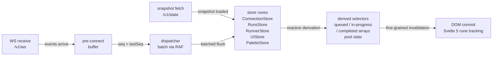
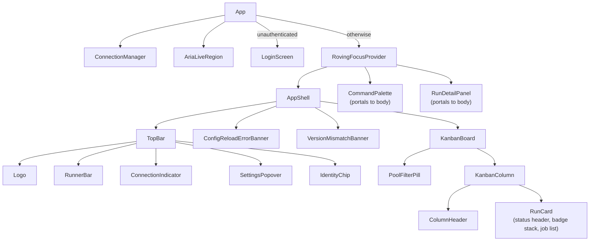
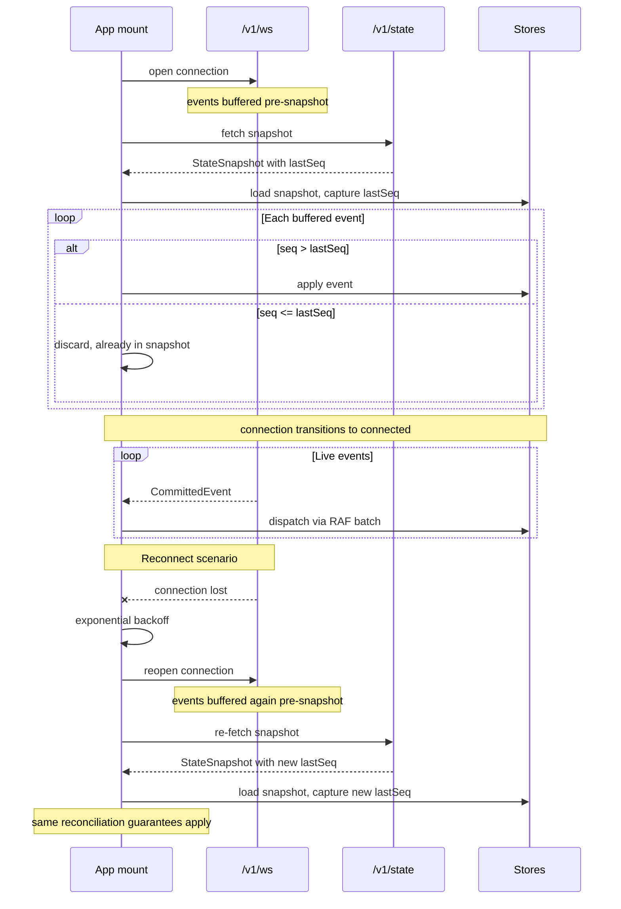
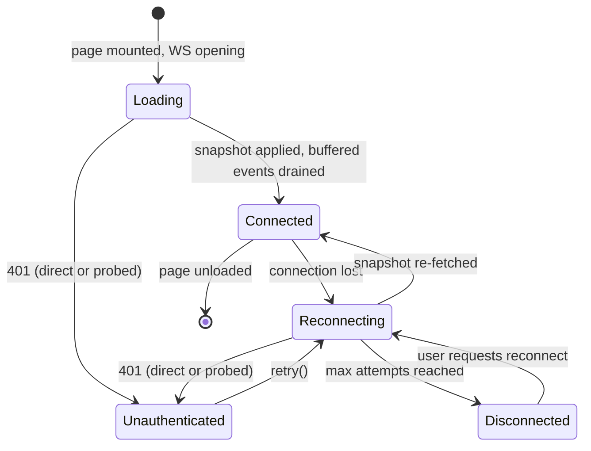
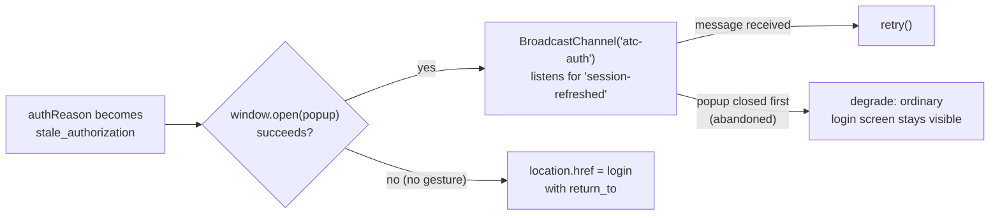

# Frontend App — Architecture

Last verified: 2026-05-23

The frontend is a standalone Svelte 5 single-page application built with Vite. It connects to the backend over a WebSocket, buffers events before the snapshot fetch completes, reconciles state using a monotonic sequence cursor, and renders a real-time kanban via Svelte 5 rune-class stores. Tailwind v4 with an OKLCH design system drives theming. The build output is a static bundle embedded into the Rust binary via rust-embed. The framework and toolchain choices are recorded in [ADR-0012](../architecture-decisions/0012-frontend-stack.md).



## Component hierarchy

ConnectionManager is a service component (no rendered DOM) that mounts and destroys the WebSocket client. RovingFocusProvider is a context-only wrapper that carries 2D arrow-key navigation state. CommandPalette and RunDetailPanel portal their overlay content to `document.body` — in the Svelte component tree they are siblings of AppShell under RovingFocusProvider, not children of it. App renders LoginScreen instead of the RovingFocusProvider subtree while `connectionStore.status === 'unauthenticated'`; ConnectionManager and AriaLiveRegion stay mounted either way.



## Connection Protocol

The frontend uses a WS-first protocol with pre-connect buffering and sequence-cursor reconciliation.



Two reconciliation guarantees follow from this protocol: no gaps (every event after `lastSeq` is applied in order) and no duplicates (events at or below `lastSeq` are already reflected in the snapshot and are discarded). `lastSeq = 0` is the cold-start sentinel — no events committed yet. The contract is monotonic, not gapless; aborted Postgres transactions consume sequence values without producing events. See [ADR-0003](../architecture-decisions/0003-lastseq-cursor.md) for the multi-replica operator policy and the cursor design.

On connection loss, the client reconnects with exponential backoff. After the maximum attempt count is exhausted the manager gives up: the connection store transitions to a terminal disconnected state, and the connection indicator promotes from a status chip to a button the user can click to re-arm the loop. Reconnect re-fetches the full snapshot — there is no incremental sync. Rolling-update behavior affecting reconnect UX (the operator-toggleable preStop sleep, EndpointSlice drain) is documented in [deployment.md](deployment.md).

A 401 is an authentication outcome, not an outage, and does not enter the backoff loop. On the state fetch, a 401 body's `reason` (`auth_required` or `stale_authorization`) is parsed directly. A WS that fails before it opens carries no such body — browsers do not surface a failed upgrade's HTTP status — so the manager probes `/v1/state` once, bounded by a 5-second timeout so a request that's accepted but never answered still falls through to the ordinary backoff path, to tell an auth rejection apart from a real outage; a non-401 probe result (or a probe that itself fails or times out) falls through to the ordinary backoff path unchanged. Either path clears the runs store — the server has just said this session may not see that data, and a repo revoked mid-session (or a long-stale unauthenticated window before the user re-authenticates) must not leave it on screen — before moving the connection store to `unauthenticated` with the parsed reason. `retry()` clears the reason and re-enters the normal connect sequence (fresh WS + snapshot fetch) via the existing reconnect signal — the entry point auth-flow completion (login popup / redirect) calls once a session is re-established.

## App Lifecycle State Machine



The Loading state covers the window between page mount and the first successful snapshot load. No kanban cards render in this state. Connected is the live steady state. Reconnecting introduces an exponential backoff delay before each re-attempt; the backoff counter resets to zero when a reconnect succeeds, so the operator can re-arm the loop indefinitely via the reconnect button. Unauthenticated is terminal until `retry()`: no backoff timer runs, and no further network attempts are made. WebSocket event instrumentation (latency histograms, connection lifecycle metrics) is cataloged in [metrics.md](metrics.md).

## Login Screen and Identity Chrome

App renders `LoginScreen` in place of the entire dashboard (AppShell, kanban, palette, detail panel) while `connectionStore.status === 'unauthenticated'` — the login prompt is quiet and minimal by design, not a banner layered over a half-populated shell. `ConnectionManager` and `AriaLiveRegion` stay mounted regardless, since `ConnectionManager` is what will detect a re-authenticated session and drive `retry()`. Entering unauthenticated also closes the command palette (`paletteStore.close()`, alongside `runStore.clear()`, in `ConnectionManager`'s `transitionToUnauthenticated`) — `paletteOpen` is a module-level singleton that `CommandPalette` binds to directly, so without this a palette toggled open while the login screen is showing would spring back open, unprompted, the moment the dashboard remounts after sign-in. `LoginScreen`'s "Sign in with GitHub" control computes `return_to` from `window.location` at click time, not at mount — the URL can change while the screen stays mounted (e.g. a stale `?run=` deep link stripped once its run is gone from the just-cleared `runStore`), and the redirect target should reflect wherever the user actually is when they click.

`IdentityChip`, mounted in `TopBar`, fetches `GET /v1/auth/me` exactly once — on the first `connected` transition, guarded by a component-local flag so a later reconnect does not re-fetch, bounded by the same probe timeout `connection.ts` uses (`AUTH_PROBE_TIMEOUT_MS`) so a request that's accepted but never answered doesn't permanently suppress the chrome. A 200 populates `connectionStore.identity` (`{ login, repoCount, reposRefreshedAt, stale }`) — but only if the session hasn't since gone unauthenticated, since a revocation elsewhere in the app can resolve while this fetch is still in flight and would otherwise resurrect a stale identity moments after `enterUnauthenticated()` cleared it — and the chip renders the GitHub login name plus a logout control; any other response (401, or 404 when `auth.mode = "none"` — the endpoint isn't mounted) leaves `identity` null and the chip renders nothing. `enterUnauthenticated()` also clears `identity`, so a session that goes stale or gets revoked mid-visit doesn't leave a stale login name in the header. Logout `POST`s `/v1/auth/github/logout` then hard-reloads to `/`, landing back on `LoginScreen` once the cleared cookie takes effect.

`KanbanBoard`'s ordinary "connected, zero runs" empty state distinguishes two causes via `identity`: `repoCount === 0` (signed in, but the app∩user∩webhook intersection is empty) gets its own message via `EmptyState`'s `message` prop; everything else (including `mode = "none"`, where `identity` is always null) falls through to the default "Watching for runs." caption.

## Popup-First Staleness Re-Auth

`LoginScreen` auto-attempts a silent re-auth the moment `connectionStore.authReason` becomes `stale_authorization` — unlike `auth_required` (no prior GitHub session to refresh; always needs the explicit "Sign in with GitHub" click), staleness usually means the browser's own github.com session is still live and can re-derive the repo set with no visible interruption.



`window.open` is called synchronously inside the `$effect` that observes the reason change (wrapped in a `try`/`catch` — a sandboxed embedding without `allow-popups` can throw rather than return `null`) — calling it from an async continuation would already have lost any transient user activation, so there would be nothing to check. Most of the time there's no activation at all (an unattended dashboard reconnecting after a deploy), and `window.open` returns `null`; that's the expected common case, not a failure — the full-page redirect is what makes an unattended session self-heal. When a popup does open, the callback page (server-side, `POPUP_CALLBACK_HTML` in `auth.rs`) posts `'session-refreshed'` on a `BroadcastChannel` named `'atc-auth'` and self-closes; `LoginScreen` never sends anything back, it only listens and then calls `connectionStore.retry()`, which is what actually re-fetches the snapshot and reopens the WS — the popup round-trip never touches the main tab's connection.

If the user closes the popup manually instead of completing the flow, a `setInterval` poll on `popup.closed` notices. Detecting `closed` doesn't immediately tear down the channel: `window.close()` in the callback page runs right after `postMessage`, and BroadcastChannel delivery is asynchronous, so the poll can observe the popup as closed a moment before an already-sent `'session-refreshed'` message actually arrives. The poll stops immediately but gives the channel a one-second grace window before closing it, so a message already in flight still lands instead of being silently discarded — only after that window with no message does it degrade to the ordinary login screen.

`popupInFlight` (a `$state` field, read `untrack`'d inside the effect's own guard check to avoid a read-your-own-write dependency cycle) serves two purposes: it guards against opening a second popup while one is already open, and — since the backend's OAuth flow cookie is a single slot per browser, not scoped per popup/tab — it disables the manual "Sign in with GitHub" link while a popup is in flight, so a concurrent click can't overwrite the popup's flow and fail both with a state mismatch. `cleanup()` also closes the popup window itself (not just the channel/timers), so a session refreshed through some other path doesn't leave the popup orphaned mid-flow.

## Store Architecture

Five rune-class stores are module-level singletons. Five is the design ceiling; a sixth store requires justification at the same level of specificity that introduced the fifth.

- **Connection store** — tracks connection status (disconnected, connecting, connected, reconnecting, unauthenticated), reconnect attempt count, last event timestamp, server version reference, mismatch flag, config reload error state, the parsed 401 reason (`auth_required` | `stale_authorization`) plus a `retry()` entry point while unauthenticated, and the fetched `/v1/auth/me` identity (`{ login, repoCount, reposRefreshedAt, stale } | null`) once `IdentityChip` populates it. Does not manage the WebSocket lifecycle directly; that belongs to the ConnectionManager service component.

- **Runs store** — holds the map of workflow runs and per-run job lists. Receives and applies run and job events from the dispatcher. Derives three sorted arrays (queued ascending by creation time, in-progress descending by start time, completed descending by update time, each with a run-id tiebreaker). Sorting uses direct lexical ISO-8601 string comparison — no date parsing, no precision loss. The completed array also applies a display-TTL filter driven by an operator-configured duration stamped on each snapshot; completed rows age out reactively as the clock advances, without a new event arriving. The per-run job derivations (`jobStatsByRun`, `jobsByRunId`, `jobs`) drop jobs whose `runAttempt` is *lower* than the parent run's — a GitHub re-run reuses the run ID with fresh job IDs at a higher attempt, so prior-attempt jobs are excluded from counts and views (mirroring the backend's `j.run_attempt >= r.run_attempt` read filter). The comparison keeps current-or-higher attempts: a queued re-run job can arrive at a higher attempt before the run row advances (GitHub emits no `requested` for a queued re-run), and must stay visible. On `applyRunEvent`, a higher attempt also resets the run's terminal fields. Operator-declared runner pool capacities from the snapshot are held here as well; the runner store's derived pool computation reads them. See [ADR-0003](../architecture-decisions/0003-lastseq-cursor.md) for the multi-replica reasoning behind snapshot-stamped TTL.

- **Runner store** — a single fully-derived store: its pool list is computed from the runs store's job list and capacity declarations with no independent state. Pool statistics (running count, queued count, total capacity) are computed by a pure exported function that the derivation calls. The pool key used for capacity lookup is a branded TypeScript type to prevent label-sort-order mismatches between wire and JS representations — see [ADR-0001](../architecture-decisions/0001-pool-key-branded-type.md). Runner pool stats are derived on the frontend rather than delivered from the backend to keep multi-replica concurrent writes from racing; see [ADR-0004](../architecture-decisions/0004-frontend-derived-pool-stats.md).

- **UI store** — local state only: theme, mode, density, the selected run ID (which run's detail panel is open), the selected job ID (which job to scroll to on panel open), the last trigger run ID (focus restoration after panel close), the active pool filter, and a shared wall-clock signal that feeds live duration derivations across all cards.

- **Palette store** — separated from the UI store to keep keystroke-rate query mutations (one per character) from co-locating with low-frequency preference state. Carries palette open/close state, the search query, a session-scoped LRU of recently visited run IDs (persisted to sessionStorage), and the active submenu.

**Derivation chain.** The runs store derives sorted filtered arrays; the runner store derives pool stats from those jobs; the UI store's wall-clock signal drives per-card duration re-derivations. Svelte 5's fine-grained dependency tracking means a card whose run is in the completed state with a non-action-required conclusion never subscribes to the clock signal — that derivation short-circuits before reading it.

**Pool filter flow.** The active pool filter lives in the UI store as a branded `PoolKey`. The command palette and runner pool clicks write it; a filter pill in the top bar reads and clears it; both the kanban board and the roving focus provider's visible-column derivation apply `filterRunsByPool` to produce the filtered arrays that feed the DOM.

## Dialog Stacking and Focus Management

CommandPalette (a Bits UI Command.Dialog) and RunDetailPanel (a Bits UI Sheet, itself a Dialog) can be open simultaneously. Both portal their overlay and content to document.body. Getting Esc-unwind, click-outside, and backdrop suppression right requires understanding two independent Bits UI stacking mechanisms.

**DialogRootContext (Svelte lexical context) — drives `data-nested`**. When a Bits UI Dialog renders inside another Dialog's component tree, the inner dialog sees a non-null parent via Svelte context. CommandPalette and RunDetailPanel are siblings in App.svelte's component tree — both land in `<body>` after portal, but neither is a Svelte-tree child of the other. No `DialogRootContext` parent is established; `data-nested` never appears on either overlay when both are open.

**`bitsEscapeLayers` and `bitsDismissableLayers` (global insertion-order maps) — drive Esc and interact-outside behavior**. Bits UI maintains global maps of registered dialog layers in mount order. The topmost registered layer handles each event first. This is what enables sibling palette + panel stacking: the palette, mounted last, is found first by `findLast`; first Esc closes the palette. The panel uses `defer-otherwise-close` for both Esc and interact-outside; with only the panel open, `findLast` reaches the panel and the defer policy falls through to close it.

**Backdrop suppression.** Both portal overlays are appended to document.body in mount order: panel first, then palette. A single CSS rule hides every overlay after the first:

```css
[data-dialog-overlay] ~ [data-dialog-overlay] {
  display: none;
}
```

The `[data-nested]` alternative would not have matched here — the sibling combinator is the correct selector for this portal topology.

**Focus restoration.** RunCard instances unmount and remount when runs change columns, making stored element references dangle. Focus restoration uses a stable-attribute query pattern instead: when the palette closes with the panel still open, `onCloseAutoFocus` queries the panel's close button by its stable `aria-label`; when the panel closes, it queries the originating card's inner button via a `data-run-id` attribute written by RunCard. The `data-run-id` attribute survives remounts; a stored element reference would not.

**Roving focus.** The kanban grid implements 2D arrow-key navigation via roving tabindex without adopting the WAI-ARIA grid or listbox contract. A context-only provider component (no DOM element) wraps the app subtree and owns two state cells: the currently focused run ID and whether the kanban grid holds focus. A Svelte action attached to the grid element handles focusin, focusout, and keydown events; pure geometry functions resolve arrow-key moves over the visible-column tuple. Each RunCard derives its tabindex from the focused run ID and imperatively focuses its inner button when it becomes the target. Suspension is structural: when the palette or panel opens, Bits UI moves focus into its portaled DOM outside the kanban grid, and the action's keydown listener silences naturally without any explicit coordination flag. Roving state lives in Svelte context rather than a store because it is component-scoped — it dies with the kanban and needs no persistence.

## URL Deep-Link Projection

`uiStore.selectedRunId` is the canonical source of truth for "the detail panel is open on run X". The URL is a read projection of it.

Two pure helpers in `url-state.ts` handle parsing and formatting: one parses `?run=` into a bigint (or null), the other returns a relative URL mutating only the `run` key while preserving all other query params and the hash. Bigints preserve precision for 64-bit GitHub run IDs.

Three pieces of plumbing in App.svelte wire the projection:

- **Outbound effect** (`selectedRunId` → URL): reads the current run ID and the parsed URL run param; calls `history.pushState` only when the two values disagree semantically. A flag gates the effect's first execution to prevent it from stripping the URL before hydration fires. The comparison is semantic (bigint or null equality), not string equality — string comparison would treat URL-encoded and canonical representations of the same params as different and push spurious history entries.

- **Inbound popstate handler** (URL → `selectedRunId`): on back/forward navigation, parses the new URL and assigns `selectedRunId` if the referenced run is present in the store. If the run is unknown (evicted since the entry was pushed), `history.replaceState` strips the param and the selection clears — adding a history entry for "URL pointed at nothing, we scrubbed it" would trap the user in a back-button loop.

- **Hydration effect** (gated on first `connected` transition): the first `connected` transition is the earliest moment `runStore.runs` reflects the server snapshot. If the initial URL carried a `?run=` param and the referenced run is present, `selectedRunId` is assigned and the panel opens. If the run is unknown, `replaceState` strips the param. The effect fires once; subsequent reconnects do not re-trigger it.

## Deploy Detection and Config Error Banners

**Version mismatch banner.** The backend sends a `ServerHello` frame as the first text frame on every new WS connection carrying the backend's semver version. The first observed version in a tab session becomes the reference. A subsequent reconnect that sees a different version sets a mismatch flag and arms a 30-second countdown. The banner renders as a full-width strip in AppShell with a "Refresh now" button and a CSS-animated countdown bar. A new mismatched version refreshes the deadline; the same mismatched version repeating does not. The reference is in-memory only — a page refresh wipes it and the new bundle's first `ServerHello` matches the running backend.

**Config reload error banner.** The backend broadcasts a `ConfigReloadError` frame when a config file edit is rejected (parse failure, validation failure). The connection store surfaces this as a mismatch reason. The banner is single-slot, last-wins: a second error mid-display replaces the reason and restarts a 60-second auto-dismiss timer. A manual dismiss button clears state and the timer immediately. Pre-snapshot `ConfigReloadError` frames are dropped — the snapshot already carries the current server-side capacities, and surfacing an error during initial connection would race with the loading indicator.

Both banners use `<aside role="status" aria-live="polite" aria-atomic="true">` as separate ARIA live regions so deploy announcements and workflow-update announcements don't override each other.

## ARIA Live Region

The live region module announces run-level state transitions to screen readers via a singleton store and an `AriaLiveRegion` component mounted as a sibling to AppShell.

Snapshots loaded by ConnectionManager bypass the dispatcher entirely and generate no announcements. The post-snapshot buffered drain also runs silently — the dispatcher's flush callback is not wired until after the drain completes, and is explicitly detached on disconnect (along with any in-flight burst debounce timer) to prevent stale announcements during the reconnect window.

Announcement routing applies a burst threshold: three or fewer transitions in a flush emit immediate per-run messages; more than three open a burst accumulator that debounces for 200 ms and then emits a summary of the form "N runs queued, M completed (X succeeded, Y failed...)". The `aria-busy` attribute flips to `"true"` during accumulation to signal screen readers to defer announcement. The transition classifier uses an exhaustive switch over `RunConclusion` backed by a full-coverage verb table — adding a new conclusion variant to the domain model breaks the frontend type-check until the verb table is updated.

## OKLCH Design System

All colors derive from a single `--hue` CSS variable. OKLCH is perceptually uniform — equal changes in lightness and chroma produce equal-looking changes across different hues — so one hue variable drives an entire theme: warm amber, radar teal, violet, pink. Semantic tokens (surfaces, text, borders, accents) are defined in the `@theme` block and derive from fixed lightness/chroma combinations against `--hue`. The token set covers light and dark modes. Status tokens that carry fixed semantic meaning (timed-out, action-required, neutral) pin their own hues; the halo animation token also pins amber regardless of theme.

WCAG AA contrast (4.5:1) is mechanically enforced: a design-token test validates all status tokens across all theme hues and both modes against the surface token. AA failures fail the build. AAA (7:1) misses are informational.

Tailwind v4 is integrated via the `@tailwindcss/vite` plugin rather than PostCSS. The `@theme` block syntax allows design tokens to be declared directly in CSS, which is natural for an OKLCH system where all colors derive from a single variable.

Linting is split by file type: Biome handles `.ts` and `.js` for speed; eslint-plugin-svelte and prettier-plugin-svelte handle `.svelte` because Biome does not support Svelte file syntax. The split uses each tool where it is strongest.

## Test Strategy

Testing spans four tiers:

**Unit (Vitest, jsdom)** — store logic, sort correctness, event classification, component lifecycle, duration formula edge cases. DOM-structure assertions use data-attribute selectors rather than CSS class names.

**Browser-mode (Vitest, Playwright Chromium)** — animation behavior (crossfade, FLIP), computed-style assertions (`::before` accent, halo keyframe, density toggle), store reactivity with real Svelte 5 runes, reduced-motion support. Browser mode is required because jsdom does not provide a reliable Animation API or `requestAnimationFrame` semantics for stub-and-replay.

Tailwind utility classes do not apply in browser tests unless the `@tailwindcss/vite` plugin is registered in the browser Vitest config. Tests that need computed styles must import `app.css` explicitly. The module-level store singleton does not re-evaluate across test isolation in the browser pool; tests asserting on initial store state must reset state explicitly in `beforeEach`.

**Integration (Vitest, MSW)** — store interactions across a full event sequence, reconnect and re-fetch behavior.

**E2E (Playwright)** — full lifecycle (connect → snapshot → card render → column transition), theme switching, dark/light mode, pool filter, dialog stacking, ARIA live region attribute audit, URL deep-link, roving focus, and clock-driven duration assertions via `page.clock.fastForward`. `fullyParallel: true` with a two-worker ceiling in CI — three workers triggered a global-stub race in the run-detail-panel suite.

**Performance verification** spans two tiers: a deterministic CI gate in browser mode (manually driven RAF queue, exact flush-count assertions — no wall-clock variance) and an informational end-to-end Playwright trace that fires a 1000-event paced burst, records Chrome DevTools Protocol frame timing, and writes a percentile summary to a CI artifact. The informational tier always passes; `dropped_frames` in its output reflects Kanban column render cost under burst load, not dispatcher cost alone, because list windowing is not yet implemented.

**Test fixtures.** Domain and wire fixtures are built by shared factories in `src/lib/test-utils/factories.ts` — `createMockRun`, `createMockJob`, `createMockStep`, `createMockRunner`, `createMockRunEvent`, `createMockJobEvent`, the `CommittedEvent`-shell wrappers `createMockRunCommittedEvent` / `createMockJobCommittedEvent`, and `createMockJobEventFor` (a `seq = jobId`, name-derived convenience over the job wrapper for tests that don't care about sequence ordering). Each takes a `Partial<T>` of overrides over sensible defaults, so a new required field on a wire type is a one-line change to the factory rather than an edit across every test. Tests pass only the fields they assert on; a few files keep thin named wrappers (e.g. loosely-typed off-shape actions, seq auto-increment) that delegate to a factory. E2E specs import the factories by **relative path** (`../src/lib/test-utils/factories`), not the `$lib` alias — Playwright resolves relative imports but not tsconfig path aliases for value imports, and the factory module is import-free after type erasure so it transpiles cleanly. Because factories return real `bigint` ids, any E2E snapshot serialized for injection must use `bigintReplacer` from `e2e/lib/ws-mock.ts`.

**E2E page setup.** Specs share `setupMockedPage` in `e2e/lib/page-setup.ts` — it installs the JS-level WebSocket mock (`WS_MOCK_INIT_SCRIPT`), stubs an empty `/v1/state` snapshot, navigates to `/`, and waits for the `window.__stores` bridge plus `connectionStore.status === 'connected'`. Because `main.ts` assigns the bridge as a single object literal, all stores appear atomically, so one superset wait predicate serves every spec. Opt-in flags cover the keyboard/focus specs' `matchMedia` hover stub (`stubHover`, which keeps `HoverPeekPopover.canHover === false`) and an explicit `viewport`; specs seed runs/jobs via `sendWS` after setup resolves.
