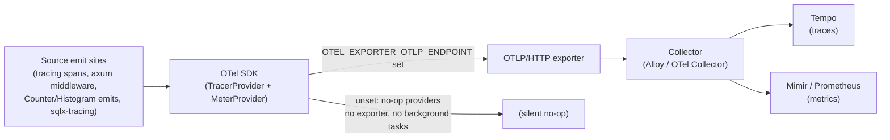
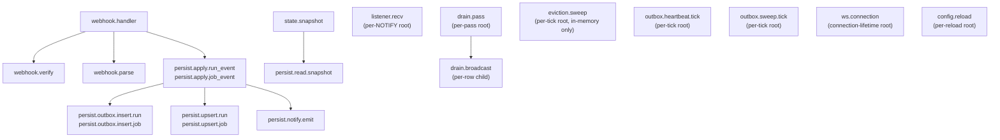

# Observability — metric and span surface

Last verified: 2026-05-23

> **Persistence layering (ADR-0008).** The broadcast envelope `CommittedEvent` lives in `atc-wire`. The `PersistentStore` trait (which owns `subscribe()` and `shutdown()`) lives in `atc-persist`. `InMemoryStore` lives in `atc-store-mem`. `PgStore` and the entire `PgMetrics` surface live in `atc-store-pg`. Metric and span names did not change — only emit-site file paths did. See [ADR-0008](../architecture-decisions/0008-persistence-crate-split.md).

> **Runner-pool capacities (issue #16).** The wire field `StateSnapshot.runner_pool_capacities` carries operator-declared capacity from `AppState` onto the snapshot response. It is **not** a metric and introduces no new `atc_runner_pool_*` instrument — ADR-0004 keeps pool-stats derivation on the frontend.

This document is the canonical home for ATC's metric and span contract. Every metric ATC emits is documented here with the seven-element authoring block defined under [Metric and span authoring contract](#metric-and-span-authoring-contract). Every span boundary is enumerated under [Span inventory](#span-inventory). Cross-references from other docs (backend-server architecture, deployment runbooks, dashboard descriptions, alert rules) link here rather than duplicating per-metric or per-span prose.

For operator interpretation — NaN-sentinel meanings, sustained-rate heuristics, cross-replica aggregation guidance, and example queries — see [`../operator/metric-interpretation-guide.md`](../operator/metric-interpretation-guide.md).

## OTel pipeline

ATC emits structured telemetry through one OpenTelemetry pipeline. When `OTEL_EXPORTER_OTLP_ENDPOINT` is set, the SDK initializes a tracer provider and a meter provider that export over OTLP/HTTP (HTTP/protobuf) to an operator-run collector (Grafana Alloy, OpenTelemetry Collector, etc.). The collector decides the downstream destination — Tempo for traces, Mimir or Prometheus for metrics.

When `OTEL_EXPORTER_OTLP_ENDPOINT` is unset, the SDK is never initialized: the OTel global meter provider stays at the no-op default, every instrument built against it is a no-op, and there is no exporter and no background-task overhead. An invalid value (typo, missing scheme, unparseable URL) is treated as unset — `init_otel` parses the value as a URI before installing the SDK so misconfiguration disables OTel with a clear stderr warning instead of silently routing telemetry to the SDK's default fallback.

**Logs are not in the OTel pipeline.** All `tracing::{info,warn,error}!` events flow only to the JSON / pretty stderr subscriber registered in `main.rs`. There is no `LoggerProvider` and no OTLP log exporter — operators wanting logs in Loki or another OTel-aware store collect them through their container-log path (kubelet stdout/stderr → Fluent Bit / Vector / etc.).

**OTel SDK init wiring.** `init_otel` installs a `W3CTraceContextPropagator` globally, registers `Base2ExponentialHistogram` as the aggregation view for every histogram instrument (see [Histogram aggregation](#histogram-aggregation)), and constructs both the tracer provider and the meter provider against the OTLP/HTTP exporter before returning `OtelHandles`. `OtelHandles` carries the two providers; `run_shutdown_orchestration` in `shutdown.rs` calls their shutdown methods after every emitter has joined. See [backend-server.md](backend-server.md) § "Supervision and shutdown" for the sequence diagram.

**Sampler.** The default SDK sampler (`OTEL_TRACES_SAMPLER` env, defaulting to `parentbased_always_on`) is used without override. Operators wishing to tail-sample pass a sampling collector in front of the OTLP endpoint.

## Metric and span authoring contract

Every metric ATC emits MUST ship with documentation in this section covering its interpretation surface. Every span boundary ATC adds MUST be enumerated in [Span inventory](#span-inventory).

### Metric naming

- `atc_` project prefix on every application metric.
- `pg_` subsystem prefix for Postgres-path metrics; reserve future subsystem prefixes (`http_`, `ws_`, etc.) for analogous separation.
- `_total` suffix for monotonic counters.
- `_seconds` suffix for time-valued metrics regardless of metric type (counter, gauge, histogram).
- `_bytes` suffix for memory or byte-valued metrics.
- Gauges that are not time- or byte-valued carry no unit suffix; the description names the unit.
- snake_case throughout. The OTLP→Prometheus path leaves names alone.

### Metric attribute conventions

- Lowercase keys; no high-cardinality values; no PII.
- No replica or pod label is baked into any application metric — replica identity is added by the collector at ingest time as standard target labels (`pod`, `instance`).
- Use HTTP semantic conventions for HTTP-shaped metrics: `http.request.method`, `http.response.status_code`, `http.route`, `url.scheme`. The `axum-otel-metrics` middleware emits these on the request-duration histogram.

Every new metric MUST extend [Operational metrics](#operational-metrics) with the seven-element block before merge. The doc-staleness gate (`scripts/check-docs-lefthook.sh`) blocks the push if backend metric changes land without a matching update here.

The seven elements:

1. **Name** — exact metric name as exported.
2. **Type** — counter / gauge / histogram.
3. **Attributes** — every emitted attribute name AND its source. Distinguish *emitted* attributes (added by the application) from *injected* attributes (e.g., `pod`, `instance`, added by the collector at ingest).
4. **Measures** — one sentence stating what the metric value means in operational terms (not implementation terms).
5. **Per-replica vs cluster scope** — is the value a property of one replica's process state, or a cluster-wide invariant? This determines whether dashboards aggregate `by (pod)` or `without (pod)`.
6. **Aggregation guidance** — recommended cross-replica aggregator (`avg`/`max`/`sum`/`p99`) with one-sentence rationale.
7. **Example PromQL** — one canonical query an operator can paste into Grafana to see meaningful data. Queries assume the OTLP→Prometheus path (the collector translates OTel exponential histograms into Prometheus native histograms; see [Histogram aggregation](#histogram-aggregation) for the cross-format note on `*_bucket` series). Keep this element only when the query shape is non-obvious; standard forms (`rate(...)`, `sum by (...) (rate(...))`) are described in the operator guide and not repeated here.

### Span naming

ATC spans use a dotted hierarchy that names the boundary, not the implementation:

- `state.snapshot` — root request span for `GET /v1/state` reads.
- `persist.read.snapshot` — `PgStore` / `InMemoryStore` read-path entry; child of `state.snapshot`.
- `webhook.handler` — root request span for `/v1/webhooks/github` POSTs.
- `webhook.verify`, `webhook.parse` — atc-github boundary spans nested under `webhook.handler`.
- `persist.apply.run_event`, `persist.apply.job_event` — `PgStore` / `InMemoryStore` write-path entries.
- `persist.notify.emit` — the in-transaction `pg_notify` after the outbox INSERT.
- `listener.recv` — per-NOTIFY root span for the PG listener. Each notification exports as its own root trace.
- `drain.pass`, `drain.broadcast` — per-pass root and per-row child for the outbox drain.
- `eviction.sweep` — per-tick root span for the in-memory-mode TTL eviction sweep.

### Span attribute conventions

- Lowercase, dotted keys (e.g., `webhook.delivery_id`, `pass.rows_fetched`). Use OpenTelemetry semantic conventions where they apply (`http.route`, `http.request.method`, `http.response.status_code`).
- Late-bound fields use `tracing::field::Empty` at span construction and `Span::current().record(...)` once the value is known.
- Never put webhook bodies, signatures, secrets, or full URLs (with secrets in query strings) on a span. The webhook attributes capture identifiers (`delivery_id`, `event_type`, `action`) and presence flags (`signature.present`), not payloads.

### Boundary discipline

New instrumentation goes at one of these boundaries:

- **API boundaries.** Every public HTTP route handler that performs work worth tracing (today: `webhook_handler`). The `axum-otel-metrics` middleware is the duration / status-code surface for *every* HTTP route automatically; per-route span instrumentation only needs to be added when the handler does enough work that the operator wants to see its internal structure.
- **Persist boundaries.** `PgStore::apply_*_event` and the in-transaction outbox / notify helpers under `atc-store-pg`. Internal SQL helpers nested inside an `apply_*` span inherit context via the default `#[instrument]` skip rules.
- **Background-task boundaries.** Long-lived futures spawned with `tokio::spawn` do NOT take a task-lifetime root span. Decorate the per-tick handler function (`listener.recv`, `drain.pass`, `eviction.sweep`) with `#[tracing::instrument(...)]` directly, so each iteration emits its own root that exports on completion. A wrapper at the spawn site is an anti-pattern — see [Task-lifetime root spans are an anti-pattern](#task-lifetime-root-spans-are-an-anti-pattern) below.

Do NOT decorate every internal function with `#[tracing::instrument]`. Spans are an operator surface; not an internal call graph.

### Cached instrument convention

Every repeat-emit metric in PG mode MUST go through a cached OTel `Counter` / `Histogram` instrument held on the `PgMetrics` struct in `atc-store-pg`. `PgStore::start` calls `PgMetrics::register(...)` once after the global meter provider is installed; the resulting `Arc<PgMetrics>` is cloned into the listener and drain task closures, and every emit on a hot path is a field access instead of building an instrument inline at every call.

For attribute-bearing instruments (`atc_pg_write_failures_total{kind=…}`, `atc_pg_notify_emitted_total{kind=…}`), `PgMetrics` stores one instrument per metric name plus pre-built `[KeyValue; N]` attribute slices alongside it. Emit sites read `counter.add(1, &self.attrs_parity)` so neither the instrument lookup nor the `KeyValue` allocation happens on a webhook path. Dedicated helpers (`write_failure_parity()`, `notify_emitted_run()`, etc.) wrap each `(instrument, slice)` pair so call sites never duplicate the attribute reference.

Gauges use **`ObservableGauge<f64>`** instruments instead of sync `Gauge<f64>`. Each observable gauge's callback closes over an `Arc<AtomicI64>` (the same atomic the listener/drain already manipulate) and is invoked by the SDK on every collection cycle. The atomic update IS the metric update — production code never calls `record()` on these instruments. This avoids the delta-temporality footgun where a sync `Gauge` only surfaces on flushes that include a fresh `record()` call: an observable gauge re-reports its last-read value on every scrape, matching the semantics the OTel→Prometheus exporter expects for gauge-shaped metrics.

The mechanical guard: the only sites that build OTel instruments live inside `atc-server::metrics` (`register_build_info`) and `atc-store-pg::metrics` (`PgMetrics::register_with_meter`). A new instrument built anywhere else is a reintroduced inline emit and must be moved onto `PgMetrics` (or, if genuinely new, added to `PgMetrics::register_with_meter` and documented under [Operational metrics](#operational-metrics)).

### W3C trace context propagation

`init_otel` installs a `TraceContextPropagator` globally. For inbound webhook requests, the handler extracts the incoming `traceparent` header before constructing the root span and calls `set_parent` to attach the incoming trace context. `set_parent` MUST be called between span construction and the first poll of the instrumented future — calling it from inside an `#[instrument]` body is wrong because the span has already been entered. When the header is absent or malformed, the resulting `webhook.handler` span is a fresh root with a new trace ID.

### Cross-trace causal link via outbox `traceparent`

The outbox table's `traceparent` column captures the W3C trace context of the `webhook.handler` span at INSERT time. When the drain task processes an outbox row, `drain.broadcast` receives an OTel span **link** (not a parent) to that webhook trace. This is the canonical cross-trace causal mechanism that lets operators follow the path from "webhook received" to "event broadcast to WebSocket" without stitching traces manually in Tempo.

The link-not-parent design is intentional: `drain.pass` is a per-tick root (see [Task-lifetime root spans are an anti-pattern](#task-lifetime-root-spans-are-an-anti-pattern) below), so making the drain broadcast a child of the originating webhook span would require a task-lifetime root on the drain side — the pattern that breaks span export. A link preserves the causal reference without collapsing the drain into the webhook trace.

### Task-lifetime root spans are an anti-pattern

`tracing-opentelemetry` only exports a span to the OTel pipeline when it closes. A span attached to a `tokio::spawn`-ed future via `.instrument(span)` closes when the task ends — for long-lived background tasks (the listener loop, the drain loop, the eviction loop) that means "at process shutdown." Under normal operation the span never exports, and a SIGKILL or OOM kill loses it entirely.

The fix is per-tick roots: decorate the handler function (`listener.recv`, `drain.pass`, `eviction.sweep`) with `#[tracing::instrument(name = "...", ...)]` directly. Each iteration is then a fresh root that exports as soon as it returns. `drain.broadcast` stays a child of `drain.pass` because it is constructed inside the instrumented `drain_pass` function. The rationale was first written in `docs/design-plans/2026-05-13-eviction-fold-into-in-memory-store.md` (§ "Postscript") and extended to listener/drain in issue #170.

### Shutdown ordering

OTel SDK tear-down runs after every emitter has joined. The shutdown orchestration in `atc-server` enumerates the ordering — the principle is "no live emitter when shutdown fires." A new emitter category (a future scheduled job, a periodic task, a long-lived consumer) MUST be joined before the OTel shutdown step. See [backend-server.md](backend-server.md) § "Supervision and shutdown" for the full sequence.

### Histogram aggregation

The meter provider registers an instrument view that maps every `Histogram` instrument to `Aggregation::Base2ExponentialHistogram { max_size, max_scale }`. The shared `exponential_histogram_view()` function in `atc-server` is the canonical hook for changing aggregation choice — both production `init_otel` and the test harness call it, so tests observe the same shape as production.

This requires the `spec_unstable_metrics_views` feature on `opentelemetry_sdk`. The feature is unstable per OTel's spec stability tracking — the API may shift on a future SDK release. The implementer who bumps `opentelemetry_sdk` owns reviewing the feature gate.

The cross-format implication: native and classic histograms have incompatible query forms. Against a Prometheus native histogram, `histogram_quantile` operates on the metric directly — `histogram_quantile(0.99, sum by (pod) (rate(name[5m])))`, no `_bucket` suffix. Against a classic histogram the `_bucket` / `le` grouping is required. The OTel SDK's `Base2ExponentialHistogram` aggregation maps to native histograms when the storage supports them (Prometheus 2.40+, Mimir); the bundled dashboard assumes that path. Operators running collectors that emit only classic histograms must translate dashboard panel queries to the classic `_bucket` form.

## atc_build_info

`register_build_info()` (called once at startup) sets a gauge always equal to `1.0` with these labels:

| Label | Source | Example |
|---|---|---|
| `version` | `VERGEN_GIT_DESCRIBE` (via `build.rs`) | `v1.0.0` |
| `git_describe` | `VERGEN_GIT_DESCRIBE` (via `build.rs`) | `v1.0.0-3-gabc1234` |
| `git_sha` | `VERGEN_GIT_SHA` (via `build.rs`) | `a1b2c3d...` |
| `rustc_version` | `VERGEN_RUSTC_SEMVER` (via `build.rs`) | `1.94.0` |
| `build_timestamp` | `VERGEN_BUILD_TIMESTAMP` (via `build.rs`) | `2026-04-08T...` |
| `target_triple` | `VERGEN_CARGO_TARGET_TRIPLE` (via `build.rs`) | `x86_64-unknown-linux-gnu` |

`version` deliberately mirrors `git_describe` rather than carrying `CARGO_PKG_VERSION`. The operator-facing identifier should track the git tag the image was built from — which is also what `org.opencontainers.image.version` and the `service.version` OTel resource attribute carry. Sourcing `version` from `Cargo.toml` instead lets the three identifiers drift apart on rc cycles where a tag is placed on a commit whose `Cargo.toml` was already bumped by release-please for the next stable release. The redundant column is left intact for any dashboards that already filter on `git_describe`.

`main.rs` also emits an `atc-server starting` INFO log line at process startup carrying the same six fields. The log surfaces build metadata when the metrics endpoint isn't available — early startup crashes, OTel pipeline disabled, container logs as the only diagnostic surface.

## HTTP request duration

`axum-otel-metrics`'s `HttpMetricsLayer` wraps the API router. Every request emits a duration histogram with HTTP semantic-convention attributes:

- `http.request.method` — request method (`POST`, `GET`, etc.).
- `http.response.status_code` — response status (`200`, `401`, `503`, etc.).
- `http.route` — matched Axum route pattern (`/v1/webhooks/github`, `/v1/state`, etc.).
- `url.scheme` — request scheme (`http`, `https`).

The middleware records into the global meter installed by `init_otel`. When OTel is disabled, the middleware records into the no-op meter and the measurements never reach an exporter.

See [frontend-app.md](frontend-app.md) for the WebSocket message-delivery instrumentation on the frontend side.

## Process collector

`spawn_process_collector` spawns the `opentelemetry-system-metrics` observer under a tokio task and returns a wrapper handle. The observer ticks on the standard `OTEL_METRIC_EXPORT_INTERVAL` interval (default 30 s, configurable via env), reads `sysinfo` snapshots of the current process, and records gauges against the global meter installed by `init_otel`. Emitted instruments (OTel dotted names; the OTLP→Prometheus collector translates dots to underscores so the scrape names are the `process_*` variants shown):

| OTel name | Scrape name | Type | Unit | Value | Attributes |
|---|---|---|---|---|---|
| `process.cpu.usage` | `process_cpu_usage` | f64 gauge | percent | `raw_cpu_percent / core_count` (0..100% of host capacity) | `process.pid`, `process.executable.name`, `process.executable.path`, `process.command` |
| `process.cpu.utilization` | `process_cpu_utilization` | f64 gauge | percent | raw sysinfo `cpu_usage` summed across cores (0..N*100%) | none |
| `process.memory.usage` | `process_memory_usage` | i64 gauge | byte | resident memory | same four `process.*` |
| `process.memory.virtual` | `process_memory_virtual` | i64 gauge | byte | committed virtual memory | same four `process.*` |
| `process.disk.io` | `process_disk_io` | i64 gauge | byte | cumulative read/write bytes | same four `process.*` plus `direction=read\|write` |

The `process_cpu_usage` / `process_cpu_utilization` row inversion above is correct — `opentelemetry-system-metrics 0.31.0` binds the Rust variables to inverted constants: the Rust binding named `process_cpu_utilization` records CPU usage with attributes, and the binding named `process_cpu_usage` records CPU utilization without attributes.

For dashboard migration notes (prior `metrics_process` names, per-process CPU query guidance) see [`../operator/metric-interpretation-guide.md`](../operator/metric-interpretation-guide.md) § "Process metrics — dashboard migration note".

The observer's loop runs forever — there is no cooperative shutdown surface on the upstream crate. `ProcessCollectorHandle::shutdown()` calls `tokio::task::AbortHandle::abort()` and returns the underlying `JoinHandle<()>` so the orchestration in `shutdown.rs` can await it. The observer does no DB/network work, so an abort between ticks is the common case and an abort mid-tick is safe.

## Operational metrics

All `atc_pg_*` metrics are emitted unlabeled per-process. Replica identity is added at ingest as standard target attributes (`pod`, `instance`) — the exact attachment mechanism depends on the collector configuration; the metrics themselves are agnostic.

For operator interpretation — NaN-sentinel meanings, what sustained rates suggest, per-channel eviction severity, cross-replica aggregation guidance, and example queries — see [`../operator/metric-interpretation-guide.md`](../operator/metric-interpretation-guide.md).

The blocks below are listed in roughly the order an event traverses the pipeline: webhook write → outbox row → NOTIFY emission → listener receipt → drain pass → broadcast → snapshot cursor → drain shutdown.

### `atc_pg_write_failures_total`

- **Name:** `atc_pg_write_failures_total`
- **Type:** counter
- **Attributes:** emitted `kind` ∈ `{parity, transient}`; injected `pod`, `instance`. `kind="parity"` fires when the PG UPSERT matches 0 rows (the WHERE predicate rejected the transition under PG's view of state); `kind="transient"` fires on sqlx errors at `pool.begin()`, mid-transaction, or `tx.commit()`. A `WARN` log with `target_status` is emitted alongside every parity rejection.
- **Measures:** Webhook writes that failed inside `PgStore::apply_*_event`. Parity rejections return a 200 `{"status":"rejected"}` to GitHub and are NOT retried. Transient failures return 503 and ARE retried by GitHub's webhook delivery.

### `atc_pg_notify_emitted_total`

- **Name:** `atc_pg_notify_emitted_total`
- **Type:** counter
- **Attributes:** emitted `kind` ∈ `{run, job}` matching the event discriminator; injected `pod`, `instance`. Incremented by `PgStore::apply_*_event` after `tx.commit()` succeeds (the in-transaction `pg_notify` call is queued by PG and delivered on commit; aborted transactions silently drop it, so this counter only increments when the NOTIFY actually went out).
- **Measures:** Successfully committed write transactions broadcast to `LISTEN atc_outbox`. The listener-side counterpart is `atc_pg_notify_received_total`.

### `atc_pg_notify_received_total`

- **Name:** `atc_pg_notify_received_total`
- **Type:** counter
- **Attributes:** none emitted; `pod`, `instance` (injected).
- **Measures:** NOTIFY payloads received by this replica's listener task on the `atc_outbox` channel. Every replica's listener receives every NOTIFY (PG fans out to all sessions holding `LISTEN atc_outbox`), so the per-replica rate should track parity across replicas.

### `atc_pg_listener_recv_errors_total`

- **Name:** `atc_pg_listener_recv_errors_total`
- **Type:** counter
- **Attributes:** none emitted; `pod`, `instance` (injected).
- **Measures:** Receive errors surfaced by the listener task (e.g., connection drops that sqlx could not silently reconnect through). Sqlx attempts to reconnect transparently on most listener errors; this counter only fires when the error escapes that retry loop.

### `atc_pg_drain_passes_total`

- **Name:** `atc_pg_drain_passes_total`
- **Type:** counter
- **Attributes:** none emitted; `pod`, `instance` (injected). Heartbeat-only wakes (the 5-second readiness tick) do NOT increment — only NOTIFY-driven passes count.
- **Measures:** NOTIFY-driven drain passes completed by this replica.

### `atc_pg_drain_rows_total`

- **Name:** `atc_pg_drain_rows_total`
- **Type:** counter
- **Attributes:** none emitted; `pod`, `instance` (injected).
- **Measures:** Outbox rows fetched and processed by the drain task across all paginated batches.

### `atc_pg_drain_duplicate_skipped_total`

- **Name:** `atc_pg_drain_duplicate_skipped_total`
- **Type:** counter
- **Attributes:** none emitted; `pod`, `instance` (injected).
- **Measures:** Outbox rows fetched during a drain pass but suppressed by the ring-buffer dedup because they had already been broadcast in a previous pass.

### `atc_pg_drain_unknown_kind_total`

- **Name:** `atc_pg_drain_unknown_kind_total`
- **Type:** counter
- **Attributes:** none emitted; `pod`, `instance` (injected).
- **Measures:** Outbox rows whose `kind` discriminator was neither `run` nor `job`. The set of legal kinds is fixed by a CHECK constraint on the outbox table, so this counter should be flat zero in any healthy deployment.

### `atc_pg_outbox_lag_seconds`

- **Name:** `atc_pg_outbox_lag_seconds`
- **Type:** histogram (base-2 exponential aggregation; see [Histogram aggregation](#histogram-aggregation))
- **Attributes:** none emitted; `pod`, `instance` (injected)
- **Measures:** Event age at broadcast — `clock.now() - row.inserted_at` recorded once per broadcast row, where `clock` is `PgStore.clock: Arc<dyn Clock>`. Routing the now-side through `PgStore.clock` makes the observation deterministic under `TestClock`.

### `atc_pg_drain_pass_duration_seconds`

- **Name:** `atc_pg_drain_pass_duration_seconds`
- **Type:** histogram (base-2 exponential aggregation)
- **Attributes:** none emitted; `pod`, `instance` (injected)
- **Measures:** Wall time from drain-pass start to drain-pass exit, including all paginated batches in the pass. NOT recorded for heartbeat-only wakes.

### `atc_pg_wake_coalesced_total`

- **Name:** `atc_pg_wake_coalesced_total`
- **Type:** counter
- **Attributes:** none emitted; `pod`, `instance` (injected)
- **Measures:** NOTIFY arrivals observed by the listener while a drain pass was in flight (`drain_in_flight=true`). Counts arrival rate, NOT extra-pass rate (Tokio's `Notify` permit collapses N permits into 1).

### `atc_pg_drain_startup_seconds`

- **Name:** `atc_pg_drain_startup_seconds`
- **Type:** histogram (base-2 exponential aggregation)
- **Attributes:** none emitted; `pod`, `instance` (injected)
- **Measures:** Startup readiness latency — wall time from `COALESCE(MAX(seq),0)` watermark init through first drain pass exit. One observation per process lifetime. Per the restart-recovery contract there is no historical replay; this measures startup readiness, NOT catch-up backlog.

### `atc_pg_drain_shutdown_remaining_rows`

- **Name:** `atc_pg_drain_shutdown_remaining_rows`
- **Type:** histogram (base-2 exponential aggregation)
- **Attributes:** none emitted; `pod`, `instance` (injected)
- **Measures:** Outbox rows whose `seq` is greater than this replica's drain watermark at drain task exit time. One observation per process lifetime, recorded after the drain loop exits on `cancel.cancelled()` and before the spawned task returns. When the post-shutdown count query fails or exceeds its 1-second timeout, the observation is skipped (logged as a warning) rather than recorded as zero, so `_count` only advances on successful observations.

### `atc_pg_broadcast_watermark`

- **Name:** `atc_pg_broadcast_watermark`
- **Type:** gauge
- **Attributes:** none emitted; `pod`, `instance` (injected)
- **Measures:** Highest outbox seq broadcast by this replica's drain task — the commit-order cursor read by `state_handler` as `lastSeq` in PG mode. Implemented as an OTel `ObservableGauge<f64>` whose callback reads the per-replica `broadcast_watermark: Arc<AtomicI64>` on every collection cycle; seeded at startup from `COALESCE(MAX(seq),0)` and advanced by the drain task after each successful pass.

### `atc_pg_min_pending_seq`

- **Name:** `atc_pg_min_pending_seq`
- **Type:** gauge
- **Attributes:** none emitted; `pod`, `instance` (injected)
- **Measures:** Lowest pending NOTIFY seq below the watermark (the gap-healing pressure signal). Implemented as an OTel `ObservableGauge<f64>` whose callback reads the per-replica `min_pending_seq: Arc<AtomicI64>` and maps `i64::MAX` (the sentinel the drain swaps in once caught up) to `f64::NAN`.

### `atc_pg_outbox_rows_deleted_total`

- **Name:** `atc_pg_outbox_rows_deleted_total`
- **Type:** counter
- **Attributes:** none emitted; `pod`, `instance` (injected)
- **Measures:** Outbox rows deleted by this replica's retention sweep task on each tick. Counted via the sweep statement's `DELETE ... RETURNING seq` row count under `FOR UPDATE SKIP LOCKED` semantics — concurrent sweepers on other replicas account for disjoint candidate subsets. See [ADR-0009](../architecture-decisions/0009-display-vs-data-retention.md) for the display vs data retention boundary that drives sweep eligibility.

### `atc_pg_outbox_min_replica_watermark`

- **Name:** `atc_pg_outbox_min_replica_watermark`
- **Type:** gauge
- **Attributes:** none emitted; `pod`, `instance` (injected)
- **Measures:** `MIN(broadcast_watermark)` across non-stale replicas — the cluster-wide multi-replica safety floor that the sweep statement uses to bound deletions. Implemented as an OTel `ObservableGauge<f64>` whose callback reads the per-replica `min_replica_watermark_atomic: Arc<AtomicI64>` and maps `-1` to `f64::NAN`. **Refreshed every 30 s by the outbox heartbeat task** — coarse-grained relative to OTel collection cadence.

### `atc_config_reload_total`

- **Name:** `atc_config_reload_total`
- **Type:** counter
- **Attributes:** `result` (`"success"` | `"failure"`), `reason` (`"applied"` | `"noop"` | `"read"` | `"parse"` | `"validate"`); `pod`, `instance` (injected)
- **Measures:** Config-watcher reload attempts, labeled by outcome. `result="success",reason="applied"` — reload changed AppState and broadcast `ConfigUpdate`. `result="success",reason="noop"` — content matched current AppState (no broadcast). `result="failure",reason="read"` — file I/O failure. `result="failure",reason="parse"` — YAML deserialization failure. `result="failure",reason="validate"` — zero capacity / empty labels / duplicate pool.

### `atc_config_runner_pools`

- **Name:** `atc_config_runner_pools`
- **Type:** gauge
- **Attributes:** none emitted; `pod`, `instance` (injected)
- **Measures:** Number of operator-declared runner pools currently loaded in `AppState.runner_pool_capacities`. Reflects the startup-loaded count until the first applied reload, then tracks the latest applied reload's pool count. Implemented as an OTel `ObservableGauge<f64>` whose callback reads from `Arc<AtomicI64>` on every collection cycle.

### `atc_ws_connections_active`

- **Name:** `atc_ws_connections_active`
- **Type:** gauge
- **Attributes:** none emitted; `pod`, `instance` (injected)
- **Measures:** Number of WebSocket clients currently connected to `/v1/ws` on this replica — the count of in-flight `handle_socket` tasks. The atomic is incremented at the start of each `handle_socket_inner` and decremented via a drop guard on every exit path.

### `atc_ws_lagged_evictions_total`

- **Name:** `atc_ws_lagged_evictions_total`
- **Type:** counter
- **Attributes:** `channel` (`"committed"` | `"config"`); `pod`, `instance` (injected)
- **Measures:** WebSocket clients force-disconnected because their broadcast receiver fell behind and the bounded buffer (capacity 256) overflowed. `channel="committed"` is the `CommittedEvent` fan-out from `PersistentStore::subscribe()`; `channel="config"` is the operator-config reload stream from `config_events_tx`.

### `atc_display_ttl_seconds` — intentionally absent

`ATC_DISPLAY_TTL` (the snapshot/UI visibility gate, see [ADR-0009](../architecture-decisions/0009-display-vs-data-retention.md) and [deployment.md](deployment.md#atc_display_ttl)) deliberately does not emit a metric. Operationally there is no urgency to monitor it: the value is restart-only, the snapshot's `display_ttl_seconds` field already carries it to clients on every reconnect, and the boundary-band edge cases are bounded by clock skew rather than by anything the server can measure.

### `atc_pg_outbox_oldest_row_age_seconds`

- **Name:** `atc_pg_outbox_oldest_row_age_seconds`
- **Type:** gauge
- **Attributes:** none emitted; `pod`, `instance` (injected)
- **Measures:** Age in seconds of the oldest outbox row, computed Rust-side as `clock.now() - MIN(inserted_at)`. Implemented as an OTel `ObservableGauge<f64>` whose callback reads the per-replica `oldest_row_age_seconds_atomic: Arc<AtomicI64>` and maps `-1` to `f64::NAN` (the empty-outbox sentinel). **Refreshed every 30 s by the outbox heartbeat task** — coarse-grained.

## Span inventory

Span names are stable identifiers — operators build dashboards and alerts that filter on them. Do not rename a span without coordinating with dashboard owners.

### State snapshot path

| Span | Attributes |
|---|---|
| `state.snapshot` — root request span for `GET /v1/state`. Built manually (not via `#[instrument]`) so span fields can be recorded from the snapshot response before the handler returns. No `traceparent` extraction: `/v1/state` is a client-pull endpoint with no upstream trace context today. | `http.route="/v1/state"`, `snapshot.runs_count` (usize; late-bound), `snapshot.jobs_count` (usize; late-bound), `snapshot.last_seq` (u64; late-bound). |
| `persist.read.snapshot` — child of `state.snapshot`; via `#[tracing::instrument]`. | `last_seq` (u64; late-bound), `runs_count` (usize; late-bound), `jobs_count` (usize; late-bound). |

### Webhook ingestion path

| Span | Attributes |
|---|---|
| `webhook.handler` — root request span built in the handler body so `traceparent` extraction can attach the parent context before the span is entered. | `http.route="/v1/webhooks/github"`, `http.request.method="POST"`, `http.response.status_code` (u16; late-bound), `webhook.delivery_id` (late-bound), `webhook.event_type` (late-bound). The three late-bound fields are declared as `tracing::field::Empty` at construction. |
| `webhook.verify` — atc-github HMAC verification boundary. | `webhook.signature.present` (bool), `webhook.signature.algorithm="sha256"`. Secret, body bytes, and the signature value are explicitly skipped. |
| `webhook.parse` — atc-github parse boundary. | `webhook.event_type`, `webhook.action` (late-bound). Body bytes are skipped. |

### Persist path

| Span | Attributes |
|---|---|
| `persist.apply.run_event` — `PgStore` / `InMemoryStore` write-path entry. | `run_id` (i64); `seq` (i64; late-bound, recorded after the outbox row's `BIGSERIAL` is allocated). |
| `persist.apply.job_event` | `run_id`, `job_id` (both i64); `seq` (late-bound for `PgStore`). |
| `persist.notify.emit` — wraps `SELECT pg_notify('atc_outbox', $1)` inside the `apply_*` transaction. | `notify.kind` (`"run"` / `"job"`), `notify.seq` (i64). |

Inner transaction helpers carry explicit `name = "persist.…"` spans (`persist.upsert.run`, `persist.upsert.job`, `persist.outbox.insert.run`, `persist.outbox.insert.job`) and inherit context from the surrounding `persist.apply.*` span. The explicit names keep span identifiers in the `persist.*` namespace rather than leaking crate-internal Rust function names.

### Listener path

| Span | Attributes |
|---|---|
| `listener.recv` — per-NOTIFY root span. The spawn site carries no task-lifetime wrapper; each notification's handler invocation emits its own root. | `notify.payload.seq` (i64; the seq carried by the NOTIFY payload). |

### Drain path

| Span | Attributes |
|---|---|
| `drain.pass` — per-pass root span. The spawn site carries no task-lifetime wrapper; each invocation emits its own root. | `pass.start_floor` (i64), `pass.rows_fetched` (u64; recorded after pagination), `pass.batches` (u64; recorded after pagination). |
| `drain.broadcast` — per-row child nested under `drain.pass`. When the outbox row carries a W3C `traceparent`, this span gets an OTel span **link** to that trace (not a parent) — see [Cross-trace causal link via outbox `traceparent`](#cross-trace-causal-link-via-outbox-traceparent). | `seq` (i64), `kind` (`"run"` / `"job"`), `outbox_lag_ms` (i64). |

### Eviction path (in-memory mode only)

| Span | Attributes |
|---|---|
| `eviction.sweep` — per-tick root span for `InMemoryStore::evict_expired`. Per-tick roots mean every sweep exports as one tidy trace on tick. | `jobs.evicted` (u64; recorded after the sweep), `runs.evicted` (u64), `elapsed.micros` (u64). Recorded on both the eviction and the no-op-sweep code paths. |

### Outbox retention path (PG mode only)

| Span | Attributes |
|---|---|
| `outbox.heartbeat.tick` — per-tick root span. The spawn site deliberately omits a task-lifetime parent. | `replica_id` (string; the `<hostname>-<uuid8>` identity bound to this `PgStore`), `broadcast_watermark` (i64; late-bound), `min_replica_watermark` (i64; late-bound — `-1` when no live replicas), `oldest_row_age_seconds` (i64; late-bound — `-1` when outbox is empty). |
| `outbox.sweep.tick` — per-tick root span. Same no-task-lifetime-parent pattern. | `retention_seconds` (u64), `rows_deleted` (u64; late-bound), `watermarks_cleaned` (u64; late-bound). |

### sqlx per-query spans (PG mode)

Per-query spans for every sqlx call land under the `sqlx-tracing` target — see the sqlx-tracing crate for the full surface. Each span is a child of whatever `#[tracing::instrument]` boundary it runs inside (e.g., `persist.upsert.run` → the sqlx span for its query).

### WebSocket connection lifetime

| Span | Attributes |
|---|---|
| `ws.connection` — root span wrapping the entire connection lifetime from upgrade to disconnect. No `traceparent` extraction: each WS connection is independently rooted (a session, not an RPC). See [frontend-app.md](frontend-app.md) for the client-side instrumentation context. | `ws.close_reason` (`&'static str`; late-bound — `"shutdown"`, `"client sent close"`, `"connection dropped"`, `"read error"`, `"lagged"`, `"config lagged"`, `"broadcast channel closed"`, `"config channel closed"`, or `"send failed"`). `ws.lagged_channel` (`"committed"` | `"config"`; late-bound, only recorded on a lagged-eviction exit — paired with `atc_ws_lagged_evictions_total`). |

### Liveness + config-reload internals

| Span | Attributes |
|---|---|
| `persist.liveness` — child of the inbound `/readyz` request frame (Axum auto-instruments the route). Wraps the `SELECT 1` round-trip AND the drain-heartbeat staleness check so an operator looking at a 503 trace can see which side broke. | `liveness.outcome` (`"ok"` / `"db_unreachable"` / `"drain_stale"`; late-bound). `liveness.heartbeat_age_ms` (i64; late-bound, absent when the DB ping itself failed). |
| `config.reload` — root span on each watcher-driven reload attempt. Decorates the file read, YAML parse, and validation pipeline. Pairs with `atc_config_reload_total{result,reason}`. | `config.path` (string), `config.outcome` (`"ok"` / `"read_error"` / `"parse_error"` / `"validate_error"`; late-bound), `config.pools` (usize; late-bound, only recorded on the `ok` path). |
