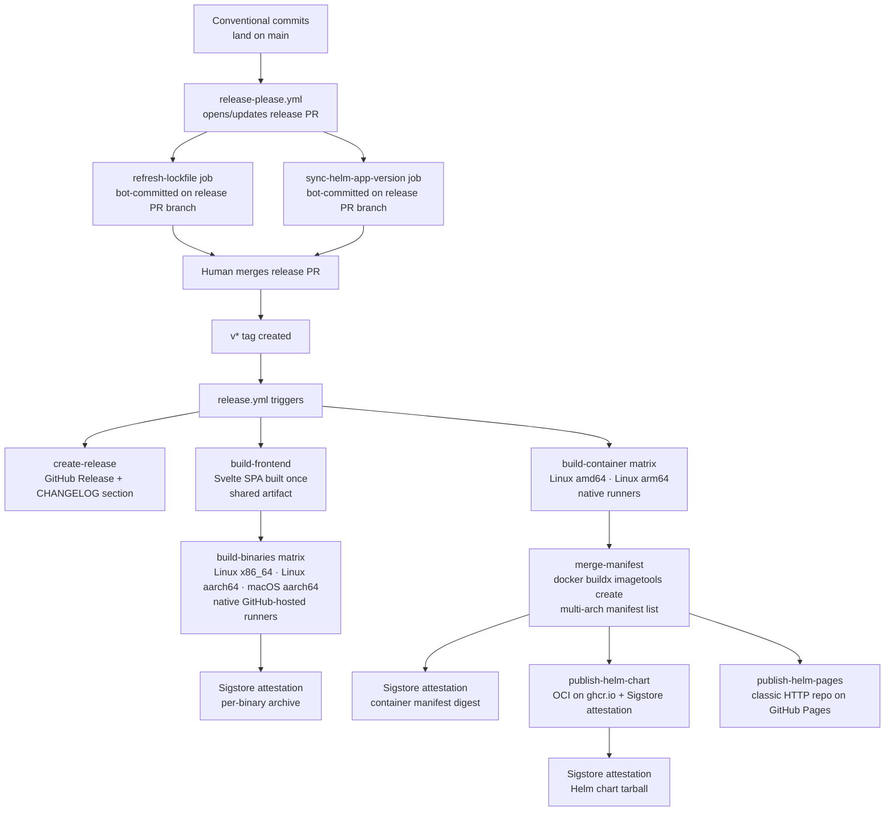

# Release Pipeline — Architecture

Last verified: 2026-05-23

The release pipeline runs in two phases. `release-please.yml` monitors conventional commits on `main` and maintains a release PR that bumps version fields, updates CHANGELOG files, and coordinates companion jobs. Merging that PR creates a `v*` tag. `release.yml` is tag-triggered: it builds and publishes all release artifacts — binaries, container images, and the Helm chart. The boundary between the two phases preserves a human review gate: a release happens only when a developer merges the release PR. The toolchain choice and rejected alternatives are in [ADR-0011](../architecture-decisions/0011-release-toolchain.md).

## Two-phase release flow

Conventional commit type determines version bump: `feat:` → minor, `fix:` → patch, `feat!:` or `BREAKING CHANGE:` → major. `chore(deps):` and other non-releasing types produce no bump. This mapping is enforced by release-please; the Renovate configuration agrees — runtime dependency bumps arrive as `fix(deps):` (patch), tooling bumps as `chore(deps):` (no release).

## Lockstep versioning

All seven Rust crates (`atc-core`, `atc-github`, `atc-wire`, `atc-persist`, `atc-store-pg`, `atc-store-mem`, `atc-server`) and the frontend version in lockstep via release-please's `linked-versions` plugin. The highest-precedence bump across any member sets the version for the whole group. One release PR covers all of them.

The Helm chart at `deploy/helm/atc` is registered as a separate release-please package (`release-type: helm`) and is deliberately excluded from `linked-versions`. Chart-only changes — values schema additions, template fixes — produce a chart release without bumping the application version, and vice versa.

Two companion jobs run after release-please on the same workflow:

- **refresh-lockfile** — release-please bumps crate versions in `Cargo.toml` without touching `Cargo.lock`. The companion job runs `cargo update --workspace` and commits the refreshed lockfile to the release PR branch so `cargo build --locked` continues to pass in CI and in `release.yml`.
- **sync-helm-app-version** — reads the resolved app version from `.release-please-manifest.json` and rewrites `Chart.yaml`'s `appVersion` field. An idempotent `git diff --quiet` guard skips the commit when the value is already correct.

Both jobs commit under the releaser GitHub App identity (see "GitHub App token" below).

## Tag-triggered artifact phases

`release.yml` triggers on `v*` tags. Jobs run in dependency order established by `needs:`:

**GitHub Release** — extracts the relevant CHANGELOG section and creates the GitHub Release entry. All upload jobs declare `needs: create-release`.

**Frontend build** — compiles the Svelte SPA once and uploads `frontend/dist` as a workflow artifact. `atc-server` embeds the frontend at compile time via `rust-embed`; without a pre-built `frontend/dist`, a clean binary build would fail or ship an empty SPA. Each binary matrix job downloads this artifact before invoking `cargo build`.

**Binary matrix** — builds `atc-server` for three targets on native GitHub-hosted runners: `x86_64-unknown-linux-musl` on `ubuntu-24.04`, `aarch64-unknown-linux-musl` on `ubuntu-24.04-arm`, and `aarch64-apple-darwin` on `macos-26`. Native runners on each target arch eliminate cross-compilation complexity (the `aws-lc-sys` C dependency fails against musl when linked through a glibc-targeting cross-toolchain) and the ~5× QEMU compile-time penalty. Each binary archive receives a Sigstore attestation (see "Attestation" below).

**Container matrix + manifest merge** — per-platform images build natively on `ubuntu-24.04` (amd64) and `ubuntu-24.04-arm` (arm64) using the regular multi-stage `Dockerfile`. The merge job calls `docker buildx imagetools create` to assemble the per-platform digests into a multi-arch manifest list published under the semver tag. Only the final manifest digest is attested, not the per-platform images.

**Helm publishing** — the chart publishes to two channels after `needs: merge-manifest`: OCI on `ghcr.io` (Sigstore-attested) and a classic HTTP Helm repo on GitHub Pages (auth-free `helm repo add` for consumers without registry credentials). Both channels are tag-triggered so chart versions always correspond to tagged application releases.

No GHA caches are used in any `release.yml` build job. Release artifacts are signed-and-attested; restoring from a cache that a prior PR run could have written is a supply-chain risk ([zizmor cache-poisoning audit](https://docs.zizmor.sh/audits/#cache-poisoning)).

## Sigstore attestation

`actions/attest-build-provenance` generates SLSA provenance records for three surfaces:

- Each binary archive uploaded to the GitHub Release
- The multi-arch container manifest digest on `ghcr.io`
- The Helm chart tarball published to the OCI channel

Consumers verify via `gh attestation verify <artifact> -R bojanrajkovic/atc`. Attestation ties each artifact to the specific Actions run and commit SHA that produced it without requiring separate key-management infrastructure.

Attestations are repository-scoped. If the repository is renamed or moved, existing attestations cannot be re-anchored.

## GitHub App token requirement

release-please and the companion jobs commit to the release PR branch under a dedicated GitHub App identity, not under `GITHUB_TOKEN`. This is a GitHub loop-prevention constraint: commits and PRs opened by `GITHUB_TOKEN` do not trigger downstream workflows, which would leave the release PR without CI status checks. The releaser GitHub App mints short-lived installation tokens via `actions/create-github-app-token` scoped to only the permissions each step needs (`contents: write` + `pull-requests: write` + `issues: write` for release-please; `contents: write` for the companion jobs). The zizmor [`github-app`](https://docs.zizmor.sh/audits/#github-app) audit enforces the least-privilege shape.

## Pre-release tag behavior

Tags containing a hyphen (e.g., `v1.0.0-rc1`) trigger `release.yml` but skip Sigstore attestation and Helm chart publishing. This avoids the GitHub API restriction on attestations for artifacts produced in private repos and prevents rc versions from occupying slots in the Helm release channel. Binary builds and container image builds run normally.

## Cross-references

- [ci-pipeline.md](ci-pipeline.md) — `ci.yml` is the merge gate; `release.yml` is tag-triggered. The two workflows are orthogonal: CI gates every PR and push to main; the release workflow runs only on `v*` tags.
- [deployment.md](deployment.md) — the Helm chart and container image this pipeline publishes; multi-replica constraints and Kubernetes-specific configuration.
- [ADR-0011](../architecture-decisions/0011-release-toolchain.md) — GitHub Actions + release-please toolchain choice, rejected alternatives, and consequences.
