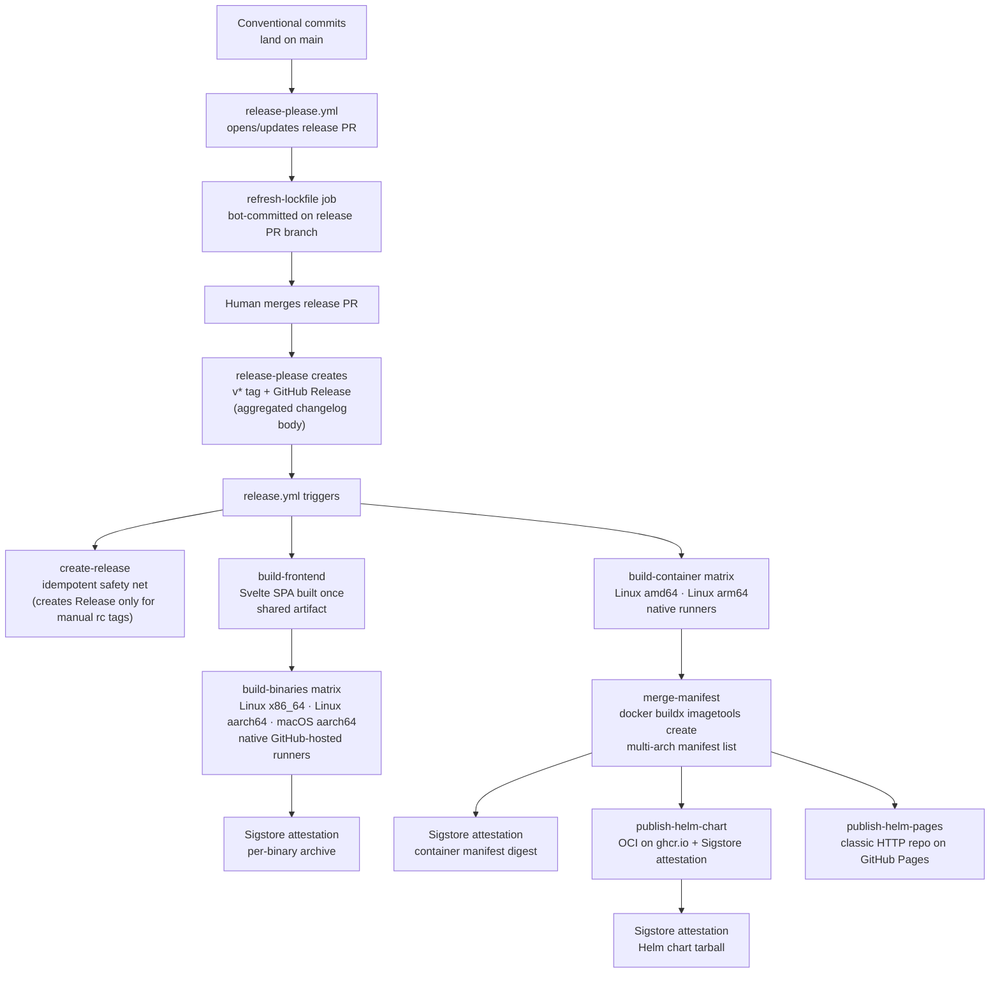

# Release Pipeline — Architecture

Last verified: 2026-06-04

The release pipeline runs in two phases. `release-please.yml` monitors conventional commits on `main` and maintains a release PR that bumps the version, updates the product `CHANGELOG.md`, and runs a lockfile-refresh companion job. Merging that PR makes release-please create the `v*` tag **and** the GitHub Release together — the Release body is the aggregated product changelog. The tag push then triggers `release.yml`, which builds and publishes all release artifacts — binaries, container images, and the Helm chart — and uploads them to that Release. The boundary between the two phases preserves a human review gate: a release happens only when a developer merges the release PR. The toolchain choice and rejected alternatives are in [ADR-0011](../architecture-decisions/0011-release-toolchain.md).

## Two-phase release flow

Conventional commit type determines version bump: `feat:` → minor, `fix:` → patch, `feat!:` or `BREAKING CHANGE:` → major. `chore(deps):` and other non-releasing types produce no bump. This mapping is enforced by release-please; the Renovate configuration agrees — runtime dependency bumps arrive as `fix(deps):` (patch), tooling bumps as `chore(deps):` (no release).

## Lockstep versioning

ATC releases as a single product. `release-please-config.json` registers one package at the repository root (`release-type: simple`), so every conventional commit feeds one aggregate root `CHANGELOG.md` and one bare `v<version>` tag. The seven Rust crates are internal to the `atc-server` build and are never published independently, so they inherit a single version from `[workspace.package].version` in `backend/Cargo.toml` (`version.workspace = true`). release-please bumps that one field — plus `frontend/package.json` and the Helm chart's `version` and `appVersion` — through `extra-files` typed updaters.

Modelling the surfaces as independent release-please packages instead made them collide on the shared bare `v<version>` tag: with `include-component-in-tag: false`, every package resolved to the same tag, so only the first won and the rest were skipped as duplicates. The single-product model removes that whole class of failure. The chart `version` is locked to the product version, so every release ships an installable chart whose `appVersion` always names a published image. See [ADR-0011](../architecture-decisions/0011-release-toolchain.md) for the rationale and rejected alternatives.

One companion job runs after release-please on the same workflow:

- **refresh-lockfile** — release-please bumps the workspace version in `backend/Cargo.toml` without touching `Cargo.lock`. The companion job runs `cargo update --workspace` and commits the refreshed lockfile to the release PR branch so `cargo build --locked` continues to pass in CI and in `release.yml`. The chart's `appVersion` no longer needs a companion job — the `extra-files` updater bumps it directly to the product version.

Both jobs commit under the releaser GitHub App identity (see "GitHub App token" below).

## Tag-triggered artifact phases

`release.yml` triggers on `v*` tags. Jobs run in dependency order established by `needs:`:

**GitHub Release** — the canonical Release is created by release-please when the release PR merges (atomically with the `v*` tag, with the aggregated product changelog as its body), so for a real release it already exists when this workflow starts. The `create-release` job is therefore an idempotent safety net: when the Release already exists it does nothing (never editing the body, so release-please's notes are preserved); when it is missing it creates one **only** for a prerelease/rc tag (the manually-pushed path release-please does not drive) and **fails loud** for a stable tag — a stable release always comes from release-please, so a missing one signals a bypass or failure rather than a manual cut. All upload jobs declare `needs: create-release` purely as an ordering gate, so the job always runs and either succeeds or fails loud.

**Frontend build** — compiles the Svelte SPA once and uploads `frontend/dist` as a workflow artifact. `atc-server` embeds the frontend at compile time via `rust-embed`; without a pre-built `frontend/dist`, a clean binary build would fail or ship an empty SPA. Each binary matrix job downloads this artifact before invoking `cargo build`.

**Binary matrix** — builds `atc-server` for three targets on native GitHub-hosted runners: `x86_64-unknown-linux-musl` on `ubuntu-24.04`, `aarch64-unknown-linux-musl` on `ubuntu-24.04-arm`, and `aarch64-apple-darwin` on `macos-26`. Native runners on each target arch eliminate cross-compilation complexity (the `aws-lc-sys` C dependency fails against musl when linked through a glibc-targeting cross-toolchain) and the ~5× QEMU compile-time penalty. The two linux-musl entries read their Rust toolchain version from `.mise.toml` at run time (the same source of truth the `Dockerfile`'s `ARG RUST_VERSION` mirrors) rather than a hardcoded pin — since the container matrix below ships these binaries directly, that's what keeps the container's Rust version tied to `.mise.toml` without its own independent build step to enforce it. The two linux-musl binaries (statically linked, `+crt-static`) are also uploaded as workflow artifacts for the container matrix below to reuse. Each binary archive receives a Sigstore attestation (see "Attestation" below).

**Container matrix + manifest merge** — per-platform images build natively on `ubuntu-24.04` (amd64) and `ubuntu-24.04-arm` (arm64), reusing the matching linux-musl binary the binary matrix just built rather than recompiling atc-server a second time: `Dockerfile.release` just copies the pre-built static binary into the distroless runtime, with the download-artifact-populated directory as its entire build context — no Rust/Node toolchain, no cargo-chef, in this job. (The regular multi-stage `Dockerfile` — full source build, `ARG RUST_VERSION` / `ARG NODE_VERSION` defaults mirroring the `.mise.toml` pins via Renovate's `# renovate:` comments and the `customManagers:dockerfileVersions` preset, see [ci-pipeline.md](ci-pipeline.md) § Dependency updates — remains the reference build for anyone building from source outside this pipeline.) The merge job calls `docker buildx imagetools create` to assemble the per-platform digests into a multi-arch manifest list published under the semver tag. Only the final manifest digest is attested, not the per-platform images.

**Helm publishing** — the chart publishes to two channels after `needs: merge-manifest`: OCI on `ghcr.io` (Sigstore-attested) and a classic HTTP Helm repo on GitHub Pages (auth-free `helm repo add` for consumers without registry credentials). Both channels are tag-triggered so chart versions always correspond to tagged application releases.

No GHA caches are used in any `release.yml` build job. Release artifacts are signed-and-attested; restoring from a cache that a prior PR run could have written is a supply-chain risk ([zizmor cache-poisoning audit](https://docs.zizmor.sh/audits/#cache-poisoning)).

## Sigstore attestation

`actions/attest-build-provenance` generates SLSA provenance records for three surfaces:

- Each binary archive uploaded to the GitHub Release
- The multi-arch container manifest digest on `ghcr.io`
- The Helm chart tarball published to the OCI channel

Consumers verify via `gh attestation verify <artifact> -R bojanrajkovic/atc`. Attestation ties each artifact to the specific Actions run and commit SHA that produced it without requiring separate key-management infrastructure.

Attestations are repository-scoped. If the repository is renamed or moved, existing attestations cannot be re-anchored.

## GitHub App token requirement

release-please and the companion jobs commit to the release PR branch under a dedicated GitHub App identity, not under `GITHUB_TOKEN`. This is a GitHub loop-prevention constraint: commits and PRs opened by `GITHUB_TOKEN` do not trigger downstream workflows, which would leave the release PR without CI status checks. The releaser GitHub App mints short-lived installation tokens via `actions/create-github-app-token` scoped to only the permissions each step needs (`contents: write` + `pull-requests: write` + `issues: write` for release-please; `contents: write` for the companion jobs). The zizmor [`github-app`](https://docs.zizmor.sh/audits/#github-app) audit enforces the least-privilege shape.

## Pre-release tag behavior

Pre-release tags are pushed manually — release-please only drives the canonical `vMAJOR.MINOR.PATCH` releases, so it never creates a Release for an rc tag. The `create-release` safety-net job covers that gap: for a tag with no existing Release it creates one with GitHub-generated notes and the `--prerelease` flag.

Tags containing a hyphen (e.g., `v1.0.0-rc1`) trigger `release.yml` and build binaries and container images normally, **with** Sigstore attestation. (Attestation was once skipped for prereleases to dodge the `attest-build-provenance` restriction on user-owned private repos; the repo is public now, so that restriction no longer applies and rc artifacts are attested like finals.)

Only Helm chart publishing is skipped on prereleases — and the reason is a version decoupling, not a policy choice. The chart version comes from `Chart.yaml`, which release-please bumps on release-PR merge, **not** from the git tag. A manually-pushed rc tag therefore still carries the last stable chart version, so publishing would repackage that stable version and `helm push` it to the OCI registry (which has no skip-existing guard), clobbering the attested stable chart. The gh-pages channel is shielded by chart-releaser's `skip_existing`, but would still do pointless work. Publishing genuine prerelease charts would first require the chart version to track the tag's prerelease identifier.

## Cross-references

- [ci-pipeline.md](ci-pipeline.md) — `ci.yml` is the merge gate; `release.yml` is tag-triggered. The two workflows are orthogonal: CI gates every PR and push to main; the release workflow runs only on `v*` tags.
- [deployment.md](deployment.md) — the Helm chart and container image this pipeline publishes; multi-replica constraints and Kubernetes-specific configuration.
- [ADR-0011](../architecture-decisions/0011-release-toolchain.md) — GitHub Actions + release-please toolchain choice, rejected alternatives, and consequences.
