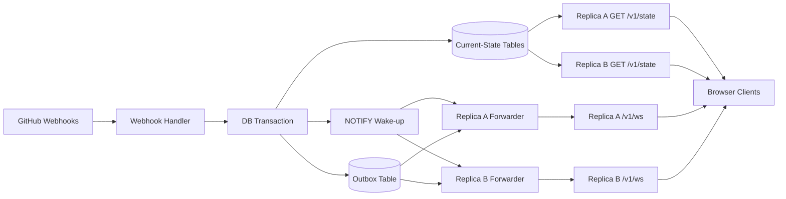

# State Externalization Research

Last verified: 2026-05-03

## Purpose

This document set records design research for [issue #7](https://github.com/bojanrajkovic/atc/issues/7), `design: externalize live state to support multi-replica deployments`.

It is not an ADR. Its job is to narrow the viable shapes before an ADR is written.

## Inputs

Primary discussion inputs:

- [Issue #7 body](https://github.com/bojanrajkovic/atc/issues/7)
- [Comment: Phase 9 design considerations](https://github.com/bojanrajkovic/atc/issues/7#issuecomment-4230507060)
- [Comment: monotonic ordering cursor / outbox shape](https://github.com/bojanrajkovic/atc/issues/7#issuecomment-4230531833)
- [Comment: seq/store atomicity constraint](https://github.com/bojanrajkovic/atc/issues/7#issuecomment-4230538568)

Repository inputs:

- `docs/architecture/backend-server.md`
- `docs/architecture/deployment.md`
- `docs/design-plans/2026-04-08-helm-chart.md`
- `docs/design-plans/2026-04-11-server-wiring.md`
- `backend/crates/atc-server/src/routes.rs`
- `backend/crates/atc-server/src/state.rs`
- `backend/crates/atc-core/src/store.rs`
- `frontend/src/lib/connection.ts`

External reference inputs:

- [PostgreSQL `NOTIFY`](https://www.postgresql.org/docs/current/sql-notify.html)
- [PostgreSQL transaction isolation notes on `serial` / sequences](https://www.postgresql.org/docs/current/transaction-iso.html)
- [Redis Pub/Sub delivery semantics](https://redis.io/docs/latest/develop/pubsub/)
- [Redis Streams](https://redis.io/docs/latest/develop/data-types/streams/)
- [NATS JetStream consumers](https://docs.nats.io/nats-concepts/jetstream/consumers)

## Current Repo Observations

Two points matter before evaluating alternatives:

1. The implemented server contract is now stricter than the older Phase 9 design plan. `atc-server` no longer uses an `AtomicU64`; it uses `Mutex<u64>` held across store mutation plus seq assignment, and `GET /v1/state` holds the same mutex across snapshot plus seq read. The code is already built around atomic snapshot/stream handoff.
2. The issue body's statement that Helm blocks all `replicaCount > 1` deployments no longer matches the repository as of 2026-05-03. The current Helm `fail` guard only rejects `persistence.enabled=true` with `replicaCount > 1`. Stateless multi-replica still renders, but it is not semantically correct because live state remains process-local.

## Document Map

- [backend-architecture.md](./backend-architecture.md) — invariants, storage/event-format answers, alternative comparison, recommended backend shape, ADR positions
- [frontend-impact.md](./frontend-impact.md) — current frontend cursor assumptions, impact of contract changes, `poolStatsAfter` sensitivity, optional client hardening
- [overlap-and-forwarding.md](./overlap-and-forwarding.md) — overlap delivery failure modes, replica drain semantics, wake-up coalescing, leader-election tradeoffs
- [rollout-and-implementation.md](./rollout-and-implementation.md) — phased rollout and `must / should / optional` implementation checklist

## Recommended Direction

Recommendation: adopt PostgreSQL current-state tables plus a transactional outbox, with `LISTEN/NOTIFY` used only as a wake-up path.

Recommended shape:

1. Keep current-state tables keyed by GitHub IDs.
2. Add an append-only outbox carrying the WS-ready payload.
3. Write current-state mutation and outbox append in one transaction.
4. Use a durable monotonic cursor for snapshot/stream reconciliation.
5. Have each replica run one serialized outbox forwarder loop.
6. Keep replicas symmetric for both `GET /v1/state` and `/v1/ws`.

## End-State Dataflow

## Summary

The recommended design is not "just add Postgres" and it is not "leader election solves it." The coherent plan is:

- transactional current-state mutation plus outbox append
- durable monotonic cursor
- serialized per-replica outbox forwarders
- exact preservation of the current WS payload shape if `poolStatsAfter` remains part of the contract

Frontend hardening such as `highestAppliedSeq` dedupe is useful defense in depth, but it is not the primary correctness mechanism.
