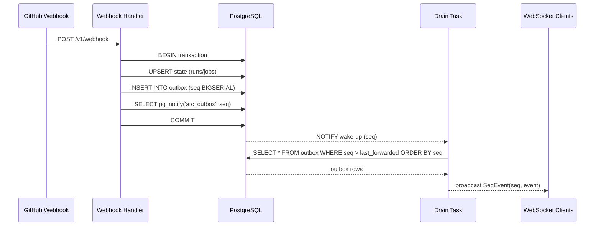
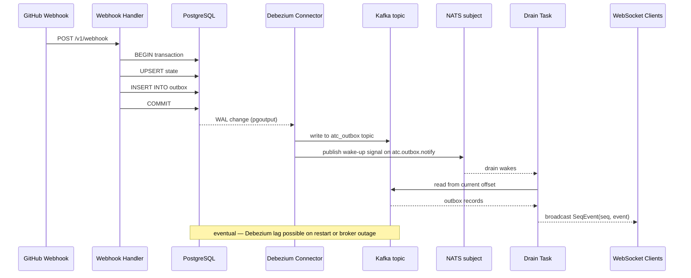

# Alternative State Backends

Last verified: 2026-05-07

## Status

This document is a forward-looking research reference, not a roadmap item. ATC runs on PostgreSQL; this doc records what a future migration would look like and what alternatives were considered. The canonical description of the current PG architecture is in [backend-architecture.md](./backend-architecture.md).

---

## 1. Three Load-Bearing Contracts

ATC's storage layer must satisfy three distinct contracts. Every candidate — whether a single-store solution or a composed multi-store system — is evaluated against these three independently.

**Contract A: Atomic state-update + log-append.** When a webhook arrives, the current-state tables and the outbox row must be written in a single atomic boundary. If the transaction aborts, neither write lands. If it commits, both are visible together. This is what prevents "state changed but no event emitted" and "event emitted for a transition that didn't land" failure modes.

**Contract B: Push notification of new log entries.** Once an outbox row commits, the drain task must learn about it promptly without polling at a fixed interval. This is the latency budget for WebSocket event delivery. Polling at 500ms intervals is acceptable; polling at 10s is not.

**Contract C: Replayable monotonic log.** The outbox must be replayable: a replica that restarts mid-stream can re-read events it missed, in committed order, without gaps or reordering. The log must also be durable — entries cannot be evicted before the drain has processed them. Durability window matters: a 24-hour retention cap would require ATC to guarantee webhook processing within 24 hours, which is not a safe assumption.

A single store that satisfies all three is the simplest topology. But **these contracts can be decomposed across multiple stores**, and many production systems do exactly this: a relational store satisfies A, a message broker satisfies C with richer replay semantics, and a lightweight pub/sub layer satisfies B. The sections below explore both shapes.

---

## 2. Decomposition Framing

When Contracts A, B, and C are satisfied by different stores, the primary question becomes: what is the atomicity boundary between them?

**Outbox pattern (local atomic, distributed eventual).** The application writes state + outbox row in one transaction (Contract A satisfied). A CDC bridge (Debezium, CHANGEFEED) consumes the outbox and writes to a durable log (Contract C satisfied). Pub/sub wake-up (NATS, Kafka notification) handles Contract B. This is what the PG + Kafka + Debezium + NATS candidate does. The trade-off is that end-to-end atomicity — from commit to log durability — is eventual. There is a window where Postgres has committed but Kafka hasn't yet received the row. The drain task must be idempotent to handle redelivery.

**CDC tools bridging state-store → log-store.** A CDC connector subscribes to a database's WAL and projects changes into a downstream log. This decouples the application from the log technology: the app only writes to Postgres; the CDC connector handles propagation to Kafka. The canonical implementation in the Postgres ecosystem is [Debezium](https://debezium.io/documentation/reference/stable/connectors/postgresql.html) using the `pgoutput` logical replication plugin. The operational cost is a third running service.

**Event-sourcing-first (log-as-primary).** EventStoreDB inverts the relationship: the event log is the primary record; current state is a projection. Contract C is inherent; Contract A is satisfied because every mutation is an append; Contract B is satisfied via native subscriptions. The cost is that ATC's current relational snapshot model must be redesigned — current state is no longer a first-class citizen.

**Saga / 2PC with idempotency.** Two-phase commit across stores provides stronger cross-store atomicity than the outbox pattern, but at significant operational complexity. Kafka's 2PC transaction support (landed in recent versions, per the Debezium ecosystem notes) is beginning to make this viable, but it is not yet widely adopted. For ATC's scale, saga semantics with idempotent retry is more practical than 2PC.

The right decomposition depends on what scale pressures motivate the move. Multi-store adds operational surface; single-store constrains future scale. The sections below examine each shape concretely.

---

## 3. Single-Store Candidates

### CockroachDB

CockroachDB maintains [PostgreSQL wire-protocol compatibility](https://www.cockroachlabs.com/docs/stable/postgresql-compatibility), so `sqlx` works as a drop-in replacement for Contracts A and the initial query layer. The divergence is in Contracts B and C.

Contract B (push notification) requires [CHANGEFEEDs](https://www.cockroachlabs.com/docs/stable/advanced-changefeed-configuration), not `LISTEN/NOTIFY`. CHANGEFEEDs deliver events to a sink — Kafka, a webhook endpoint, or a managed cloud service — rather than directly to a connected application process. This is a material architectural shift: the tight coupling between the drain task and the database disappears; an intermediate broker replaces it.

Contract C (replayable log) is satisfied via CHANGEFEED's ordered emission, but the ordering guarantee differs from Postgres's `BIGSERIAL`. CHANGEFEED ordering is determined by commit timestamp, requiring tuning of `kv.closed_timestamp.target_duration` and the `schema_locked` parameter to minimize latency between commit and emission, per [CockroachDB best practices](https://www.cockroachlabs.com/docs/stable/changefeed-best-practices).

Recent shifts worth knowing: CockroachDB 25.1 [auto-updates CHANGEFEED configs](https://www.cockroachlabs.com/docs/releases/v25.1) when named external connections rotate, removing a manual ops step that was a frequent source of drift. The [24.3 release](https://www.cockroachlabs.com/docs/releases/v24.3) added CDC dashboard UI and improved metric scoping (`changefeed.max_behind_nanos` now scoped per feed); 24.2 contained a regression where `mvcc_timestamp` emitted zeros in CDC queries, since fixed. The frontier checkpoint mechanism was renamed (`changefeed.span_checkpoint.lag_threshold`) with a backward-compatible alias.

Key gotchas: CHANGEFEED latency is a function of sink throughput plus network I/O. A Kafka sink failure cascades into a stalled drain — the current ATC architecture avoids this by keeping the drain in-process. Multi-region deployments require active-active cluster coordination that is meaningfully more complex than single-region Postgres. Production benchmarks for heavily-replicated multi-region CockroachDB deployments are sparse; confidence in that shape is low.

### NATS JetStream + KV Bucket

NATS JetStream provides a KV bucket (current state) and a durable stream (event log), both backed by the same consensus layer. [NATS 2.12](https://docs.nats.io/release-notes/whats_new/whats_new_212) (released Q2 2024) introduced atomic batch publishing, which is the key addition for ATC's atomicity requirement.

Contract A (atomic state-update + log-append) is the central challenge. [Atomic batch publishing](https://www.synadia.com/blog/atomic-batch-publishing-nats-2-12) provides all-or-nothing guarantees across multiple messages within a single stream. To satisfy Contract A with a KV bucket and a stream, you would: use `Nats-Expected-Last-Subject-Sequence` for CAS on the KV entry, then batch-publish to the stream. However, atomicity is within a stream, not across stream and KV bucket — because [KV is itself a backed stream](https://docs.nats.io/nats-concepts/jetstream/key-value-store) under the hood. Cross-resource atomicity (state bucket + log stream as separate resources) still requires compensating-write semantics: write state, write log, retry on failure.

Contract B (push notification) is satisfied natively. [JetStream push consumers](https://docs.nats.io/nats-concepts/jetstream) with ordered delivery and flow control provide near-real-time notification when new messages arrive.

Contract C (replayable log) is also strong: JetStream maintains per-stream sequence numbers with configurable retention (time-based, size-based, or unlimited). Replay is straightforward.

Additional gotcha: KV bucket `direct get` requests may be served by followers in a NATS cluster, not leaders. [The documentation is explicit](https://docs.nats.io/nats-concepts/jetstream/key-value-store): "we don't guarantee read your writes at this time." A fresh state write might not be immediately visible in a subsequent read. This is an important divergence from Postgres's read-after-write guarantee within a transaction.

NATS's self-hosted story is concrete: single binary, embeddable, low operational friction. In a managed-service context (Synadia Cloud), the simplicity advantage is smaller but the operational burden remains lower than multi-node Postgres.

### DynamoDB + DynamoDB Streams

DynamoDB transactions support up to 25 items in a single write, satisfying Contract A: the current-state item and an outbox item can be written atomically in the same account and region.

[DynamoDB Streams](https://docs.aws.amazon.com/amazondynamodb/latest/developerguide/Streams.html) covers Contract B: it captures item-level changes and triggers Lambda functions for downstream processing. At low volumes, latency is sub-second; at high throughput with hot shards, Lambda concurrency limits become a concern.

Contract C is the hard blocker: **DynamoDB Streams retention is hard-capped at 24 hours, with no override.** There have been no material changes to this policy in 2024–2025. ATC webhooks can retry indefinitely; if a stream shard iterator expires before the drain has processed it, data is lost. Any recovery path requires dual-writing to an external durable log (Kinesis with 365-day retention, or S3 archival), which negates the single-store simplicity argument.

[EventBridge Pipes](https://docs.aws.amazon.com/amazondynamodb/latest/developerguide/eventbridge-for-dynamodb.html), which reached maturity in 2024–2025, simplify fan-out from DynamoDB Streams to multiple targets without custom Lambda code. This is an orchestration simplification, not a retention fix.

The AWS-only deployment model is also worth naming explicitly: DynamoDB is not deployable outside AWS. If ATC needs to run on-premises or in a different cloud, DynamoDB is a sunk cost.

### FoundationDB

FoundationDB provides ACID transactions and [versionstamps](https://apple.github.io/foundationdb/features.html) — globally ordered logical timestamps that serve as natural outbox sequence numbers. Contract A is straightforward: a single FoundationDB transaction covers state and log writes.

Contract B uses [watches](https://github.com/apple/foundationdb/wiki/An-Overview-how-Watches-Work): a client registers a watch on a key, and the watch is signaled when that key changes. Watch semantics differ from `LISTEN/NOTIFY` in an important way: watches are per-key, and if you model the log as a range of keys (`log:001`, `log:002`, ...), you cannot watch the range natively — you would watch a sentinel key and then range-scan for new entries. Custom notification logic is required.

Contract C requires explicit design: FoundationDB does not provide a built-in replayable log. You define the log structure (range-scanned entries with versionstamp ordering) and manage retention yourself.

The operational bar is high. FoundationDB requires [manual cluster configuration](https://apple.github.io/foundationdb/configuration.html) across storage, transaction, and stateless process roles, with a [recommended minimum process count that is non-trivial](https://apple.github.io/foundationdb/building-cluster.html). The current stable line is 7.3.x; Apple's maintenance cadence is steady but feature velocity is slow relative to other databases. Production adoption exists (Apple internally, some financial firms) but community size and operational knowledge sharing are significantly smaller than Postgres. Confidence in FoundationDB's operational story in production multi-tenant deployments is medium; the limited public case study visibility makes it harder to validate.

---

## 4. Composed / Multi-Store Candidates

### PG + Kafka + Debezium + NATS Notify

This three-way decomposition uses Postgres as the atomic write layer (Contract A), Kafka as the durable log (Contract C), [Debezium](https://debezium.io/documentation/reference/stable/connectors/postgresql.html) as the CDC bridge from Postgres WAL to Kafka, and NATS (or Postgres NOTIFY) to wake the drain task (Contract B).

Atomicity at the application boundary is preserved — the Postgres transaction writes both state and outbox row. End-to-end atomicity to Kafka is eventual: Debezium can lag, and there is a window between Postgres commit and Kafka receipt. The drain task must be idempotent. If Postgres is replicated (streaming replication), Debezium may read from a standby and see the same outbox row twice on failover; idempotency handles this.

The [Debezium PostgreSQL connector](https://debezium.io/documentation/reference/stable/connectors/postgresql.html) uses the native `pgoutput` logical replication plugin (PostgreSQL 10+), eliminating the need for custom WAL decoders. Recent Debezium [release lines](https://debezium.io/releases/) (2.5+ and 3.1+) are production-grade with reliable offset management via the `connect-offsets` topic.

Kafka's [configurable retention](https://www.conduktor.io/blog/transactional-outbox-pattern-database-kafka) (days to years) cleanly solves the 24-hour retention wall that disqualifies DynamoDB. Debezium's offset tracking ensures the drain resumes from the last committed offset after restarts.

The cost is operational fragmentation: you are now managing three distributed systems. A Kafka broker failure cascades into a stalled Debezium connector, which fills the Postgres outbox table. Monitoring must span all three. Debezium's durability/latency trade-off is explicit: processing commit logs before segment completion reduces latency, but waiting for segment completion improves durability. Neither option is free.

### CockroachDB State + CHANGEFEED → Kafka + NATS Notify

Same topology as the PG + Kafka + Debezium shape, with CockroachDB's native CHANGEFEED replacing the external Debezium connector. CockroachDB satisfies Contract A; CHANGEFEED writes to a Kafka sink, satisfying Contract C; NATS publishes a wake-up signal to the drain, satisfying Contract B. The drain reads from Kafka, never reaches back into CockroachDB on the live path.

The CDC dependency shrinks — no external Debezium connector to operate — but CockroachDB's operational surface replaces it. End-to-end atomicity is still eventual, with the same idempotency requirement on the drain. CHANGEFEED latency requires tuning `kv.closed_timestamp.target_duration` and `schema_locked`. If you are already running CockroachDB elsewhere, this is a known operational surface; if not, the learning curve is real.

### DynamoDB + Streams + EventBridge

AWS-native composition. DynamoDB transactions satisfy Contract A. [DynamoDB Streams → EventBridge Pipes](https://docs.aws.amazon.com/eventbridge/latest/userguide/eb-pipes-dynamodb.html) (GA 2023, mature 2024–2025) route item changes to Lambda, SQS, or SNS without custom code, satisfying Contract B.

Contract C remains the hard blocker: the 24-hour retention cap applies to DynamoDB Streams regardless of how many EventBridge Pipes you layer on top. You must archive to Kinesis or S3 for durable replay. The cost model is also layered: Lambda invocations, EventBridge rule evaluations, and non-Lambda stream reads each add cost that scales with throughput. For a single-cluster GitHub Actions dashboard, this is unlikely to be significant in absolute terms, but the vendor lock-in cost is permanent.

### EventStoreDB Primary + Projection-Derived State

EventStoreDB inverts the relationship between log and state. Events are appended to streams atomically — the event stream *is* the outbox, satisfying Contracts A and C together. [Native subscriptions](https://developers.eventstore.com/http-api/v5/projections) deliver events to consumers as they commit, satisfying Contract B.

Current state is a projection: either a server-side projection (simpler operationally, but slower for complex aggregations) or an application-side projection that replays EventStoreDB subscriptions into an external database. Recent [2024–2025 guidance](https://event-driven.io/en/projections_and_read_models_in_event_driven_architecture/) from the EventStoreDB community favors application-side projections for production durability.

The adoption story is credible but niche: [documented production users](https://www.kurrent.io/case-studies) include Fenergo, Insureon, Wiser, Vispera, and Kallidus, primarily in fintech and logistics.

The key cost for ATC specifically is a fundamental redesign. ATC's current model — transactional state plus outbox in one database — is not event-sourcing-shaped. Adopting EventStoreDB would require all mutations to become event appends and all current-state reads to become projections. This is not a swap; it is a rewrite. The mismatch between ATC's relational snapshot model and EventStoreDB's log-primary model is the largest friction point.

---

## 5. Anti-Patterns and Poor Fit

**Redis Pub/Sub.** Fire-and-forget semantics mean messages are lost if the subscriber disconnects. [Redis Pub/Sub](https://redis.io/topics/pubsub/) has no persistence, no replay, and no atomicity boundary with a state write. This fails Contract A and Contract C outright. Redis Pub/Sub is appropriate for non-critical real-time signaling where loss is acceptable; it is not appropriate for ATC's webhook delivery contracts, which require durable event records.

**Plain S3.** Object storage provides no push notification mechanism (event notifications on upload are eventually consistent and coarse-grained), no transactional writes, and no sub-second latency. This fails Contracts A and B. S3 is viable as an append-only archive after the primary log has moved events elsewhere — it is not a primary state backend.

**Cassandra / Scylla CDC.** Cassandra's CDC is commit-log-based: the same write replicates to multiple nodes and appears as duplicate mutations that require off-box deduplication. Commit log segment processing is latency-unfriendly (a segment must fill before processing, per the [AxonOps documentation on Cassandra CDC](https://axonops.com/docs/data-platforms/cassandra/architecture/storage-engine/cdc/)). Scylla's CDC is better-designed — queryable CDC tables that are pre-deduplicated, as described in [Redpanda's Scylla CDC analysis](https://www.redpanda.com/blog/cdc-pipeline-scylladb-redpanda) — but still not as clean as purpose-built CDC systems (Debezium, FoundationDB watches) for real-time broadcast use cases. The Yelp Cassandra connector work from [2019](https://engineeringblog.yelp.com/2019/12/cassandra-source-connector-part-1.html) remains a useful illustration of the complexity involved. For ATC's real-time WebSocket delivery use case, the latency characteristics of both are unfavorable compared to Postgres `LISTEN/NOTIFY` or NATS push consumers.

---

## 6. CockroachDB Drop-In Case Study

CockroachDB is the most plausible single-store migration candidate because it preserves the `sqlx` query layer and the relational snapshot model. This section traces what changes and what doesn't.

**What doesn't change:**
- SQL schema, migrations, and all `sqlx` query code are compatible at the wire-protocol level.
- `BIGSERIAL` outbox sequence numbers work identically.
- The REPEATABLE READ snapshot isolation for `/v1/state` reads is supported.
- Predicated UPSERTs (`INSERT ... ON CONFLICT DO UPDATE ... WHERE status = ANY($preds)`) work as today.

**What changes:**
- **`LISTEN/NOTIFY` is not supported.** CockroachDB has no `pg_notify` and no `LISTEN` command. The drain task's wake-up mechanism must be replaced. The canonical replacement is a row-level CHANGEFEED targeting the `outbox` table, with a Kafka or webhook sink. The drain task subscribes to the Kafka topic (or webhook endpoint) instead of `LISTEN`-ing on a Postgres channel.
- **The `notify_outbox_seq_in_txn` helper in `persist.rs` must be removed** and replaced with the CHANGEFEED-based notification path. This is a non-trivial change: the current design relies on `pg_notify` being emitted *inside* the same transaction as the outbox write, so notification is atomic with commit. CHANGEFEED emission is asynchronous relative to commit; the drain must handle the latency window.
- **Closed-timestamp tuning is required.** `kv.closed_timestamp.target_duration` must be set to match ATC's acceptable notification latency. The default of 3 seconds may be acceptable for a dashboard, but it is a new operational parameter.
- **Multi-region topology is optional.** Single-region CockroachDB looks nearly identical to Postgres in operation. Multi-region active-active is where CockroachDB's operational surface diverges materially from Postgres.

**Impact on `atc-server::persist`:**

The trait-relocation work in [ADR 0005](../../architecture-decisions/0005-persistentstore-trait-relocation.md) moves `PersistentStore` into `atc-server::persist` and makes `PgStore` a private implementation behind `Arc<dyn PersistentStore>` on `AppState`. A future CockroachDB swap would create a `CockroachStore` implementing the same `PersistentStore` trait, replacing the NOTIFY helper with a CHANGEFEED-based notification mechanism and leaving the UPSERT/outbox helpers largely intact. The swap is genuinely localized to `atc-server::persist` — no changes to the webhook handler dispatch logic, no changes to the drain task's event-processing loop (only its wake-up source), and no changes to `atc-core` or the frontend.

---

## 7. NATS JetStream Inverted-Layering Case Study

NATS JetStream offers a qualitatively different architecture: the log is the primary, and state is derived from it.

**Architecture sketch:**
- Incoming webhook → `atc_events` JetStream stream (append-only)
- State KV bucket keyed by `run_id` / `job_id` — updated by a consumer that replays the stream
- WebSocket drain task is a JetStream push consumer on `atc_events`, forwarding events to clients

**How the contracts are satisfied:**
- Contract C: The JetStream stream is the replayable log. Retention policy (size or time) can be set to unlimited. Sequence numbers are per-stream monotonic integers.
- Contract B: Push consumers with `flow_control` deliver events near-real-time. No polling required.
- Contract A: This is where the architecture bends. As described in §2, [atomic batch publishing](https://www.synadia.com/blog/atomic-batch-publishing-nats-2-12) covers multi-message ordering within a stream, not across stream and KV bucket. A CAS write to the KV bucket (`Nats-Expected-Last-Subject-Sequence`) plus a stream append are two separate operations; there is no cross-resource transaction that makes them atomic.

**The cross-resource atomicity gap is the load-bearing limitation.** There are two ways to address it, each with trade-offs:

1. **Single stream, reconstructed state.** Model everything as stream appends; derive state from the stream by replaying into in-memory maps (per replica) or a materialized KV projection. This satisfies Contract A because there is only one write target. The cost is that current-state queries must either replay the full stream on startup or maintain a projection that is eventually consistent with the append log.
2. **Compensating writes.** Write KV, write stream, retry on partial failure. This is eventually consistent and requires idempotent writes at both sites. Suitable if the state KV is treated as a best-effort cache, not the authoritative record.

Additionally, the KV `direct get` read-your-writes caveat (documented by [NATS](https://docs.nats.io/nats-concepts/jetstream/key-value-store)) means that a fresh write to the state KV might not be visible in a subsequent read from a follower. For ATC's `/v1/state` snapshot path, this would require either pinning reads to the leader or accepting stale reads with client-side reconciliation.

The operational case for NATS here is single-binary simplicity: a NATS binary can embed alongside the application, with no external broker dependency. For a self-hosted single-cluster ATC deployment, NATS JetStream as the sole backend is plausible if the application is redesigned around the log-as-primary model. For the current relational snapshot design, it is an architectural mismatch.

---

## 8. PG-State + Kafka-Log Composed Case Study

This composition uses Postgres for Contract A (atomic state + outbox write), Kafka for Contract C (durable log), and either Postgres NOTIFY or NATS for Contract B (wake-up).

**Cross-store atomicity in practice:**

The Postgres transaction writes the state upsert and the outbox row. Debezium reads the Postgres WAL, detects the `INSERT` on the outbox table, and writes to a Kafka topic. From the application's perspective, the commit is atomic; from end-to-end, the log write is eventual.

The window between Postgres commit and Kafka receipt is typically milliseconds with a healthy Debezium connector. On Debezium connector restart or Kafka broker outage, the window grows. The drain task must tolerate:
- Redelivery: if Debezium resumes from an earlier offset after restart, the drain may see outbox rows it has already processed. Idempotency (keyed on `seq`) handles this.
- Lag: if Kafka is temporarily unavailable, the drain pauses. The outbox table grows. When Kafka recovers, the drain catches up via offset resumption.

**Debezium considerations:**

[Debezium PostgreSQL connector](https://debezium.io/documentation/reference/stable/connectors/postgresql.html) uses `pgoutput` (native logical replication, available since PostgreSQL 10) for WAL consumption. No custom decoder plugin is required. Offset management uses the `connect-offsets` Kafka topic; resumption after restarts is reliable per [Debezium's release documentation](https://debezium.io/releases/).

Durability / latency tuning is explicit: processing logs before WAL segment completion reduces latency at the cost of higher risk of re-delivery on crash. Waiting for segment completion increases durability at the cost of latency. The [decodable.co analysis of the outbox pattern](https://www.decodable.co/blog/revisiting-the-outbox-pattern) covers this trade-off in depth.

Kafka's long-term retention replaces the outbox table's retention function. With Kafka storing events for weeks or months, the Postgres outbox table can be pruned aggressively (e.g., retain only the last N rows). This resolves the outbox retention design question (issue #67) by offloading it to Kafka's topic configuration.

**Operational lift:**

Running Debezium means running a Kafka Connect cluster. The [Confluent Platform](https://www.conduktor.io/blog/transactional-outbox-pattern-database-kafka) approach bundles Kafka and Kafka Connect with support contracts; the self-hosted path means managing ZooKeeper (older Kafka) or KRaft (Kafka 3.3+), Kafka broker replication, and Debezium connector lifecycle. This is meaningful operational overhead for a single-cluster GitHub Actions dashboard. The lift is justified at the scale where Kafka's partition-based throughput and long-term log replay become differentiating features — not at ATC's current scale.

---

## 9. Architecture Diagrams

### Current PG Architecture (Live Write Path)



### CockroachDB Variant

The drain consumes the Kafka topic that CHANGEFEED writes to; the application no longer reaches back to CockroachDB on the live event path.

```mermaid
sequenceDiagram
    participant GH as GitHub Webhook
    participant WH as Webhook Handler
    participant CR as CockroachDB
    participant CF as CHANGEFEED
    participant KF as Kafka topic
    participant DT as Drain Task
    participant WS as WebSocket Clients

    GH->>WH: POST /v1/webhook
    WH->>CR: BEGIN transaction
    WH->>CR: UPSERT state (runs/jobs)
    WH->>CR: INSERT INTO outbox (seq BIGSERIAL)
    WH->>CR: COMMIT
    CR-->>CF: CHANGEFEED emission (async, ~closed_timestamp delay)
    CF->>KF: write outbox row to topic
    KF-->>DT: consumer poll / push delivery
    DT-->>WS: broadcast SeqEvent(seq, event)
    Note over CF,KF: drain reads only Kafka; no live-path reads back into CockroachDB
```

### NATS JetStream Inverted Architecture

Log-primary: the webhook handler appends to the stream, the push consumer broadcasts, and a separate KV-projection consumer derives current state asynchronously.

```mermaid
sequenceDiagram
    participant GH as GitHub Webhook
    participant WH as Webhook Handler
    participant NS as NATS JetStream Stream
    participant PC as Push Consumer (Drain)
    participant KP as KV Projection Consumer
    participant KV as NATS KV Bucket
    participant WS as WebSocket Clients

    GH->>WH: POST /v1/webhook
    WH->>NS: publish to atc_events (per-stream seq assigned)
    NS-->>PC: push consumer delivery
    PC-->>WS: broadcast SeqEvent(seq, event)
    NS-->>KP: durable consumer delivery
    KP->>KV: derive state (CAS update keyed by run_id/job_id)
    Note over NS,KV: state KV is a derivation; it lags the stream and is rebuildable
```

### PG + Kafka + NATS Decomposed Architecture

Three stores, three contracts. Postgres satisfies Contract A; Kafka (fed by Debezium) satisfies Contract C; NATS satisfies Contract B as the in-process wake-up signal.



---

## 10. When to Switch

The right time to move off Postgres is when a specific limit is reached, not before. ATC's current scale — a single-cluster GitHub Actions dashboard for one organization — is well within Postgres's operational envelope. The rollout/phasing doc at [rollout-and-implementation.md](./rollout-and-implementation.md) describes the operational posture that motivates this conservatism.

Here are the concrete conditions that would prompt a re-evaluation:

**Sustained outbox lag.** The Phase 5 metric `atc_pg_outbox_lag_seconds` is the canonical signal. If lag is sustained above the operator's acceptable WebSocket-delivery budget under steady-state load — and tuning the drain (batch size, pagination, watermark seeding) does not bring it down — the ingestion rate has outgrown the in-process drain pattern, and a Kafka-backed log becomes worth its operational lift.

**Listener-backlog accumulation.** `atc_pg_min_pending_seq` and the gap-healing backstop are tuned for the expected NOTIFY arrival pattern. If the listener is repeatedly observing seqs that the drain has not yet caught up on (i.e., NOTIFYs arriving faster than the drain can read and broadcast), and the gap-healing rescans are no longer succeeding within the heartbeat-staleness budget, `LISTEN/NOTIFY` is no longer the right wake-up mechanism. A push-consumer model (NATS JetStream, Kafka consumer group) decouples notification rate from drain throughput.

**Postgres saturation.** Disk IOPS exhaustion, connection-pool contention, or sustained CPU saturation on the primary that cannot be relieved by index tuning, vacuum tuning, or vertical scaling — these are the classic pre-shard signals. At that point, partitioning the outbox into a separate log store (Kafka) buys headroom without requiring a full database swap.

**Multi-region active-active.** If ATC needs to run active-active across multiple geographic regions with low-latency state convergence for each region's users, Postgres streaming replication (async, read-replica topology) is no longer sufficient. This is the scenario where CockroachDB's multi-region story or a Kafka-based log becomes worth the operational investment. Current ATC deployments are single-cluster; this limit has not been approached.

**Self-hosting product shape.** If ATC is ever distributed as a product that operators self-host without managing an external database, NATS JetStream's single-binary story becomes attractive. A NATS-backed ATC server could ship as a single binary with no external database dependency, trading the relational snapshot model for a log-primary design. This is a product-shape change, not a scaling change.

The recommendation in all cases is: stay on Postgres until one of the signals above is observed and tuning has not resolved it, then revisit this document. Premature migration adds operational complexity without corresponding benefit. The current operator policy lives in [rollout-and-implementation.md](./rollout-and-implementation.md).

---

## 11. Recommendation

Postgres fits ATC's current scale and operational footprint. The research above is a forward-looking reference for the day a switch is contemplated, not a current roadmap item.

For the single most likely migration path: CockroachDB offers genuine drop-in compatibility at the SQL layer, and its `sqlx`-compatible wire protocol means most of `atc-server::persist` would survive unchanged. The blocking change is replacing `LISTEN/NOTIFY` with CHANGEFEED-based notification — a real rewrite of the drain task's wake-up path, but scoped to one module. The trait-relocation work in [ADR 0005](../../architecture-decisions/0005-persistentstore-trait-relocation.md) makes any future backend swap genuinely localized to `atc-server::persist`: the webhook handler dispatch logic, the drain task's event-processing loop, and all of `atc-core` would be unaffected.

For a future where ATC is self-hosted without an external database dependency, NATS JetStream is the most interesting alternative — but it requires a log-primary redesign, not a swap.

PG + Kafka + Debezium is the right answer when long-term event log retention, independent Kafka-based consumers, or very high ingestion throughput become requirements. None of those requirements are present today.
