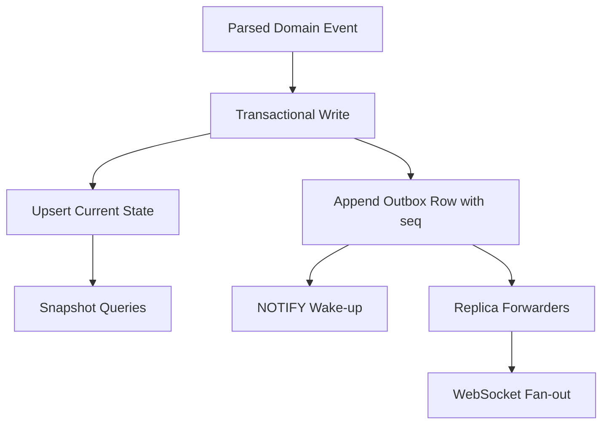

# Backend Architecture

Last verified: 2026-05-03

## Status

This document is pre-ADR research. The canonical decisions are in [ADR 0002](../../architecture-decisions/0002-state-externalization-postgres-outbox.md), [ADR 0003](../../architecture-decisions/0003-state-cursor-contract-and-operator-policy.md), and [ADR 0004](../../architecture-decisions/0004-frontend-derived-pool-stats.md). The research below is preserved for analysis and rejected alternatives.

Notable supersessions:

- **`pool_stats_after` is not persisted in the outbox** (ADR 0004). Pool stats are derived frontend-side; the outbox stores domain events only. References below to "WS-ready payload," "derived sidecar," or "compute any derived sidecar needed for WS" should be read as historical recommendations that were not adopted.
- **Concurrency control uses atomic `UPDATE ... WHERE status IN (predecessors)`** parameterized from the Rust state machine (ADR 0002 Decision 2). The recommendation below for "transition validation in SQL / stored procedure / transaction logic" was narrowed — Rust remains the single source of truth for transition rules; SQL just consumes them as parameters.
- **Helm gating has no `unsafe` escape hatch.** ADR 0003 Decision 3 simply requires `postgres://` for `replicaCount > 1` and removes SQLite mode entirely; the "unsafe escape hatch" recommendation in the ADR Positions section below was not adopted.

## Non-Negotiable Invariants

Any durable multi-replica design should preserve these properties from the current implementation and issue comments:

- `GET /v1/state` remains the snapshot path and `/v1/ws` remains the live event path.
- Clients reconcile snapshot and stream using an ATC-owned cursor, not GitHub timestamps.
- Current-state rows stay keyed by GitHub identities (`run_id`, `job_id`).
- The current-state mutation and the durable event append happen in one atomic write boundary.
- Cross-replica fan-out is allowed to lag briefly, but it cannot invent events that are not durably reflected in the snapshot path.
- Reconnect and listener-restart recovery must not depend on best-effort pub/sub alone; every design needs a replay/catch-up path.

## Cross-Cutting Answers To The Issue Comments

### Domain events vs raw GitHub payloads in storage

Recommendation: persist domain events as the canonical hot-path event representation.

Reasoning:

- The server, WebSocket wire contract, and frontend already speak in domain-event terms.
- Domain events are source-agnostic and smaller than raw webhook JSON.
- Re-reading raw GitHub payloads would force every replica to re-run translation logic on the read path.

If raw webhook retention is useful for audit/debug/backfill, store it as an optional side table or blob column, not as the primary projection/event format.

### Upsert/conflict semantics

Recommendation: encode forward-only state transitions in the durable write path rather than trusting "last write wins".

At minimum:

- `runs` keyed by `run_id`
- `jobs` keyed by `job_id`
- explicit status ordering or transition validation in SQL / stored procedure / transaction logic
- idempotent same-status replays allowed
- stale or backward transitions ignored without emitting a new durable event

The durable path must preserve the same semantics the in-memory `StateStore` has today.

### Broadcast payload

Recommendation: separate the cross-replica wake-up signal from the full event payload.

- The wake-up signal should be small: usually just `seq`, or `seq` plus a small discriminator.
- The durable event row should carry the full payload needed for WS fan-out, including `pool_stats_after` for job events if that contract is preserved.

This is especially important for PostgreSQL: `NOTIFY` payloads must be shorter than 8000 bytes, which is too small to safely carry arbitrary job events with steps and sidecar data.

### Cursor semantics

Recommendation: the ADR should move from "next seq to assign" semantics to "last committed seq" semantics, or rename the field so its meaning is unambiguous.

Why this needs an explicit decision:

- Current code and generated types document `StateSnapshot.seq` as "next seq to assign".
- The issue comments recommend `last_seq`.
- Durable backends naturally expose "last committed event" more cleanly than "next event to be assigned".

If the ADR adopts `last_seq`, the client rule becomes:

- buffer WS events
- fetch snapshot with `last_seq`
- discard buffered events with `seq <= last_seq`
- apply buffered/live events with `seq > last_seq`

This is simpler and more portable.

### Gapless vs strictly increasing seq

Recommendation: relax the contract to "strictly increasing committed order", not "no gaps".

Why:

- Today's in-memory design is gapless because one mutex guards store mutation and seq increment.
- PostgreSQL `serial` / identity sequences are not rolled back on transaction abort, so `BIGSERIAL` gives monotonic ordering but not contiguity.

If gaplessness is treated as a hard requirement, PostgreSQL needs a custom counter-allocation mechanism instead of a normal sequence. That adds complexity without helping the client protocol, which only needs ordering.

## Alternative Summary

| Alternative | Fit for ATC now | Operational cost | Main risk |
|---|---|---:|---|
| PostgreSQL current-state tables + outbox + `LISTEN/NOTIFY` | Strong | Medium | listener catch-up / SQL projection work |
| Redis hashes + Pub/Sub | Poor | Low-Medium | at-most-once fan-out; no durable replay |
| Redis hashes + Streams | Medium | Medium | manual state/index modeling in Redis |
| Queue-first (JetStream/RabbitMQ) + DB projection | Medium for future scale, weak for current scope | High | too many moving parts for current product stage |
| Leader-routed in-memory store | Weak | Low | does not really solve durability or horizontal scale |

## Recommended Backend Shape

## Alternative 1: PostgreSQL Current-State Tables + Outbox + `LISTEN/NOTIFY`

### Shape

- `runs` table keyed by `run_id`
- `jobs` table keyed by `job_id`
- append-only `events` / outbox table with ATC-owned `seq`
- one transaction per ingested webhook-derived domain event:
  - validate / upsert current state
  - compute any derived sidecar needed for WS
  - insert event row
  - `NOTIFY` listeners with `seq`
  - commit
- app replicas:
  - `LISTEN` on one channel
  - when notified, fetch `events where seq > last_forwarded_seq order by seq`
  - forward fetched rows to local WS clients

### Why it fits ATC well

- The chart already supports external Postgres configuration.
- REST snapshot path becomes ordinary SQL queries.
- The outbox row solves reconnect, replay, and cross-replica catch-up in one place.
- The issue comments' atomicity constraint maps cleanly to a single DB transaction.
- Future filtered subscriptions, history, and admin/debug tooling all benefit from SQL visibility.

### Important design details

1. `NOTIFY` should carry `seq`, not the full event.
2. Listener recovery must not trust `LISTEN/NOTIFY` alone. On startup and on reconnect, each replica should fetch missed outbox rows by `seq`.
3. The persisted event row should likely store the WS-ready payload:
   - domain event
   - `pool_stats_after` for job events, if that sidecar stays in the wire contract
4. Snapshot responses should return the highest committed `seq` reflected in the snapshot, not depend on a gapless counter.

### Costs

- translating the `StateStore` rules into SQL upsert logic
- deciding what remains normalized vs JSONB
- adding migrations, transactional tests, and DB-backed integration tests
- changing current frontend/server cursor docs if `last_seq` is adopted

### Verdict

This is the strongest default choice for ATC's current stage.

It is the only option that directly aligns with:

- the existing external-database deployment mode
- the issue comments' outbox recommendation
- the repo's current REST + WS split
- future needs beyond just "more than one pod"

## Alternative 2: Redis As The Source Of Truth

Two very different Redis designs are possible. They should not be evaluated as one thing.

### 2A. Redis hashes + Pub/Sub

This is the closest match to the issue body's original Redis sketch and it is not sufficient as the primary design.

Why it falls short:

- Redis Pub/Sub is at-most-once. If a subscriber disconnects or fails while receiving a message, the message can be lost.
- Pub/Sub alone does not give replay for new replicas, restarted replicas, or missed messages.
- Snapshot/stream atomicity becomes awkward unless the state update and publish happen inside Lua / `MULTI`, and even then the fan-out path is still best-effort.

Verdict: acceptable only as a cache-side fan-out helper, not as ATC's canonical multi-replica state design.

### 2B. Redis hashes + Streams

This is the serious Redis variant.

### Shape

- current state in hashes / sets / sorted sets keyed by `run_id`, `job_id`, repo, and indexes
- durable event log in a Redis Stream
- consumer groups for replica catch-up and delivery coordination
- all write-side mutations performed in Lua or a carefully scoped `MULTI/EXEC` block

### Strengths

- lower-latency fan-out than a SQL-first design
- stream replay exists, unlike Pub/Sub
- consumer-group semantics are closer to the durable cross-replica story ATC needs

### Weaknesses

- all of ATC's current relational shape becomes manual Redis data modeling
- secondary indexes, TTL cleanup, and snapshot query assembly become application-owned complexity
- if the public cursor uses Redis Stream IDs directly, ATC's wire contract changes shape from `u64` to string IDs
- if ATC wants to preserve a numeric cursor, it needs an explicit counter in addition to the Stream append

### Verdict

Viable, but only if ATC deliberately wants to become Redis-first.

For this repository, it is a weaker fit than PostgreSQL because the current product already leans toward SQL-shaped snapshots and has an existing external Postgres deployment path.

## Alternative 3: Queue-First Ingestion (JetStream / RabbitMQ) + DB Projection

### Shape

- webhook handler validates and quickly enqueues work
- one or more consumers process messages idempotently
- consumers write current-state tables plus outbox rows in a database
- app replicas serve snapshots from the DB and fan-out from the outbox

### Strengths

- best durability/backpressure story during webhook spikes
- any replica can consume from the queue
- queue consumer acknowledgments and retries are a good fit for long-lived outages or slow downstreams

NATS JetStream is the most interesting queue variant here because durable consumers support acknowledgments and redelivery, and can recover from server/client failure.

### Weaknesses

- a queue does not replace the need for a queryable current-state store
- ATC still needs projection tables and an outbox or equivalent replayable read model
- operational footprint becomes queue plus database, not one stateful dependency
- the complexity is justified only if ATC expects materially higher scale or a SaaS-style multi-tenant future

### Verdict

Architecturally strong, but ahead of the repository's current needs.

Choose this only if the roadmap says "webhook ingestion pipeline first" rather than "unblock multi-replica dashboard deployments".

## Alternative 4: Leader-Routed In-Memory Store

### Shape

- elect one active writer / state owner
- route all webhooks and possibly all WS/snapshot traffic to that leader
- other replicas proxy, standby, or serve only static assets

### Strengths

- minimal implementation change
- preserves most current in-memory code

### Weaknesses

- still loses live state on leader restart
- does not really provide horizontal scaling of live state
- creates routing and failover coupling instead of removing it
- leaves HPA / anti-affinity / replica scheduling partially blocked in practice

### Verdict

Useful only as a temporary stopgap. It does not satisfy the spirit of issue #7.

## Recommended ADR Positions

The ADR for issue #7 should explicitly take positions on these points:

### 1. Cursor contract

Recommended answer:

- rename or redefine the snapshot cursor as `last_seq` or `resume_after_seq`
- require only strict monotonic ordering of committed events

### 2. Canonical persisted event format

Recommended answer:

- canonical hot path: domain event payload plus optional derived sidecar
- optional cold-path audit: raw GitHub webhook JSON

### 3. Outbox schema

Recommended answer:

- append-only outbox/event table
- `seq` primary key
- `run_id`, `job_id`, event kind, payload, created_at
- optional source metadata if audit/debug value is worth the storage

### 4. Helm behavior

Recommended answer:

- if `replicaCount > 1`, require a durable externalized-state backend
- explicitly reject multi-replica in-memory mode at template render time unless there is an intentional `unsafe` escape hatch

### 5. Cleanup/retention

Recommended answer:

- keep current-state TTL semantics for completed runs/jobs
- decide separately how long outbox/history rows are retained
- do not tie event retention to current-state TTL automatically

## Why PostgreSQL Wins Here

The deciding factor is not that PostgreSQL is universally better than Redis or a queue. It is that it best matches ATC's actual shape:

- ATC already has a SQL-friendly snapshot model.
- The frontend already uses a snapshot-plus-stream reconciliation protocol.
- The issue comments already converge on a transactionally coupled outbox shape.
- The existing Helm story already has an external Postgres mode.
- Future features like history, replay, per-repo filtering, and debugging all become easier once the state is queryable with SQL.

Redis Streams is the best fallback if "single dependency and very fast fan-out" becomes more important than query ergonomics. Queue-first becomes attractive only once ingestion scale, SaaS isolation, or retry/backpressure requirements dominate the design.
