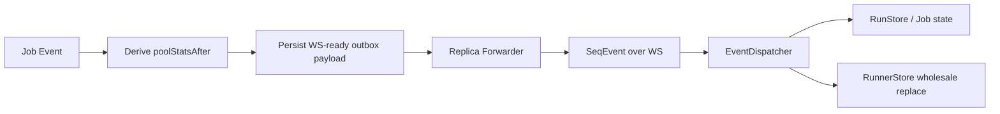

# Frontend Impact

Last verified: 2026-05-03

## Status

This document is pre-ADR research. The canonical decisions are in [ADR 0002](../../architecture-decisions/0002-state-externalization-postgres-outbox.md), [ADR 0003](../../architecture-decisions/0003-state-cursor-contract-and-operator-policy.md), and [ADR 0004](../../architecture-decisions/0004-frontend-derived-pool-stats.md). The research below is preserved for analysis and rejected alternatives.

Notable supersessions:

- **`SeqEvent.poolStatsAfter` and `StateSnapshot.poolStats` are removed from the wire contract** (ADR 0004). Pool stats are derived frontend-side from `runStore.jobs`. The "Outbox Semantics And Frontend Interaction" and "`poolStatsAfter` And The Outbox" sections below describe an approach that was not adopted; the cleaner outcome is that the outbox stores domain events only and the frontend derives pool stats locally.
- **Frontend `highestAppliedSeq` dedupe is not added.** ADR 0003 explicitly decided against the dedupe guard the "Frontend Hardening Worth Considering" section below recommends; the forwarder design in ADR 0002 (serialized per-replica loop, level-triggered wake-up coalescing, strict `seq > watermark`, watermark advances only after acceptance) prevents overlap by construction.
- **No backward-compatible cursor transition window.** Frontend and backend ship together in one binary via `rust-embed`, so the cursor rename happens in lockstep (ADR 0003 Context). The "files that would need to change" list below is still accurate as the set of frontend touch-points; the change just happens in one commit alongside the backend rename rather than across a transition.

## Frontend Contract Today

The frontend uses `seq` in a much narrower way than the backend does.

Current behavior in `frontend/src/lib/connection.ts`:

- open WS first
- buffer incoming `SeqEvent`s while `GET /v1/state` is in flight
- load the snapshot into stores
- replay buffered events whose `seq` passes the snapshot filter
- after connect completes, trust the live WS stream and stop consulting `seq`

Important consequences:

- the only place the frontend currently compares cursor values is the snapshot/stream handoff
- there is no client-side `highestAppliedSeq` or duplicate filter after connect
- there is no gap detection
- `EventDispatcher` applies events in arrival order, not by sorting on `seq`

This means the frontend is already compatible with a **monotonic but non-gapless** durable cursor. It does **not** require contiguous numbers.

It also means the frontend currently assumes the connected replica will only forward:

- committed events
- in correct `seq` order
- without duplicate live delivery

That assumption is mostly safe if each replica replays outbox rows with `ORDER BY seq` and only advances its local forwarding watermark after successful read/forward. It is less safe if the server can resend overlap rows during listener recovery or rolling deploy transitions.

## Snapshot / Stream Handoff

```mermaid
sequenceDiagram
  participant B as Browser
  participant WS as /v1/ws
  participant REST as /v1/state

  B->>WS: Open WebSocket
  WS-->>B: SeqEvent(seq=n) while snapshot pending
  Note over B: Buffer in preConnectBuffer
  B->>REST: GET /v1/state
  REST-->>B: StateSnapshot(cursor)
  Note over B: Load snapshot into stores
  Note over B: Replay buffered events past cursor cutoff
  Note over B: Connected; trust live WS order
```

## Frontend Impact Of Contract Changes

### If the snapshot cursor changes from "next seq to assign" to `last_seq`

This is the main frontend-facing contract change.

Files that would need to change:

- `frontend/src/lib/connection.ts`
- generated `frontend/src/lib/types/generated/StateSnapshot.ts`
- tests in `frontend/src/lib/connection.buffering.test.ts`
- tests/comments in `frontend/src/lib/connection.aria-silence.test.ts`
- `docs/architecture/frontend-app.md`

Current handshake rule:

- replay buffered events with `seq >= snapshot.seq`
- discard buffered events with `seq < snapshot.seq`

If the backend returns `last_seq` instead:

- replay buffered/live events with `seq > snapshot.lastSeq`
- discard buffered events with `seq <= snapshot.lastSeq`

So the code change in `connection.ts` is small but precise:

- rename the local cursor field away from `snapshotSeq`
- invert the comparator from `>=` to `>`
- update comments so the handoff semantics stay legible

This is a real behavior change, not just renaming.

### If ordering semantics change from gapless to monotonic-only

No functional frontend change is required.

Why:

- `SeqEvent.seq` and snapshot cursors are already `bigint`
- the client does not compute `+1`, ranges, or contiguity checks
- the client only needs an ordered cutoff for the snapshot/stream handoff

What should change:

- generated type comments
- frontend architecture docs
- any tests or prose that imply "no gaps"

### If outbox semantics become the server's live-event source

If the server continues to emit the same WS wire payload:

- `SeqEvent { seq, event, poolStatsAfter }`

then the frontend does not need to know an outbox exists.

The frontend does not read the outbox directly. It only depends on:

- snapshot cursor semantics
- WS payload shape
- per-connection event ordering

So outbox introduction is mostly a backend concern unless it changes one of those three things.

## Frontend Hardening Worth Considering

The current frontend is fine if the backend gives a clean ordered stream. If the durable design makes duplicate or overlap delivery plausible, one extra client-side guard would be worth adding.

### Recommended optional hardening: `highestAppliedSeq`

Add a `highestAppliedSeq` (or `lastAppliedSeq`) guard in the frontend connection path and drop live events where:

- `seq <= highestAppliedSeq`

Why this helps:

- suppresses duplicate outbox rows during listener recovery overlap
- suppresses duplicate ARIA announcements
- suppresses stale `poolStatsAfter` sidecars being re-applied
- prevents redundant rerenders from idempotent-but-duplicated state updates

Why this is optional rather than mandatory:

- if the backend guarantees strict single-delivery per WS connection, the client does not need it
- the current store layer is already idempotent for duplicate run/job events

Important nuance:

- idempotent store updates are **not** enough on their own, because `LiveRegion.observeFlush` reacts to event batches, not to semantic state diffs. A duplicated `RunEvent::Requested` or `Completed` would still announce twice.

### Optional hardening: sort flushes by `seq`

`EventDispatcher` currently processes events in arrival order. Because WebSocket preserves message order on a single connection, this is fine if the server writes them in committed order.

If the server cannot make that guarantee during outbox catch-up, the frontend could sort each drained batch by `seq` before:

- applying store mutations
- invoking the ARIA `onFlush` callback

This is probably unnecessary if replicas query outbox rows as `ORDER BY seq`, but it is the client-side fallback.

### What not to add

Do not add gap detection that assumes contiguous numbers, such as "if `seq !== highestAppliedSeq + 1`, treat as data loss".

That logic is incompatible with PostgreSQL `BIGSERIAL` / identity semantics once aborted transactions are possible.

If client-visible loss detection is wanted later, it needs a different explicit server contract, not inferred gaplessness.

## Outbox Semantics And Frontend Interaction

The outbox matters to the frontend indirectly, not directly.

### Where it does matter

- it becomes the source of the durable cursor
- it defines the order in which replicas should push WS events
- it may become the source of the WS payload itself

### Where it does not matter

- the frontend does not care whether the replica learned about new events via `NOTIFY`, Redis, or queue wake-up
- the frontend does not need outbox retention for its own reconnect story because it already re-fetches a full snapshot on reconnect

That last point is important: outbox retention only needs to be long enough for:

- replica fan-out recovery
- operational debugging / optional history

It does **not** need to preserve every event for offline browser clients, because browsers recover from snapshots, not from direct event-log replay.

## `poolStatsAfter` And The Outbox

`runnerStore` is updated from `SeqEvent.poolStatsAfter` by full replacement. That means:

- if job-event WS payloads continue carrying `poolStatsAfter`, frontend behavior is unchanged
- if the backend stops carrying the sidecar and sends only entity keys, the frontend contract changes materially

For the current frontend, the cleanest durable design is to persist the WS-ready payload in the outbox, including `poolStatsAfter` when present. That keeps the frontend fully decoupled from the outbox's existence.

### Sidecar Dataflow



### Why the sidecar is sensitive

`poolStatsAfter` is not just extra metadata. It is a point-in-time derived snapshot.

That means:

- duplicate or stale sidecars can regress pool UI even if run/job events are otherwise idempotent
- recomputing the sidecar at replay time changes its meaning from "pool state immediately after seq N" to "pool state when this replica replayed seq N"

If the current WS contract stays, the outbox should preserve the exact sidecar value that belonged to the original event boundary.
