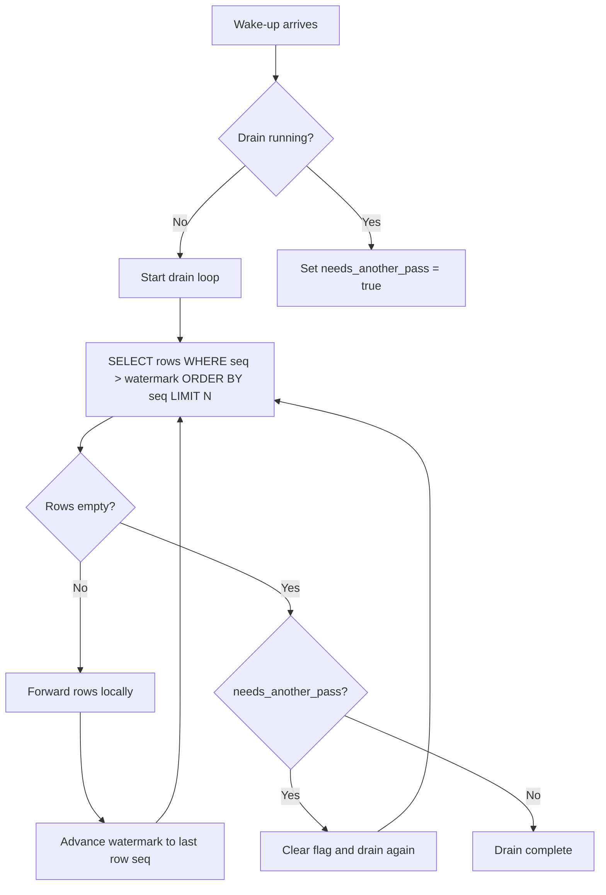

# Overlap And Forwarding

Last verified: 2026-05-03

## Status

This document is pre-ADR research. The canonical decisions are in [ADR 0002](../../architecture-decisions/0002-state-externalization-postgres-outbox.md), [ADR 0003](../../architecture-decisions/0003-state-cursor-contract-and-operator-policy.md), and [ADR 0004](../../architecture-decisions/0004-frontend-derived-pool-stats.md). The forwarder analysis below was adopted; the analysis of failure modes and client-side dedupe was modified during the ADR process.

Notable supersessions:

- **The `poolStatsAfter` regression failure mode is no longer applicable** (ADR 0004). Pool stats are derived frontend-side; duplicate events produce idempotent recomputes that yield the same value. The "repeated older `poolStatsAfter` sidecars can temporarily regress the pool display" bullet under "Why Overlap Matters To This Frontend" no longer applies.
- **Frontend `highestAppliedSeq` dedupe is not added** (ADR 0003 dropped its dedupe decision entirely). The recommendation at the end of this document — "optional frontend dedupe by `highestAppliedSeq`" — was superseded; the forwarder design described here prevents overlap by construction, so no client-side dedupe is needed at all.
- **The forwarder loop design itself was adopted as-is.** The serialized per-replica loop, level-triggered wake-up coalescing, strict `seq > last_forwarded_seq ORDER BY seq`, and watermark-advances-after-acceptance pattern from this document became ADR 0002 Decision 5.

## Overlap Delivery In More Detail

In an outbox-backed design, overlap delivery means one replica forwards the same committed outbox range more than once on a single WS connection, or forwards an older overlapping range after a newer one.

This is not the same as the existing reconnect story:

- browsers already recover by re-fetching `GET /v1/state`
- overlap delivery is a live-stream behavior on an otherwise healthy connection

## What "Drain" Means Here

In this document, a replica "drain" means:

- one app replica reads newly committed outbox rows from the shared durable store
- that replica forwards those rows to its own local WS / in-process broadcast path
- the replica advances its own local forwarding watermark as it progresses

It does **not** mean:

- the outbox rows are destructively consumed
- the replica itself is shutting down
- some cluster-wide queue is being emptied once for everyone

Each replica has its own view of:

- `last_forwarded_seq`
- whether a drain is currently in progress
- whether another wake-up arrived during the current drain

## How Overlap Can Happen

Common ways:

- a replica is doing startup catch-up from `seq > X` and also receives a wake-up notification for newly committed rows before the first catch-up finishes
- multiple `NOTIFY` wake-ups trigger concurrent outbox fetches against the same local watermark
- the replica reconnects its DB listener and intentionally re-queries from an older safe point to avoid loss
- an off-by-one query uses `>= last_forwarded_seq` instead of `>`
- paginated catch-up advances its watermark too late, so a second fetch overlaps the first page window

The important point is that overlap is usually the result of building for **loss avoidance**. Systems often accept at-least-once forwarding because replaying overlap is safer than skipping a committed event.

## Why Overlap Matters To This Frontend

The current frontend:

- filters by cursor only during the snapshot/stream handoff
- does not track `highestAppliedSeq` after connect
- applies `poolStatsAfter` by wholesale replacement
- announces transitions from the flushed event list, not from semantic diffs

So duplicate live delivery is not catastrophic, but it is user-visible:

- repeated `Run` / `Job` events cause redundant rerenders
- repeated `RunEvent::Requested` or `Completed` can announce twice through the ARIA live region
- repeated older `poolStatsAfter` sidecars can temporarily regress the pool display

## Server-Side Ways To Reduce Or Eliminate Overlap

Best options:

1. One forwarder loop per replica.
   Notifications only wake the loop; they do not each run their own fetch-and-forward pipeline.
2. Treat wake-ups as level-triggered, not edge-triggered.
   "There may be rows after my watermark" is enough; coalesce wake-ups while a fetch is already in progress.
3. Query strictly with `seq > last_forwarded_seq`.
4. Advance the local watermark only after the replica has durably accepted the fetched rows for forwarding to local WS clients.
5. Replay from outbox in `ORDER BY seq` always, including recovery paths.

These measures often make client-side dedupe optional rather than required.

## Wake-Up Coalescing

### What it means

It means a wake-up notification should not automatically start a second concurrent outbox fetch on the same replica if that replica is already replaying rows.

Desired behavior:

- wake-up arrives
- if no drain is running, start the drain loop
- if a drain is already running, record "another pass is needed" and return
- when the current drain finishes, loop again from the updated watermark

This treats notifications as level-triggered:

- "there may be rows after my watermark"

rather than edge-triggered:

- "run one independent fetch pipeline for this notification"

### Forwarder Loop



### Pseudocode

```text
on_wakeup():
  if draining:
    needs_another_pass = true
    return
  start drain()

drain():
  draining = true
  loop:
    rows = SELECT ... WHERE seq > last_forwarded_seq ORDER BY seq LIMIT N
    if rows empty:
      break
    forward rows locally
    last_forwarded_seq = last row seq
  draining = false

  if needs_another_pass:
    needs_another_pass = false
    drain()
```

The point is not to suppress work. The point is to suppress overlapping fetch-and-forward pipelines on the same replica.

## Leader Election

### Would leader election solve this?

Partially, but it is usually too much machinery for this specific problem.

If one elected leader is the only process allowed to read the outbox and fan out WS events, then yes:

- overlap between multiple replicas' forwarders disappears
- duplicate forwarding caused by concurrent fetchers in different replicas disappears
- event ordering becomes easier to reason about

But leader election does not fully remove the problem space:

- the leader can still duplicate rows if its own recovery logic replays overlap
- failover still needs a handoff point or durable watermark
- non-leader replicas either need to proxy WS through the leader or stop serving WS locally
- snapshot traffic and event traffic become topologically coupled to the leader again

That last point is a real architectural regression for ATC. The current design intentionally keeps:

- `GET /v1/state` as a store query
- `/v1/ws` as a thin event pipe
- replicas symmetric

Leader election reintroduces a distinguished node into a system that issue #7 is trying to make horizontally correct.

### Recommendation on leader election

Do not choose leader election as the primary answer to overlap delivery.

Use it only if the system deliberately wants a single active event-forwarder topology for broader reasons, such as:

- minimizing total DB listener load
- centralizing fan-out metrics / debugging
- simplifying an early stopgap deployment before true symmetric multi-replica support

For ATC's likely direction, the better default is:

- symmetric replicas
- transactional outbox
- `NOTIFY` as wake-up only
- one serialized forwarder loop per replica
- optional frontend dedupe by `highestAppliedSeq`
