# Rollout And Implementation

Last verified: 2026-05-04 (Phase 2d LISTEN/NOTIFY: complete)

## Status

This document is the canonical phasing for the state-externalization work. It is maintained in lockstep with [ADR 0002](../../architecture-decisions/0002-state-externalization-postgres-outbox.md), [ADR 0003](../../architecture-decisions/0003-state-cursor-contract-and-operator-policy.md), and [ADR 0004](../../architecture-decisions/0004-frontend-derived-pool-stats.md). The ADRs decide *what* and *why*; this document decides *when* and *in what order*.

Each sub-phase is intended to be roughly one PR's worth of work — small enough that an implementor (human or AI agent) can hold the full scope in context, large enough not to be busywork. Each sub-phase should get its own detailed task-by-task implementation plan in `docs/implementation-plans/` before execution.

## Phased Rollout

The recommended design does not need to land in one PR, but it should be phased so that snapshot and stream semantics stay coherent at every cutover point.

```mermaid
flowchart LR
  P1[Phase 1 ADRs] --> P2A[2a Foundation]
  P2A --> P2B[2b Shadow Writes]
  P2B --> P2C[2c Outbox]
  P2C --> P2D[2d NOTIFY]
  P2D --> P3A[3a Cursor Rename]
  P3A --> P3B[3b Pool Stats Move]
  P3B --> P3C[3c Read Cutover]
  P3C --> P4[Phase 4 Multi-Replica]
  P4 --> P5[Phase 5 Hardening]
```

### Phase 1: ADR and contract decisions

Settle the decisions that shape every later phase.

**Status: complete.** Decisions captured in [ADR 0002](../../architecture-decisions/0002-state-externalization-postgres-outbox.md), [ADR 0003](../../architecture-decisions/0003-state-cursor-contract-and-operator-policy.md), and [ADR 0004](../../architecture-decisions/0004-frontend-derived-pool-stats.md).

### Phase 2: Durable write path in shadow mode

Add the durable backend structures without changing frontend-visible behavior. The app continues to serve snapshots and WS from the in-memory path while the durable path is built and validated in parallel. After Phase 2, every webhook produces both an in-memory mutation AND a durable PG write, and a NOTIFY fires post-commit — but no replica is reading from the outbox or PG yet.

#### Phase 2a: PG foundation

**Status: complete (PR #48).**

Bootstrap the database integration without touching any read paths or the webhook handler logic.

In scope:
- Pick a PG client crate (`sqlx`, `tokio-postgres`, `sea-orm`, etc.) — ADR 0002 leaves this open as a Phase 2 implementation choice
- Pick a migration tool (`sqlx-cli`, `refinery`, `sea-orm-migration`, etc.) — same Phase 2 choice
- Initial SQL schema for `runs` and `jobs` tables only (no outbox yet); FK from `jobs.run_id` to `runs.id`; whatever indexes are needed for the Phase 3c snapshot queries
- Connection pool wiring against `ATC_DATABASE_URL` (already exists in chart)
- Add a DB connectivity check to `/readyz` so the readiness probe catches misconfiguration
- Add testcontainers-based integration test infrastructure
- The in-memory `StateStore` is unchanged; nothing else is wired to PG yet

Acceptance: `just test` runs an integration test that boots an ephemeral Postgres, runs migrations, and confirms the readiness probe passes.

ADR refs: [ADR 0002 Decision 1](../../architecture-decisions/0002-state-externalization-postgres-outbox.md) (storage backend), [ADR 0002 Out of scope](../../architecture-decisions/0002-state-externalization-postgres-outbox.md) (config shape).

#### Phase 2b: Shadow current-state writes

**Status: complete.** Implement the atomic-update pattern for `runs` and `jobs` and start writing to PG alongside the in-memory store.

In scope:
- Implement atomic `UPDATE ... WHERE status IN (predecessors)` for runs and jobs; predecessor sets parameterized from the existing Rust state machine (e.g., `RunStatus::predecessors_of(target)` and equivalent for `JobStatus`) — **DONE**
- Implement first-sight creation via `INSERT ... ON CONFLICT (id) DO UPDATE ... WHERE status IN (predecessors)` — **DONE**
- Map `0 rows affected` to `PersistError::InvalidTransition` (new error type in atc-core) — **DONE**
- Webhook handler now writes to PG in addition to the in-memory store (shadow mode — both writes happen, in-memory still authoritative for reads) — **DONE**
- Integration tests verifying PG state matches in-memory state after a sequence of webhook events — **DONE** (persist_pg_tests.rs: 15 tests)
- Tests for invalid transitions (rejected via `0 rows affected`) — **DONE**
- Tests for idempotent same-status replay — **DONE**
- Dual-write tests with full router and drift metrics (shadow_writes_tests.rs: 9 tests) — **DONE**
- AC7 metric counter assertions (parity and transient failures) — **DONE**

Acceptance: a test that fires a sequence of run/job webhooks against a real Postgres and asserts PG row state matches the in-memory store at each step. **SATISFIED.** All 24 integration tests pass (15 persist_pg + 9 shadow_writes). All 255 backend tests pass. Metrics counters verified in AC7 tests.

ADR refs: [ADR 0002 Decision 2](../../architecture-decisions/0002-state-externalization-postgres-outbox.md) (atomicity + concurrency control via UPDATE-WHERE-predicate).

#### Phase 2c: Outbox table + transactional writes

**Status: complete.** Add the `outbox` table and make the current-state UPSERT + outbox INSERT atomic. Reverse the error policy so transient PG failures return 503 (not 200). Clean up shadow terminology.

In scope:
- Add `outbox` table with `BIGSERIAL seq` primary key, `kind`, `run_id`, `job_id`, `payload JSONB`, and `inserted_at` — **DONE** (`migrations/0002_outbox.sql`)
- 4 `pub(crate)` transaction helpers in `persist.rs`: `upsert_run_in_txn`, `upsert_job_in_txn`, `insert_outbox_run_in_txn`, `insert_outbox_job_in_txn` — **DONE**
- Webhook handler holds seq mutex across `pool.begin()…tx.commit()` to preserve broadcast-order = durable-order invariant — **DONE**
- Reversed error policy: transient PG failures → 503, parity rejections → 200 `{"status":"rejected"}`, success → 200 `{"status":"processed"}` — **DONE**
- Drop `pg_store: Option<Arc<dyn PersistentStore>>` from `AppState`; handler drives transactions directly via `&PgPool` — **DONE** (14 `pg_store: None` literals + 1 `Some(...)` helper site swept)
- Rename metric `atc_shadow_pg_write_failures_total` → `atc_pg_write_failures_total`; add `atc_pg_in_memory_drift_total` — **DONE**
- Rename test file `shadow_writes_tests.rs` → `transactional_writes_tests.rs` with inverted transient-failure assertion (now 503) — **DONE** (8 tests pass)
- New `outbox_tests.rs` covering AC1–AC6: atomicity success/rollback, BIGSERIAL gap, stub run, payload envelope, error policy — **DONE** (11 tests pass)
- The outbox is written but not yet read by anyone — in-memory path still authoritative for reads

Acceptance: a test that triggers a transaction abort and confirms no outbox row is committed, and tests that confirm successful writes produce both a current-state row and a matching outbox row in one transaction. **SATISFIED.** 11 `outbox_tests` + 8 `transactional_writes_tests` + 15 `persist_pg_tests` all pass. Full backend test suite passes. `.sqlx/` offline cache covers all new queries.

ADR refs: [ADR 0002 Decision 2](../../architecture-decisions/0002-state-externalization-postgres-outbox.md) (atomicity), [ADR 0003 Decision 2](../../architecture-decisions/0003-state-cursor-contract-and-operator-policy.md) (monotonic-not-gapless ordering), [ADR 0004](../../architecture-decisions/0004-frontend-derived-pool-stats.md) (outbox stores domain events only).

#### Phase 2d: NOTIFY emission + listener stub

Wire up `LISTEN/NOTIFY` end-to-end without yet using it for forwarding.

**Status: complete (feat/phase-2d-notify-listener branch).**

In scope:
- Webhook handler emits `SELECT pg_notify('atc_outbox', seq::text)` inside the transaction (before `tx.commit()`). Note: the API call happens before commit — PG queues the NOTIFY during the transaction and delivers it atomically on COMMIT. Delivery semantics are equivalent to "after commit," but the call site is before `tx.commit()`. Aborted transactions silently drop the queued NOTIFY. — **DONE**
- Add a separate dedicated long-lived listener connection on a session-mode-compatible path — **DONE**
- Add `ATC_DATABASE_LISTENER_URL` config option that defaults to `ATC_DATABASE_URL` if unset — **DONE** (IMPLEMENTED in Phase 2d)
- Listener task in `atc-server` runs the level-triggered drain loop (per `overlap-and-forwarding.md` pseudocode) — but instead of forwarding to WS clients, it just logs received notifications and the rows it would have fetched — **DONE**
- Tests verify NOTIFY fires after commit and the listener task receives it — **DONE**
- Tests verify wake-up coalescing (multiple notifications during a drain produce one extra pass, not concurrent fetches) — **DONE**
- Helm chart wired: `config.databaseListenerUrl` (plain value) and `existingSecret.databaseListenerUrlKey` (secret key ref); existingSecret path wins when both are set — **DONE**
- Documentation updated: `docs/architecture/backend-server.md`, `docs/architecture/deployment.md`, `backend/crates/atc-server/CLAUDE.md`, this file, ADR 0002 — **DONE**

Acceptance: an integration test that fires N webhooks and confirms the listener observes N notifications and would have fetched all N outbox rows in seq order. **SATISFIED.**

ADR refs: [ADR 0002 Decision 3](../../architecture-decisions/0002-state-externalization-postgres-outbox.md) (NOTIFY + connection-pool compatibility), [ADR 0002 Decision 5](../../architecture-decisions/0002-state-externalization-postgres-outbox.md) (forwarder design including startup watermark).

**Phase 2d DONE checklist:**
- [x] NOTIFY emission inside webhook transaction (`SELECT pg_notify('atc_outbox', seq::text)` before `tx.commit()`)
- [x] Listener task (dedicated session-mode `PgListener`, fires `Arc<Notify>` on receipt)
- [x] Drain task (wakes on `Arc<Notify>`, fetches `seq > watermark ORDER BY seq`, logs, advances watermark)
- [x] Watermark init: `COALESCE(MAX(seq), 0)` at boot (ADR 0002 Decision 5)
- [x] `ATC_DATABASE_LISTENER_URL` env var and config field (`database_listener_url`)
- [x] Helm wiring: `config.databaseListenerUrl` + `existingSecret.databaseListenerUrlKey`
- [x] Five new metrics: `atc_pg_notify_emitted_total{kind}`, `atc_pg_notify_received_total`, `atc_pg_listener_recv_errors_total`, `atc_pg_drain_passes_total`, `atc_pg_drain_rows_total`
- [x] Documentation updated

### Phase 3: Single-replica read-path cutover

Switch every read path to the durable backend. The cursor rename and pool stats removal both ship in Phase 3 because they're wire-contract changes that need to land before the read path can use the new shape; they cannot be deferred to Phase 4 without risking inconsistency.

#### Phase 3a: Cursor rename

Rename the snapshot cursor and ship the lockstep frontend change.

In scope:
- Rename `StateSnapshot.seq` → `StateSnapshot.lastSeq`; semantics shift from "next seq to assign" to "highest committed seq"
- ts-rs regenerates the `StateSnapshot` TypeScript type
- Frontend `connection.ts:14` rename `snapshotSeq` → `snapshotLastSeq` (or similar)
- Frontend `connection.ts:116` invert the comparator from `>=` to `>`
- Update test fixtures and assertions referencing the old field name and comparator
- Backend and frontend ship together in one binary version (no transition window per [ADR 0003 Context](../../architecture-decisions/0003-state-cursor-contract-and-operator-policy.md))

Acceptance: existing connection-buffering tests pass with the new field name and comparator; an end-to-end test confirms a buffered event with `seq == lastSeq` is correctly discarded (vs. previously replayed).

ADR refs: [ADR 0003 Decision 1](../../architecture-decisions/0003-state-cursor-contract-and-operator-policy.md) (cursor rename), [ADR 0003 Context](../../architecture-decisions/0003-state-cursor-contract-and-operator-policy.md) (single-binary deployment shape).

#### Phase 3b: Pool stats moved to frontend

Remove backend pool stats computation; add frontend derivation.

In scope:
- Backend: delete `StateStore::pool_stats()` and the snapshot-time inline pool-stats computation
- Backend: remove `pool_stats` from `StateSnapshot` and `pool_stats_after` from `SeqEvent`
- Backend: webhook handler no longer computes `pool_stats_after` under the seq mutex
- Frontend: add a `pools` `$derived.by` to `runStore` (or thin wrapper in `runnerStore`) that replicates the existing backend algorithm — skip Waiting/Completed, group by sorted-label set, count Queued/InProgress, derive `group_name` and `is_elastic` from observed runners, sort lexicographically by labels
- Frontend: remove `runnerStore.loadPools()` call sites and the dispatcher's `if (seqEvent.poolStatsAfter != null)` block
- ts-rs regenerates the affected types
- Test churn: backend tests asserting on `pool_stats_after` go away; frontend tests fed `poolStatsAfter` through fixtures now drive derivation through the underlying jobs
- Backend and frontend ship together in one binary version

Acceptance: existing pool-display E2E tests pass with the derived store; a test confirms duplicate Job events produce idempotent recomputes that yield the same pool stats.

ADR refs: [ADR 0004](../../architecture-decisions/0004-frontend-derived-pool-stats.md) (entire ADR).

#### Phase 3c: Read-path cutover

Switch `GET /v1/state` to read from PG and `/v1/ws` to forward from the outbox. Remove the in-memory store.

In scope:
- `GET /v1/state` reads the unevicted current-state projection from PG (`runs` and `jobs` tables); `lastSeq` comes from `MAX(seq)` over the outbox in the same transaction
- WS forwarder: the listener task from Phase 2d gains the actual forwarding path — drain rows by `seq > last_forwarded_seq ORDER BY seq`, push as `SeqEvent`s to local WS clients, advance watermark only after acceptance
- On startup, initialize `last_forwarded_seq` to `MAX(seq)` from outbox at boot (no historical replay to live WS clients)
- Remove the in-memory `StateStore`, the broadcast channel, and the seq mutex from `AppState`
- Update `main.rs` lifecycle wiring (no more `start_eviction_task` for in-memory; eviction becomes a SQL `DELETE` task — implementation choice between application-side periodic SQL DELETE or `pg_cron` / scheduled query)
- Update integration tests to verify end-to-end via PG (snapshot returns PG state, WS receives outbox-forwarded events in seq order)
- Single-replica deployment is now fully on durable storage

Acceptance: an end-to-end test that fires webhooks, confirms `GET /v1/state` returns the expected projection from PG, and confirms `/v1/ws` delivers SeqEvents in seq order via the LISTEN/drain pipeline.

Note: When the drain task gains WebSocket forwarding in Phase 3c, it becomes load-bearing for cluster routing. At that point, extend `/readyz` to reflect listener health (mechanism is a Phase 3c design decision).

ADR refs: [ADR 0002 Decision 5](../../architecture-decisions/0002-state-externalization-postgres-outbox.md) (forwarder design + startup watermark), [ADR 0003 Decision 4](../../architecture-decisions/0003-state-cursor-contract-and-operator-policy.md) (TTL eviction as SQL DELETE).

### Phase 4: Multi-replica enablement

Update Helm chart and operationally validate multi-replica. This is the phase where issue #7 is closed in substance.

In scope:
- Update Helm chart: gate `replicaCount > 1` on the presence of a `postgres://` URL via `config.databaseUrl` or `existingSecret`
- Remove SQLite mode from chart entirely (per ADR 0003 Decision 3): the chart's storage-mode story collapses from three modes (ephemeral / local-SQLite / external-Postgres) to two (ephemeral / external-Postgres)
- Update `deploy/helm/atc/values.yaml:106-132` storage-mode docs
- Remove SQLite values-matrix tests under `deploy/helm/atc/tests/`
- Update existing `{{ fail }}` guard logic for the new mode constraints
- Operationally test: deploy with `replicaCount = 2` against a shared Postgres; verify both replicas serve snapshots, both forward events, and clients on either replica see consistent state
- Update `docs/architecture/deployment.md` to reflect the two-mode story

Acceptance: a multi-replica test deployment shows two pods both serving `/v1/state` and `/v1/ws` against the same PG, with consistent state across both.

ADR refs: [ADR 0003 Decision 3](../../architecture-decisions/0003-state-cursor-contract-and-operator-policy.md) (Helm gating + SQLite removal).

### Phase 5: Hardening and cleanup

After multi-replica correctness is proven. These items are independent and can land as separate PRs.

In scope:
- Add metrics for outbox lag, forwarding watermark, wake-up coalescing, and replay duration (per ADR 0002 Out of scope: operational metrics)
- Decide whether the production in-memory path remains as a dev-only mode or is removed entirely (per ADR 0003 Out of scope)
- Decide outbox retention duration and eviction strategy; implement the chosen approach (per ADR 0003 Decision 4: retention is decided separately from current-state TTL)
- Optionally: persist raw GitHub webhook JSON alongside domain events for audit/debug (per ADR 0002 Out of scope)

ADR refs: various ADR Out of scope sections.

## Implementation Checklist

A cross-reference for the ADRs. The canonical decisions are in the ADRs themselves; this checklist is a quick map from "what must / should / should not happen" to "which sub-phase and which ADR."

### Must

These are the pieces that need to land for the recommended design to be coherent.

1. Transactional current-state update plus outbox append (one DB transaction) — Phase 2c, ADR 0002 Decision 2
2. Durable monotonic cursor on the outbox (`BIGSERIAL` seq) — Phase 2c, ADR 0003 Decision 2
3. Snapshot contract uses `lastSeq` semantics, not "next seq to assign" — Phase 3a, ADR 0003 Decision 1
4. Replica forwarders fetch `seq > watermark`, never `>=` — Phase 3c, ADR 0002 Decision 5
5. Replica forwarders replay `ORDER BY seq` — Phase 3c, ADR 0002 Decision 5
6. One serialized outbox-drain loop per replica — Phase 2d / Phase 3c, ADR 0002 Decision 5
7. Atomic `UPDATE ... WHERE status IN (predecessors)` for state machine transitions — Phase 2b, ADR 0002 Decision 2
8. Pool stats derived frontend-side; outbox stores domain events only — Phase 3b, ADR 0004

### Should

Defaults the implementation should prefer unless there is a specific reason to deviate.

1. `NOTIFY` only as wake-up signal; payload is just the seq — Phase 2d, ADR 0002 Decision 3
2. Coalesce wake-ups (level-triggered drain loop) — Phase 2d / Phase 3c, ADR 0002 Decision 5
3. Listener uses a dedicated long-lived session-mode-compatible connection — Phase 2d, ADR 0002 Decision 3
4. Symmetric replicas (no leader; both serve `GET /v1/state` and `/v1/ws`) — Phase 4, ADR 0002 Decision 5
5. Initialize `last_forwarded_seq` to `MAX(seq)` at replica startup — Phase 3c, ADR 0002 Decision 5

### Optional

Worthwhile improvements that are not first-order requirements.

1. Persist raw webhook JSON alongside domain events for audit/debug — Phase 5, ADR 0002 Out of scope
2. Add operational metrics (outbox lag, forwarding watermark, wake-up coalescing, replay duration) — Phase 5
3. Server-side leader election for a single active forwarder topology — explicitly rejected as the primary mechanism in ADR 0002 Decision 5; only attractive if the system wants a distinguished forwarder for broader reasons

### Not Recommended

These are designs that should NOT substitute for the must-have core.

1. Leader election as the primary multi-replica mechanism — does not eliminate the need for transactional outbox semantics, durable watermarks, or ordered replay (ADR 0002 Decision 5)
2. Frontend `highestAppliedSeq` dedupe — explicitly decided against; the forwarder design prevents overlap by construction (ADR 0003)
3. Reimplementing transition rules in PL/pgSQL or check constraints — the Rust state machine remains the single source of truth; SQL just consumes predecessor sets as parameters (ADR 0002 Decision 2)
4. Client-visible gap detection assuming contiguous cursors — incompatible with `BIGSERIAL` semantics under aborted transactions (ADR 0003 Decision 2)
