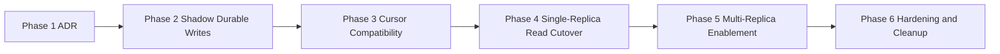

# Rollout And Implementation

Last verified: 2026-05-03

## Phased Rollout

The recommended design does not need to land in one PR, but it should be phased so that snapshot and stream semantics stay coherent at every cutover point.

### Phase 1: ADR and contract decisions

Settle the decisions that shape every later phase:

- snapshot cursor semantics (`last_seq`, `lastSeq`, `resume_after_seq`, or equivalent)
- monotonic-not-gapless ordering contract
- whether `poolStatsAfter` remains part of the WS contract
- whether frontend live dedupe is in scope for the initial rollout or deferred hardening

### Phase 2: Durable write path in shadow mode

Add the durable backend structures without changing frontend-visible behavior yet:

- current-state tables
- outbox table with durable `seq`
- one transaction that updates current state and appends the outbox row

At this stage, the app can still run single-replica and continue serving snapshots and WS from the existing in-memory path while the durable path is validated in parallel.

### Phase 3: Cursor compatibility migration

Introduce the durable cursor contract in a backward-compatible way.

Recommended approach:

- temporarily expose both the old cursor field and the new durable cursor field
- update the frontend to prefer the new field when present and fall back to the old field otherwise

This avoids a flag day deployment between backend and frontend.

### Phase 4: Single-replica read-path cutover

Still with `replicaCount = 1`, switch both read paths together:

- `GET /v1/state` reads from the durable current-state tables
- `/v1/ws` forwards from the outbox through the serialized local forwarder loop

These two cutovers should stay paired. Splitting them creates mixed-source reconciliation problems that are harder to reason about than the final design.

### Phase 5: Multi-replica enablement

After single-replica durable behavior is stable:

- run multiple app replicas against the shared durable store
- each replica runs its own serialized outbox forwarder loop
- Helm validation and defaults are updated so multi-replica requires the durable backend mode

This is the phase where issue #7 is actually closed in substance.

### Phase 6: Hardening and cleanup

After correctness is proven:

- optionally add frontend `highestAppliedSeq` dedupe
- add metrics for outbox lag, forwarding watermark, wake-up coalescing, and replay duration
- remove transitional cursor compatibility fields once old clients are no longer in scope
- decide whether the production in-memory path remains as a dev-only mode or is removed entirely

## Implementation Checklist For The ADR

This is the practical split between what is required for the recommended design to be coherent, what is strongly recommended, and what is optional defense in depth.

### Must

These are the pieces that need to land together if ATC chooses the recommended "symmetric replicas + transactional outbox" design.

1. Transactional current-state update plus outbox append.
   The durable current-state mutation and the durable event append must happen in one database transaction.
2. Durable monotonic cursor on the outbox.
   Every replayable event row needs an ATC-owned ordering cursor (`seq` or equivalent).
3. Snapshot contract updated to durable cursor semantics.
   The ADR must define whether the frontend sees `last_seq`, `resume_after_seq`, or a clearly named equivalent.
4. Replica forwarders must fetch `seq > watermark`, never `>=`.
5. Replica forwarders must replay `ORDER BY seq`.
6. One serialized outbox-drain loop per replica.
   Do not let every wake-up notification spawn a concurrent fetch-and-forward pipeline.
7. Preserve the WS-ready payload shape if the current frontend contract is kept.
   If `SeqEvent` continues to include `poolStatsAfter`, the outbox must preserve enough information to replay that exact payload deterministically.

If any of the items above are missing, the design is either incorrect or changes the frontend contract materially.

### Should

These are not strictly required for correctness in the narrowest sense, but they are the defaults the ADR should strongly prefer.

1. Use `NOTIFY` only as a wake-up signal.
   The payload should be small, usually just the durable cursor or a simple wake token.
2. Coalesce wake-ups while a replica drain is already in progress.
   Treat notifications as level-triggered: "there may be more rows after my watermark."
3. Persist the exact `poolStatsAfter` sidecar in the outbox if the sidecar contract stays.
   This keeps replay semantics identical to live semantics and avoids recomputation drift.
4. Relax ordering semantics from gapless to monotonic committed order.
   The frontend does not need gaplessness, and PostgreSQL sequence semantics make strict contiguity expensive.
5. Keep replicas symmetric.
   Each replica should be able to serve `GET /v1/state` and `/v1/ws` without routing through a distinguished node.
6. Keep raw GitHub webhook payload retention separate from the hot-path replay representation.
   Use domain events for replay; keep raw payloads only if audit/debug value justifies them.

### Optional

These are worthwhile hardening or operability improvements, but they are not the first-order requirement for the architecture to work.

1. Frontend `highestAppliedSeq` dedupe on the live path.
   Drop live events with `seq <= highestAppliedSeq` before dispatch to suppress overlap replays, duplicate ARIA announcements, and stale sidecar reapplication.
2. Frontend batch sort by `seq` before flush.
   Useful only if the backend cannot guarantee in-order delivery on a single connection.
3. Server-side leader election for a single active forwarder topology.
   Only attractive if the system wants a distinguished event-forwarding node for broader reasons; not recommended as the default answer to overlap delivery.
4. Persist raw webhook JSON alongside domain events for audit/debug.
5. Add explicit operational metrics around outbox lag, wake-up coalescing, replay duration, and replica forwarding watermark.

### Not Recommended As The Primary Plan

These are possible designs, but they should not be mistaken for substitutes for the must-have core.

1. Leader election by itself.
   This can reduce one class of overlap but does not remove the need for transactional outbox semantics, a durable watermark, ordered replay, or a sidecar strategy.
2. Recomputing `poolStatsAfter` at replay time from current DB state.
   That changes the meaning of the sidecar and can produce replay-time pool states that never actually existed at the original event boundary.
3. Client-visible gap detection that assumes contiguous cursors.
   This is incompatible with ordinary PostgreSQL sequence behavior once aborted transactions exist.
