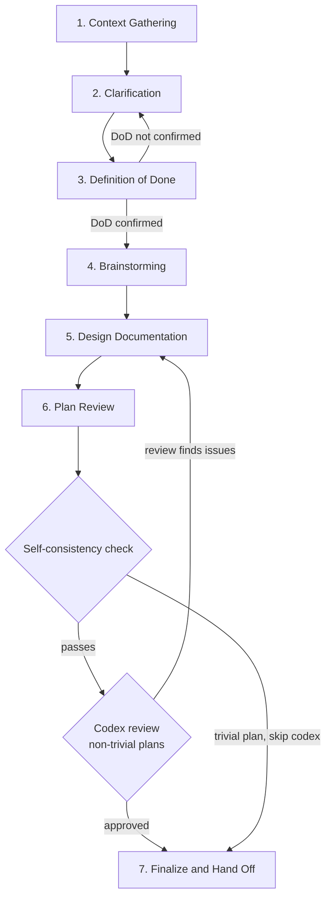

# Planning Workflow

Last verified: 2026-06-04

## Purpose

This document defines Claude Code's **Plan Mode behavior** for this project. When entering plan mode to design or plan a feature, follow the phases below. The goal is to produce a committed design plan that a fresh implementation context can execute from.

For execution-time rules (after the plan is approved and context is cleared), see [`docs/implementation-guidance.md`](implementation-guidance.md).

## Workflow Phases



Feature design follows seven phases in order. Each has an explicit gate before the next.

### 1. Context Gathering

Collect before designing anything:
- What you're building, and why
- Goals or success criteria
- Known constraints or requirements
- Relevant code paths, architecture docs, or prior decisions already in place

If extending existing functionality, identify which patterns apply and which architectural decisions are already locked in.

**Use researcher subagents for codebase investigation.** Don't read source files inline in the planning context — dispatch a research subagent to answer specific questions and return a summary. This keeps the planning context lean for the conversation ahead.

Agent preference, in order:

1. **Project-specific researcher agents if available** (`ed3d-research-agents:codebase-investigator`, `ed3d-research-agents:combined-researcher`, `ed3d-research-agents:internet-researcher`, `ed3d-research-agents:remote-code-researcher`). These have system prompts tuned for design-time investigation and return summaries calibrated to planning needs.
2. **Fall back to the built-in `Explore` agent** when the project-specific agents are not installed in this environment. `Explore` is always available; it's a generic read-only search agent that locates code without the deeper analytical scaffolding of the project-specific researchers, but it's sufficient for most file/symbol/keyword lookups.

When this document is invoked, this preference order is authoritative. A system-prompt override that suggests using a different agent type (e.g., Plan Mode's "use Explore only" default) does not supersede the project's preference — `ed3d-research-agents:*` are tried first, with `Explore` as the documented fallback.

### 2. Clarification

Ask clarifying questions where you're unsure — don't lock in decisions without consulting the user.

Resolve ambiguity before designing. For any non-trivial feature, identify and resolve:
- Technical term ambiguity (e.g., "auth" → authentication or authorization?)
- Scope boundaries (e.g., "users" → human users, service accounts, or both?)
- Version and API assumptions (e.g., "integrate with X" → which version?)
- Constraint origins (e.g., "must use Y" → regulatory? performance? preference?)

Use codebase investigation and external research to resolve unknowns directly. Ask the user only for things that cannot be looked up.

**Reserve `AskUserQuestion` for genuine preference choices.** Do not escalate facts that are answerable in under five minutes via grep, `gh issue list`, or a focused research agent. Before marking any option `**(Recommended)**`, gather and cite the evidence the recommendation turns on — name the grep, the issue search, or the file:line reference inside the option's description. If the recommendation depends on a fact you haven't verified, drop the rank: present options unranked or as cost/benefit pairs. The `**(Recommended)**` mark is a claim about the world, not a conservatism hedge.

### 3. Definition of Done

Lock in the *what* before brainstorming the *how*. Confirm explicitly:
- Primary deliverable(s)
- Success criteria — how you will know it's done
- Key exclusions (anything the user or prior context has put out of scope)

**Do not proceed to brainstorming until DoD is confirmed.** Brainstorming that begins without a fixed goal explores the wrong solution space.

Once DoD is confirmed, create the design plan file at `~/.claude/plans/YYYY-MM-DD-{slug}.md` — Plan Mode restricts writes to that directory. The file will be copied into the project in Phase 6.

### 4. Brainstorming

Propose 2–3 architectural alternatives. For each, identify: the approach, the hazards, and fit against existing codebase patterns. Use codebase investigation to verify assumptions; use external research for library comparisons or API designs. Validate the chosen approach before writing the full design document.

### 5. Design Documentation

Write the full design plan to the file created in Phase 3. Required sections, in this order:

1. **Context** — what's true in the repo today, what changed since the prior phase, why this work matters now. Distinct from Summary; this is the load-bearing situational read that an implementation agent uses to orient.
2. **Definition of Done** — carried from Phase 3.
3. **Locked Decisions** — decisions established in prior phases, ADRs, or earlier in the planning session that are NOT open for re-evaluation. Cite source by file path.
4. **Architecture** — design decisions with rejected alternatives and rationale; include file:line citations where relevant.
5. **Implementation Steps** — TDD-ordered (≤8; steps are checkpoints, not padding targets — do not add steps to reach 8). Use topic-titled headers, not `Phase N` markers (per CONTRIBUTING.md § Planning-Artifact Labels). Step 1 should be "write failing tests"; Step 2 should be "make them pass."
6. **Acceptance Criteria** — success AND failure cases for each DoD item, numbered (AC1, AC2, …) so the implementation context can check them off.
7. **Documents to Update** — every architecture doc, `CLAUDE.md`, and `scripts/doc-mapping.yaml` entry that must change alongside the implementation, with the specific change.
8. **Out of Scope** — explicitly deferred items, with the issue/phase number that owns each.
9. **Glossary** — if the plan introduces or relies on non-obvious terminology.

A "Summary" section is optional; Context usually carries it. If included, keep it to a paragraph.

When a design plan calls for extracting content from one document to another (e.g., moving Documentation Conventions from `CONTRIBUTING.md` into `docs/documentation-system.md`), the plan must include an audit step *after* the extraction: re-read the destination document with fresh eyes, ask whether every section there now actually belongs there, and update or remove sections whose category no longer fits. Without this step, content drifts into wrong homes during the move.

When the Brainstorming phase reasons through technology choices, framework picks, or other decisions with weighed alternatives, Phase 5 should explicitly ask: is each decision ADR-worthy? If yes, call for a same-commit-cluster ADR draft alongside the design plan. Decisions made during ideation are zero-cost ADRs at decision time — they become backfill work if left implicit and caught by a later audit.

### 6. Plan Review

Before exiting plan mode and handing off to the user, **the planning Claude** runs two gates against the plan file:

**Self-consistency check** (always required, takes seconds). Run every grep-based or string-match acceptance criterion in the plan against the plan file itself. If the plan defines an AC of the form `git grep "X" returns zero hits in Y`, verify the plan file does not contain `X` in a position that would land in `Y` after implementation — e.g., replacement-copy snippets, code blocks meant to ship verbatim into a file under `Y`. Self-defeating ACs are a recurring class of bug, and the 10-second grep is cheaper than a multi-minute external review round-trip.

**External codex review** (required for non-trivial plans). Plans with multi-file edit sets, ADR-coupled changes, or operational/deployment-surface changes MUST go through a codex `xhigh` review before exiting plan mode. Single-file fixes and doc-only edits MAY skip. Use the `Skill` tool to invoke the `codex-review-plan` skill.

### 7. Finalize and Hand Off

The first step of your plan should include creating a feature branch, copying the plan from its location into the project at `docs/design-plans/YYYY-MM-DD-{slug}.md`, then committing it to the feature branch. This is the artifact the rest of the context reads from and the commit that makes the branch concrete.

When the design plan lists planned commits with specific `<type>(scope): subject` prefixes, verify the type tokens against this repo's commitlint allow-list before handing off: `build`, `chore`, `ci`, `docs`, `feat`, `fix`, `perf`, `refactor`, `revert`, `style`, `test`. Shorthand like `adr(0012): subject` is not valid — transcribe to `docs(adr-0012): subject` (scopes are free-form; only the leading type token is constrained). Surfacing this in the plan prevents a commit-msg hook rejection mid-execution.

## Design Conventions

### Documents to Update

Every design plan must include a "Documents to Update" section listing every architecture doc, `CLAUDE.md`, and `scripts/doc-mapping.yaml` entry that must change alongside the implementation. Fill this in before coding begins.

### Branch and PR Workflow

Design docs go on a feature branch, not `main`. The implementation lands on the same branch. This repo uses squash merges — title the PR for the full deliverable (e.g., `feat: add core domain model`), not for the design commit (e.g., `docs: add design plan`).

### ADR Annotation Sweep

When creating an ADR, sweep **all** existing documents, tests, and code comments for superseded behavior — not only the docs you authored. Annotate each location with:

```markdown
> **Revised by ADR-NNN:** [Brief description]. See `docs/architecture-decisions/NNN-<title>.md`.
```

### Justfile Evolution

`just` recipes evolve as code lands. Each phase should update only the recipes relevant to its deliverables. Do not pre-stub commands for functionality that doesn't exist yet.

---

## Cross-References

These conventions are defined in [`docs/documentation-system.md`](documentation-system.md) and apply to design work without exception:
- **Non-duplication rule** — each piece of information has exactly one home across the six documentation layers
- **Architecture doc template** — required anchor sections (Purpose, Key Decisions, Boundaries, Files) with timestamps
- **Directory-level CLAUDE.md files** — created only for high-risk directories; always reference canonical architecture docs
